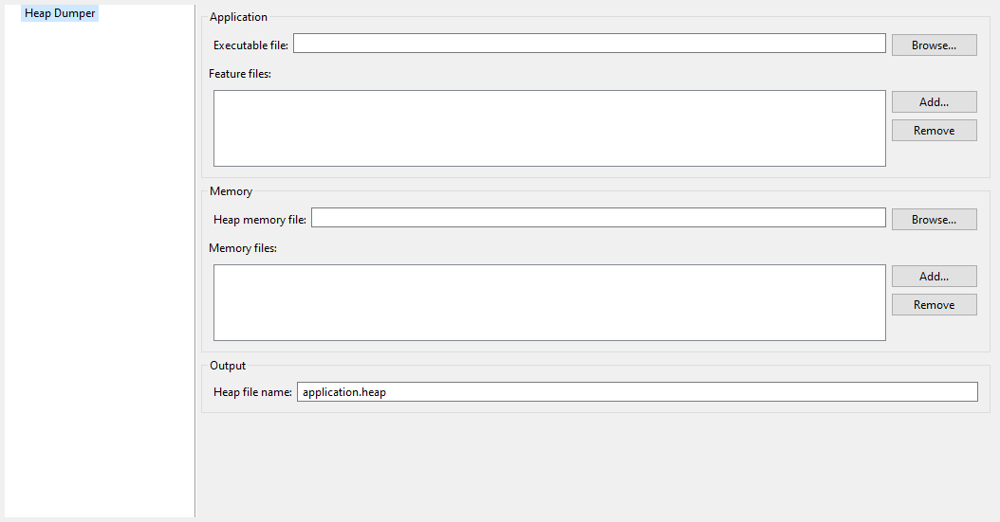

Category: Heap Dumper
~~~~~~~~~~~~~~~~~~~~~

Group: Application
^^^^^^^^^^^^^^^^^^

Option(browse): Executable file
'''''''''''''''''''''''''''''''

*Option Name*: ``application.filename``

*Default value*: ``(empty)``

*Description*:

Specify the full path of a full linked ELF file.

Option(list): Feature files
^^^^^^^^^^^^^^^^^^^^^^^^^^^

*Option Name*: ``additional.application.filenames``

*Default value*: ``(empty)``

*Description*:

Specify the full path of Feature files (``.fodbg`` files).

Group: Memory
^^^^^^^^^^^^^

Option(browse): Heap memory file
''''''''''''''''''''''''''''''''

*Option Name*: ``heap.filename``

*Default value*: ``(empty)``

*Description*:

Specify the full path of heap memory dump, in Intel Hex format.

Option(list): Memory files
''''''''''''''''''''''''''

*Option Name*: ``additional.memory.filenames``

*Default value*: ``(empty)``

*Description*:

Specify the full path of additional memory files (Installed Feature areas,
Dynamic Features table, ...).

Group: Output
^^^^^^^^^^^^^

Option(text): Heap file name
''''''''''''''''''''''''''''

*Option Name*: ``output.name``

*Default value*: ``application.heap``

..
   | Copyright 2008-2023, MicroEJ Corp. Content in this space is free 
   for read and redistribute. Except if otherwise stated, modification 
   is subject to MicroEJ Corp prior approval.
   | MicroEJ is a trademark of MicroEJ Corp. All other trademarks and 
   copyrights are the property of their respective owners.
