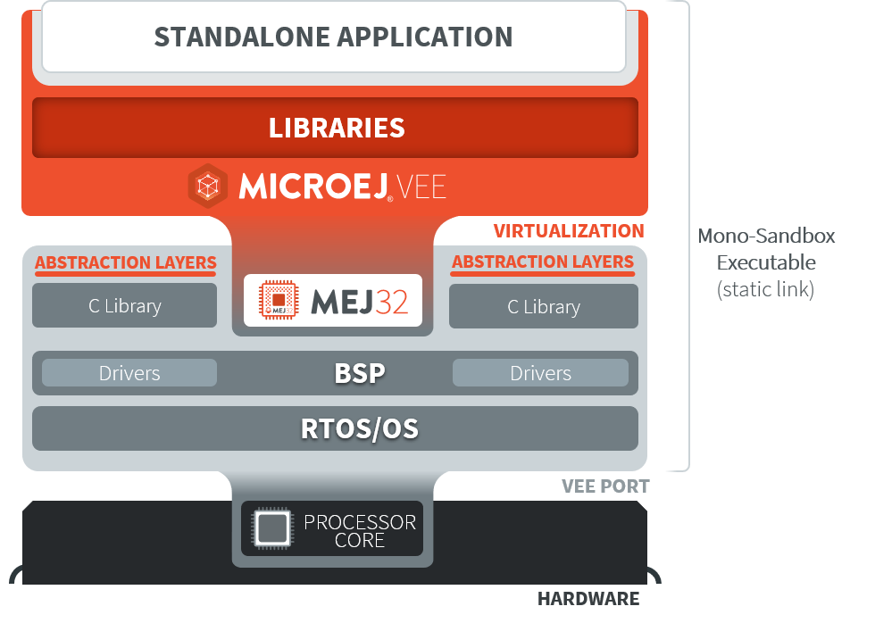

.. _Standalone_vs_Sandboxed:
.. _concepts-microejapplications:

Introduction
============

The following sections of this document shall prove useful as a
reference when developing applications for MicroEJ. They cover concepts
essential to MicroEJ Applications design.

In addition to these sections, you can access a number of helpful
resources such as:

- Developer resources at `<https://developer.microej.com/>`_.

- Libraries from the `MicroEJ Central Repository <https://developer.microej.com/central-repository/>`__.

- Application Examples as source code from `MicroEJ Github Repositories <https://github.com/MicroEJ>`__.

- `APIs Javadoc <https://repository.microej.com/javadoc/microej_5.x/apis/>`__.

- :ref:`Training Courses for Application Developers <training_for_application_developers>`.

MicroEJ Applications are developed using standard Integrated Development Environments with :ref:`MICROEJ SDK <sdk_6_user_guide>`. The SDK allows you to
run / debug / deploy Applications on a VEE Port.

Two kinds of applications can be developed: Standalone Applications and Sandboxed Applications.

A :ref:`Standalone Application <standalone_application>` is the main Application that is
directly linked to the C code to produce an Executable. 

A :ref:`Sandboxed Application <sandboxed_application>` is an Application that is partially linked, then deployed and executed over a Multi-Sandbox Executable.

.. figure:: images/sandboxed.png
   :align: center
   :scale: 75%
..
   | Copyright 2008-2024, MicroEJ Corp. Content in this space is free 
   for read and redistribute. Except if otherwise stated, modification 
   is subject to MicroEJ Corp prior approval.
   | MicroEJ is a trademark of MicroEJ Corp. All other trademarks and 
   copyrights are the property of their respective owners.
