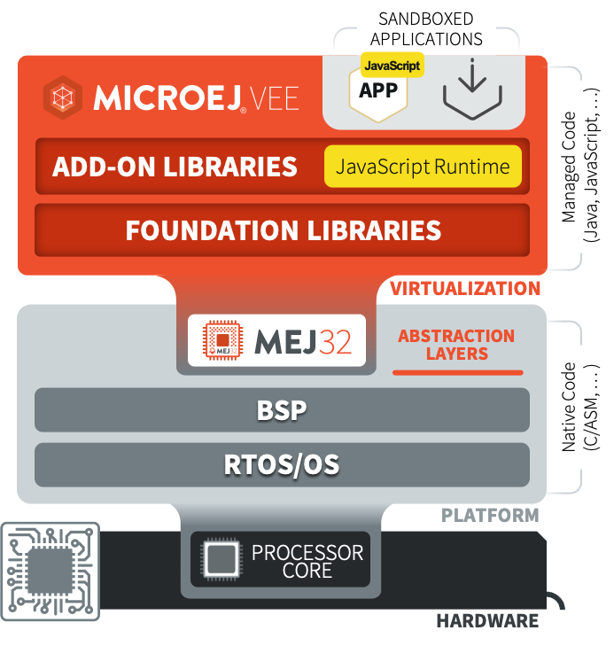

.. _javascript:

============
 JavaScript
============

MicroEJ allows to develop parts of an application in JavaScript. Basically, a MicroEJ Application boots in Java, then it initializes the JavaScript runtime to run a mix of Java and JavaScript code.

   MicroEJ JavaScript Overview

|

It supports the `ECMAScript 5.1 specification <https://262.ecma-international.org/5.1>`_, with :ref:`some limitations <js.limitations>`.
You can start playing with it by following the :ref:`Getting Started <js.getting_started>` page.

.. toctree::
   :maxdepth: 1
   :hidden:

   getting_started
   sources
   examples
   api
   java
   tests
   limitations
   troubleshooting
   internals

..
   | Copyright 2020-2023, MicroEJ Corp. Content in this space is free 
   for read and redistribute. Except if otherwise stated, modification 
   is subject to MicroEJ Corp prior approval.
   | MicroEJ is a trademark of MicroEJ Corp. All other trademarks and 
   copyrights are the property of their respective owners.
