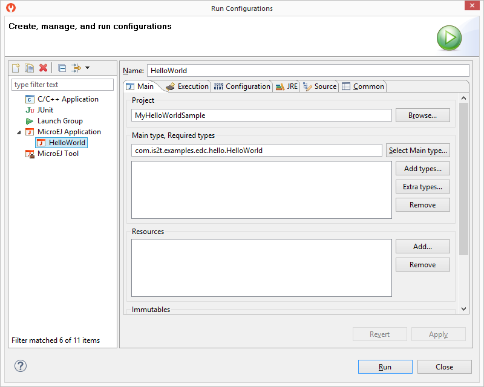
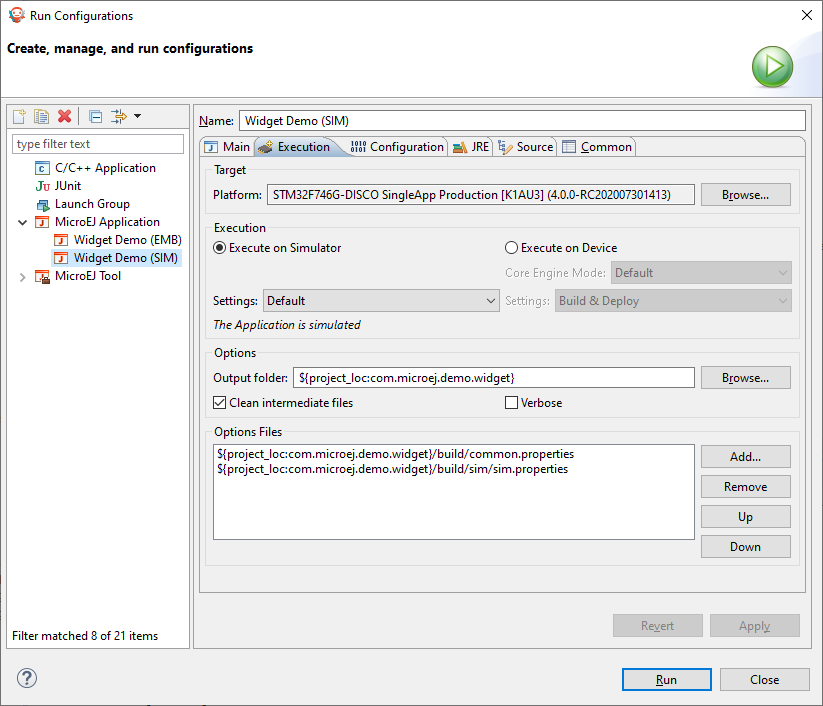
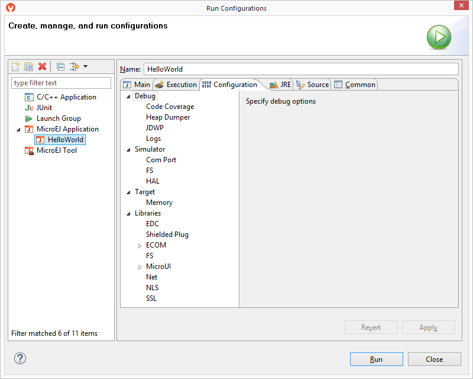

.. _concepts-microejlaunches:

MicroEJ Launch
==============

The MicroEJ launch configuration sets up the 
:ref:`MicroEJ Applications <concepts-microejapplications>` environment (main class,
resources, target platform, and platform-specific options), and then
launches a MicroEJ launch script for execution.

Execution is done on either the MicroEJ Platform or the MicroEJ
Simulator. The launch operation is platform-specific. It may depend on
external tools that the platform requires (such as target memory
programming). Refer to the platform-specific documentation for more
information about available launch settings.

Main Tab
--------

The :guilabel:`Main` tab allows you to set in order:

1. The main project of the application.

2. The main class of the application containing the main method.

3. Types required in your application that are not statically embedded
   from the main class entry point. Most required types are those that
   may be loaded dynamically by the application, using the
   ``Class.forName()`` method.

4. Binary resources that need to be embedded by the application. These
   are usually loaded by the application using the
   ``Class.getResourceAsStream()`` method.

5. Immutable objects' description files. See the [BON 1.2] ESR
   documentation for use of immutable objects.

   MicroEJ Launch Application Main Tab

Execution Tab
-------------

The next tab is the :guilabel:`Execution` tab. Here the target needs to be
selected. Choose between execution on a MicroEJ Platform or on a MicroEJ
Simulator. Each of them may provide multiple launch settings. This page
also allows you to keep generated, intermediate files and to print
verbose options (advanced debug purpose options).

   MicroEJ Launch Application Execution Tab

Configuration Tab
-----------------

The next tab is the :guilabel:`Configuration` tab. This tab contains all
platform-specific options.

   Configuration Tab

JRE Tab
-------

The next tab is the :guilabel:`JRE` tab. This tab allows you to configure the
Java Runtime Environment used for running the underlying launch script.
It does not configure the MicroEJ Application execution. The
``VM Arguments`` text field allows you to set vm-specific options, which
are typically used to increase memory spaces:

-  To modify heap space to 1024MB, set the ``-Xmx1024M`` option.

-  To modify string space (also called PermGen space) to 256MB, set the
   ``-XX:PermSize=256M -XX:MaxPermSize=256M`` options.

-  To set thread stack space to 512MB, set the ``-Xss512M`` option.

Other Tabs
----------

The next tabs (:guilabel:`Source` and :guilabel:`Common` tabs) are the default Eclipse
launch tabs. Refer to Eclipse help for more details on how to use these
launch tabs.

..
   | Copyright 2008-2020, MicroEJ Corp. Content in this space is free 
   for read and redistribute. Except if otherwise stated, modification 
   is subject to MicroEJ Corp prior approval.
   | MicroEJ is a trademark of MicroEJ Corp. All other trademarks and 
   copyrights are the property of their respective owners.
