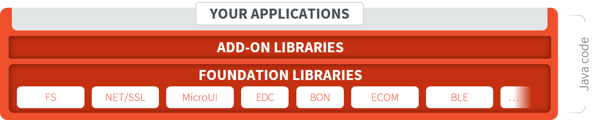

.. _libraries:

Libraries
=========

Two types of libraries are supported:

- Foundation Libraries are MicroEJ Core libraries that provide core runtime APIs or hardware-dependent functionality. 

- Add-On Libraries are MicroEJ libraries that are implemented on top of MicroEJ Foundation Libraries (100% full Managed code). 

   MicroEJ Foundation Libraries and Add-On Libraries

MicroEJ Corp. provides a large number of libraries through the :ref:`MicroEJ Central Repository <central_repository>`.
To consult its libraries APIs documentation, please visit `<https://developer.microej.com/microej-apis/>`_.

.. toctree::
   :maxdepth: 1
   :hidden:

   UI/ui
   nls
   dataSerializationLibraries
   networking
   bluetooth
   audio
   microai
   javaTime
   eventQueue
   gnss
   js/index

..
   | Copyright 2008-2025, MicroEJ Corp. Content in this space is free 
   for read and redistribute. Except if otherwise stated, modification 
   is subject to MicroEJ Corp prior approval.
   | MicroEJ is a trademark of MicroEJ Corp. All other trademarks and 
   copyrights are the property of their respective owners.
