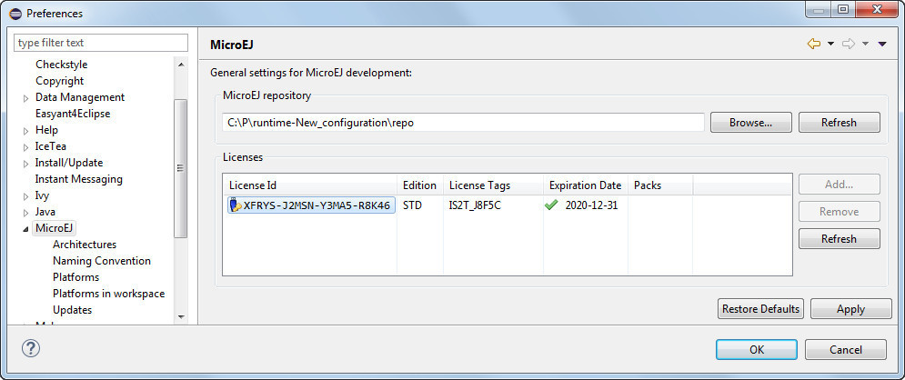
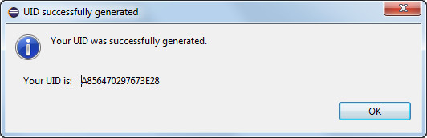
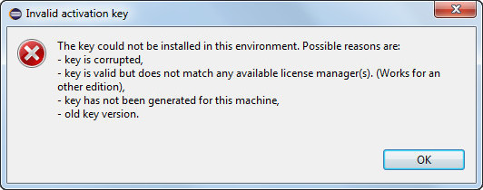
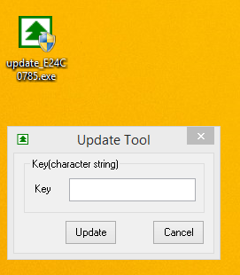
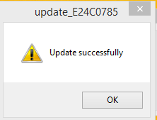
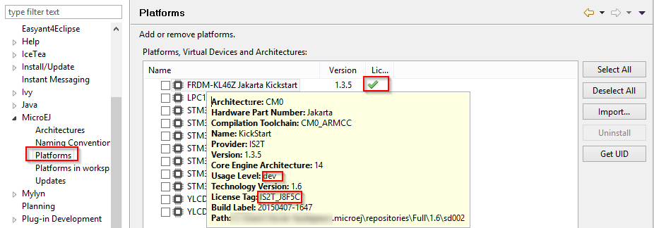

Licenses
========

.. _concepts-licenses:

Overview
--------

MicroEJ Architectures and Platforms are associated with a license. The
license type depends on the platform usage level (license key for an
evaluation version, hardware dongle for a development version). Refer to
the platform specific documentation to learn more details about the
licenses.

Licenses list is available in MicroEJ preferences dialog page in :guilabel:`Window`
> :guilabel:`Preferences` > :guilabel:`MicroEJ`

   MicroEJ Licenses View

Note that :

-  Evaluation licenses will be shown only if architectures requiring an
   evaluation license are detected in your MicroEJ repository.

-  Development licenses will be shown only if architectures requiring a
   development license are detected in your MicroEJ repository.

See section :ref:`gettingstarted-installlicenses` for more
information.

.. _gettingstarted-installlicenses:

Installation
------------

For more information about the licenses protection, please refer to
section :ref:`concepts-licenses`.

.. _gettingstarted-installlicenseseval:

Evaluation Licenses
-------------------

This section should be considered when using evaluation platforms, which
use software license keys.

.. _gettingstarted-installlicenseseval-install:

Installing License Keys
~~~~~~~~~~~~~~~~~~~~~~~

License keys can be added and removed from MicroEJ preferences main
page. License keys are added to MicroEJ repository key-store using the
:guilabel:`Add…` button. A dialog prompts for entering a license key. If an
error message appears, the license key could not be installed. (see
section :ref:`gettingstarted-installlicenseseval-troubleshoot`).
A license key can be removed from key-store by selecting it and by
clicking on :guilabel:`Remove` button.

.. _gettingstarted-installlicenseseval-uid:

Generating Machine UID
~~~~~~~~~~~~~~~~~~~~~~

To activate an evaluation platform, a machine UID needs to be provided
to the key server. This information is available from the :guilabel:`Window` >
:guilabel:`Preferences` > :guilabel:`MicroEJ` > :guilabel:`Architectures` or :guilabel:`Window` > :guilabel:`Preferences` > :guilabel:`MicroEJ`
> :guilabel:`Platforms` preferences page. Click on :guilabel:`Get UID` button to get the generated machine identifier.

   Generated Machine Identifier for Evaluation License

.. _gettingstarted-installlicenseseval-troubleshoot:

License Keys Troubleshooting
~~~~~~~~~~~~~~~~~~~~~~~~~~~~

Consider this section when an error message appears while adding the
license key. Before contacting MicroEJ support, please check the
following conditions:

-  Key is corrupted (wrong copy/paste, missing characters or extra
   characters)

-  Key has not been generated for the installed environment

-  Key has not been generated with the machine UID

-  Machine UID has changed since submitting license request and no
   longer matches license key

-  Key has not been generated for one of the installed platforms (no
   license manager able to load this license)

   Invalid License Key Error Message

.. _gettingstarted-installlicensesdev:

Development Licenses
--------------------

This section should be considered when using development platforms,
which use hardware license keys.

.. _dongles-update:

USB Dongles Update
~~~~~~~~~~~~~~~~~~

Dongle
This section contains instructions that will allow to flash your
hardware dongle with the proper activation key.

You shall ensure that the following prerequisites are met :

-  The USB dongle is plugged and recognized by your operating system
   (see :ref:`dongles-recognition` section)

-  No more than one dongle is plugged to the computer while running the
   update tool

-  The update tool is not launched from a Network drive or from a USB
   key

-  The activation key you downloaded is the one for the dongle UID on
   the sticker attached to the dongle (each activation key is tied to
   the unique hardware ID of the dongle).

You can then proceed to the dongle update by running the activation key
executable. Just press :guilabel:`Update` (no key is required). 

   Dongle Update Tool

On success, an ``Update successfully`` message shall appear. On failure, an
``Error key or no proper rockey`` message may appear.

   Successful dongle update

Once you have successfully updated your dongle, from MicroEJ, go to
:guilabel:`Window` > :guilabel:`Preferences` > :guilabel:`MicroEJ` > :guilabel:`Platforms`. You shall see that the
license status for the platforms you installed with the ``License tag``
matching the one on the sticker attached to your USB dongle has turned
from a red cross to a green tick.

   Platform License Status OK

.. _dongles-recognition:

USB Dongles Recognition
~~~~~~~~~~~~~~~~~~~~~~~

This section contains instructions that will allow to check that your
hardware dongle is actually recognized by your operating system

GNU/Linux troubleshooting
"""""""""""""""""""""""""

USB
Linux
For GNU/Linux Users (Ubuntu at least), by default, the dongle access has
not been granted to the user, you have to modify udev rules. Please
create a ``/etc/udev/rules.d/91-usbdongle.rules`` file with the
following contents:

::

   ACTION!="add", GOTO="usbdongle_end"
       SUBSYSTEM=="usb", GOTO="usbdongle_start"
       SUBSYSTEMS=="usb", GOTO="usbdongle_start"
       GOTO="usbdongle_end"
       
       LABEL="usbdongle_start"
       
       ATTRS{idVendor}=="096e" , ATTRS{idProduct}=="0006" , MODE="0666"
       
       LABEL="usbdongle_end"

Then, restart udev: ``/etc/init.d/udev restart``

You can check that the device is recognized by running the lsusb
command. The output of the command should contain a line similar to the
one below for each dongle :
``Bus 002 Device 003: ID 096e:0006 Feitian Technologies, Inc.``

Windows troubleshooting
"""""""""""""""""""""""

For Windows users, each dongle shall be recognized with the following
hardware ID :

::

   HID\VID_096E&PID_0006&REV_0109

On Windows 8.1, go to :guilabel:`Device Manager` > :guilabel:`Human Interface Devices` and
check among the ``USB Input Device`` entries that the
``Details`` > ``Hardware Ids`` property match the ID mentioned before.

..
   | Copyright 2008-2020, MicroEJ Corp. Content in this space is free 
   for read and redistribute. Except if otherwise stated, modification 
   is subject to MicroEJ Corp prior approval.
   | MicroEJ is a trademark of MicroEJ Corp. All other trademarks and 
   copyrights are the property of their respective owners.
