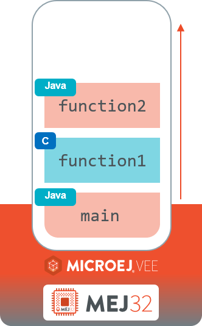

.. _managedc.binding:

Bind Java code and Managed C Code
=================================

The Core Engine features a direct connection between Java code and Managed C code through a bidirectional binding between Java methods and Managed C functions.
Also, the Java code can directly access the Managed C linear memory through a Java ``byte`` array.

Principle
---------

The following figure illustrates the binding between Java methods and C functions through a first code example.

Basically, a Java static method declared as ``native`` and annotated with ``WasmFunction`` is bound to a Managed C function with the same name.
Conversely, a Managed C function declared as ``extern`` is bound to a Java static method with the same name.

Here is a first example:

The next figure illustrates the call stack of the Core Engine main thread:

You can notice that, from Core Engine execution point of view, there is no distinction between Java methods and Managed C functions.
The execution of the main entry point produces the following stack trace:

.. code-block:: console

   Exception in thread "main" java.lang.RuntimeException: Core Engine Stack Trace
      [...]
      at java.lang.RuntimeException.<init>(RuntimeException.java:18)
      at example.JavaCode.function2(JavaCode.java:13)
      at example.JavaCode.function1(Unknown Source)
      at example.JavaCode.main(JavaCode.java:26)
      at java.lang.MainThread.run(Thread.java:856)
      at java.lang.Thread.runWrapper(Thread.java:465)
      [...]

The line ``example.JavaCode.function1`` represents the execution of the Managed C function named ``function1``.

.. note::
   
   The Core Engine prints ``Unknown Source`` because the retrieval of line numbers in C files is no yet available.

.. _managedc.bind.module:

Bind a Wasm Module to a Java class
----------------------------------

The first step is to bind your :ref:`compiled Wasm module <managedc.compilation>` to a Java class.

First, the Wasm module file must be available in the :ref:`chapter.microej.classpath`.
For that, drop your Wasm module to your project directory ``src/main/resources``. Let's assume it is called ``my_app.wasm``.

Add to the desired Java class the ``@WasmModule`` annotation with the module name (e.g. ``@WasmModule("my_app")``).
When the SOAR loads the Java class, it will transitively load the annotated Wasm module from the :ref:`resource <section.classpath.elements.raw_resources>` path with the ``.wasm`` extension (e.g. ``/my_app.wasm``).

Your class should look like the following code:

.. code-block:: java
   
   package com.mycompany;
      
   import ej.wasm.WasmModule;

   // This Java class is bound to a Wasm module named 'my_app' and
   // loaded from the '/my_app.wasm' resource in MicroEJ classpath.
   @WasmModule("my_app")
   public class MyApp {
      
   }  

Your project files should look like the following:

.. code-block:: console

   ├── src
   │   └── main
   │       ├── java
   │       │   └── com
   │       │       └── mycompany
   │       │           └── MyApp.java
   │       └── resources
   │           └── my_app.wasm

  
If necessary, you can specify a custom resource path instead of the default one derived from the module name:

.. code-block:: java
   
   package com.mycompany;
      
   import ej.wasm.WasmModule;

   // This Java class is bound to a Wasm module named 'my_app' and
   // loaded from the '/src/module1.0.wasm' resource in MicroEJ classpath.
   @WasmModule(value = "my_app", resource = "/src/module1.0.wasm")
   public class MyApp {
      
   }  

.. _managedc.bind.method:

Bind a Java Method to a Managed C Function
------------------------------------------

Once a Java class is :ref:`bound to a Wasm module <managedc.bind.module>`, 
all Java-declared methods and Managed C functions that meet the following conditions are automatically bound:

- The Java method is declared ``static``.
- The signature (name, parameters and return type) of the Java method matches with the signature of the Managed C function (see :ref:`managedc.matching.types`). 
- The Managed C function has been exported by the Wasm module. See :ref:`--export* compilation options <managedc.link.command_line_options>`. 
  (Managed C functions declared ``static`` cannot be exported as they are only visible in the C file they are declared) [1]_.

Here is an example:
  
- Java source code (``MyApp.java``):
   
   .. code-block:: java

      package com.mycompany;
      
      import ej.wasm.WasmModule;

      @WasmModule("my_app")
      public class MyApp {

         // Bound to Managed C function 'print(int)' in 'my_app.wasm' module
         public static void print(int c) {
            System.out.print((char)c);
         }

      }  

- C source code (``my_app.c``):
   
   .. code-block:: c 

      // Bound to Java method 'com.mycompany.MyApp.print(int)'
      extern void print(int c);

.. [1] By default, the :ref:`clang compiler <managedc.link.command_line_options>` exports symbols declared as ``extern`` to the Wasm module named ``env``. 
   This module name is automatically bound to the current Wasm module.

The following sections explain how to customize the default binding :ref:`from the Java code side <managedc.bind.method.java>` and :ref:`from the C code side <managedc.bind.method.c>`.

.. _managedc.bind.method.java:

Bind a Managed C Function from Java Code
----------------------------------------

The ``@WasmFunction`` annotation is used to extend the default :ref:`Java Method to Managed C Function binding <managedc.bind.method.java>` from the Java code side.

.. _managedc.call.method.java.to.c:

Call a Managed C Function from Java Code
~~~~~~~~~~~~~~~~~~~~~~~~~~~~~~~~~~~~~~~~

The most common case is to call a Managed C function from Java code.

For that, the Java method being bound must be declared ``native``, as it does not include a body.
Additionnally, it must be annotated with the ``@WasmFunction`` annotation. This indicates to the SOAR that the Java method must be bound to a Managed C function.
Otherwise, the SOAR will consider the Java method as a standard native method and will try to link it to a native C function. [2]_

Finally, the Java method must be declared ``synchronized`` to ensure there is one and only one thread executing Managed C code at a time, 
as stated by the `WebAssembly 1.0 specification <https://www.w3.org/TR/wasm-core-1/#configurations%E2%91%A0>`__.

.. note::
   
   A first support of POSIX pthreads is available through the implementation of :ref:`WASI Threads <wasi.threads>`. 

Here is an example:

- Java source code (``MyApp.java``):

   .. code:: java

      package com.mycompany;

      import ej.wasm.WasmFunction;
      import ej.wasm.WasmModule;

      @WasmModule("my_app")
      public class MyApp {

         public static void main(String[] args) {
            int a = 1;
            int b = 2;
            // Call and return result of the "add" Managed C function
            int r = add(a, b);

            System.out.println(a + " + " + b + " = "+ r);
         }

         @WasmFunction
         public static native synchronized int add(int a, int b);

      }

- C source code (``my_app.c``):

   .. code-block:: c

      int add(int a, int b) {
         return a + b;
      }

You should see the following output when launching the Java application:

   .. code-block:: console

          1 + 2 = 3

.. [2] When the Wasm module is included in a Sandboxed Application, use of ``native`` keyword in the Java method declaration is allowed in that case, 
       since SOAR interprets first the ``WasmFunction`` annotation and the ``native`` keyword is only used to declare a Java method with no body.

.. _managedc.bind.method.java.to.c:

Bind a Managed C Function with a Different Name
~~~~~~~~~~~~~~~~~~~~~~~~~~~~~~~~~~~~~~~~~~~~~~~

Another use of the ``@WasmFunction`` annotation is to bind a Java Method to a Managed C function that has a different name from the Java method.
In that case, you can provide the name of the corresponding Managed C function as a parameter of the ``@WasmFunction`` annotation.
This is especially useful if you want to write a Java method name in camel case while binding it to a Managed C function name written in snake case.

- Java source code (``MyApp.java``):

   .. code-block:: java
      :emphasize-lines: 11,12

      @WasmModule("my_app")
      public class Main {

         public static void main(String[] args) {
            int a = 1;
            int b = 2;
            // Call and return result of the "add" Managed C function
            System.out.println(a + " + " + b + " = "+ doAdd(a, b));
         }

         @WasmFunction("do_add")
         public static native synchronized int doAdd(int a, int b);
      }

- C source code (``my_app.c``):

   .. code-block:: c
      :emphasize-lines: 1

      int do_add(int a, int b) {
         return a + b;
      }

.. _managedc.bind.method.c:

Bind a Java Method from C Code
------------------------------

The ``import_module``, ``import_name`` and ``export_name`` `C attributes <https://clang.llvm.org/docs/AttributeReference.html>`__ 
are used to extend the default :ref:`Java Method to Managed C Function binding <managedc.bind.method.java>` from C code side.

.. _managedc.call.method.c.to.java:

Call a Java Method out of the Wasm Module
~~~~~~~~~~~~~~~~~~~~~~~~~~~~~~~~~~~~~~~~~

The `import_module <https://clang.llvm.org/docs/AttributeReference.html#import-module>`__ attribute is used when the Java method to be bound belongs to a Java class other than the one bound to the Wasm module.
The module name can be either the fully qualified name of the Java class containing the Java method (e.g: ``com.mycompany.MyApp``) or the name of the ``@WasmModule`` annotation of the class containing the Java method.
  
The most common case is to call a Java method declared in a library from C code.
The corresponding Java class fully qualified name is provided as a parameter of the ``__import_module__`` attribute..

Here is an example with the standard Java `Math.max(int,int)`_ method.
  
- C source code (``my_app.c``):
     
   .. code-block:: c

      // Binding to Java method 'java.lang.Math.max(int,int)'
      __attribute__((__import_module__("java.lang.Math")))
      extern int max(int i, int j);

.. _Math.max(int,int): https://repository.microej.com/javadoc/microej_5.x/apis/java/lang/Math.html#max-int-int-

.. _managedc.bind.method.c.to.java:

Bind a Java Method with a Different Name
~~~~~~~~~~~~~~~~~~~~~~~~~~~~~~~~~~~~~~~~

The `import_name <https://clang.llvm.org/docs/AttributeReference.html#import-name>`__ attribute is used when the Managed C function name has a different name from the Java method.
The corresponding Java method name is provided as a parameter of the ``__import_name__`` attribute.
This is especially useful if you want to write a Managed C function in snake case while binding it to a Java method name written in camel case .
  
- Java source code (``MyApp.java``):
   
   .. code-block:: java

      package com.mycompany;

      @WasmModule("my_app")
      public class MyApp {
         public static void javaPrint(int c) {
            System.out.print((char)c);
         }
      }  

- C source code (``my_app.c``):
   
   .. code-block:: c 

      __attribute__((__import_name__("javaPrint")))
      extern void c_print(int c);

The Managed C function can be implemented using an Unmanaged C function by adding the ``native`` keyword to the bound Java static method.

- Java source code (``MyApp.java``):
   
   .. code-block:: java

      package com.mycompany;

      @WasmModule("my_app_managed")
      public class MyApp {

         // Implemented in unmanaged (SNI) 
         public static native void javaPrint(int c);
      }  

- Managed C source code (``my_app_managed.c``):
   
   .. code-block:: c 

      __attribute__((__import_name__("javaPrint")))
      extern void c_print(int c);

- Unmanaged C source code (``my_app_native.c``):
   
   .. code-block:: c
      
      #include "sni.h"
      #include "stdio.h"

      void Java_com_mycompany_javaPrint(jint c){
         putchar(c);
      }

The `export_name <https://clang.llvm.org/docs/AttributeReference.html#export-name>`__ attribute is used for the same reason, when the Managed C function implements the code.

- Java source code (``MyApp.java``):
   
   .. code-block:: java

      package com.mycompany;

      @WasmModule("my_app")
      public class MyApp {      
         @WasmFunction
         public static synchronized native void javaPrint(int c);
      }  

- C source code (``my_app.c``):
   
   .. code-block:: c 

      #include <stdio.h>;

      __attribute__((__export_name__("javaPrint")))
      void c_print(int c){
         putchar(c);
      }

.. _managedc.matching.types:

Matching Types
--------------

Java methods bound to Managed C functions can only use Java base types ``int``, ``long``, ``float``, ``double`` as parameters and return types. 

Here is the matching table:

.. list-table::  Managed C Types / Java Types matching
   :widths: 25 25 25
   :header-rows: 1

   * - C Std Type
     - Java Type
     - Wasm Type
   * - int32_t
     - int
     - i32
   * - int64_t
     - long
     - i64
   * - float32_t
     - float
     - f32 
   * - float64_t
     - double
     - f64
   * - Any pointer
     - int
     - i32

SOAR will trigger an error if Managed C function parameter(s) and return types do not match exactly the Java method parameter(s) and return types.  

.. _managedc.communication.managedc_memory:

Access Managed C Memory from Java
---------------------------------

The Managed C memory is composed of all static arrays, structures, globals declared in C files, thread stacks and optional heap for dynamic allocations. 
All these elements are :ref:`linked <managedc.link.module>` to the :ref:`Wasm module linear memory <managedc.linear.memory>`.

On Java side, the Wasm module linear memory can be bound to a Java static byte array field declaration using the ``@WasmMemory`` annotation.

.. note:: 
   A SOAR error will occurred if ``@WasmMemory`` is not strictly followed by a Java static byte array declaration (see :ref:`managedc.troubleshooting`).

Here is a Java example:

.. code:: java

   package com.mycompany;
   
   import ej.wasm.WasmFunction;
   import ej.wasm.WasmMemory;

   @WasmModule("my_app")
   public class MyApp {

      ...

      @WasmMemory
      private static byte[] Memory;

      ...
   }

Here is an example manipulating Managed C module memory in Java code:

- C source code (``my_app.c``):

   .. code-block:: c

      typedef unsigned char uint8_t;
      /* Extern function implemented in Java code -----*/
      extern void printWasmMemoryValues(uint8_t* ptr, int size);

      /* Global variable -------------------------*/
      uint8_t array[10] = {1, 2, 3, 4, 5, 6, 7, 8, 9, 10};

      /* Managed C function called by Java -------*/
      void app_main() {
         printWasmMemoryValues(&array[0], sizeof(array));
      }

- Java source code (``MyApp.java``):

   .. code:: java

      package com.mycompany;

      import ej.wasm.WasmFunction;
      import ej.wasm.WasmMemory;
      import ej.wasm.WasmModule;

      @WasmModule("my_app")
      public class MyApp {

         public static void main(String[] args) {
            // Call Managed C entry point
            app_main();
         }

         @WasmMemory
         private static byte[] Memory;

         /**
         * Managed C entry point
         */
         @WasmFunction
         public static native synchronized void app_main();

         /**
         * Method call from Managed C which print Managed C Memory values.
         * @param ptr index on the Managed C memory
         * @param length memory length to print
         */
          public static void printWasmMemoryValues(int ptr, int length) {
              System.out.println("Wasm Memory values from " + ptr + " to " + (ptr + length) + ":");
              for (int i = 0; i < length - 1; i++) {
                  System.out.print(Memory[ptr + i] + ", ");
              }
              System.out.println(Memory[ptr + (length - 1)]);
          }

      }

You should see the following output when launching the Java application:

   .. code-block:: console

      Managed C Memory values from 1024 to 1034:
      1, 2, 3, 4, 5, 6, 7, 8, 9, 10

.. _managedc.bind.start.function:

Start Function
--------------

When a Wasm module declares a `start function <https://www.w3.org/TR/wasm-core-1/#start-function%E2%91%A0>`__, it is automatically executed 
during the :ref:`initialization of the Java class <soar_clinit>` it is bound to.

..
   | Copyright 2023-2025, MicroEJ Corp. Content in this space is free 
   for read and redistribute. Except if otherwise stated, modification 
   is subject to MicroEJ Corp prior approval.
   | MicroEJ is a trademark of MicroEJ Corp. All other trademarks and 
   copyrights are the property of their respective owners.
