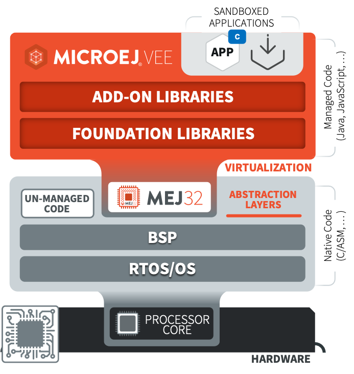

.. _managedc:

============
 Managed C
============

MicroEJ provides the capability to develop parts of an application in C, known as Managed C. Essentially, a MicroEJ Application boots in Java and then run a mix of Java and Managed C code, etc.

   MicroEJ Managed C Overview

|

.. note::
   This feature requires Architecture version ``8.2.0`` or higher, and is currently not supported in simulation.

Managed C code is enabled through `WebAssembly 1.0 <https://www.w3.org/TR/wasm-core-1/>`_, with :ref:`certain limitations <managedc.limitations>`. 

You can start exploring this functionality by following the instructions provided in the :ref:`Getting Started <managedc.getting_started>` page.

.. toctree::
   :maxdepth: 1
   :hidden:

   getting_started
   compilation
   communication
   limitations
   troubleshooting
..
   | Copyright 2023, MicroEJ Corp. Content in this space is free 
   for read and redistribute. Except if otherwise stated, modification 
   is subject to MicroEJ Corp prior approval.
   | MicroEJ is a trademark of MicroEJ Corp. All other trademarks and 
   copyrights are the property of their respective owners.
