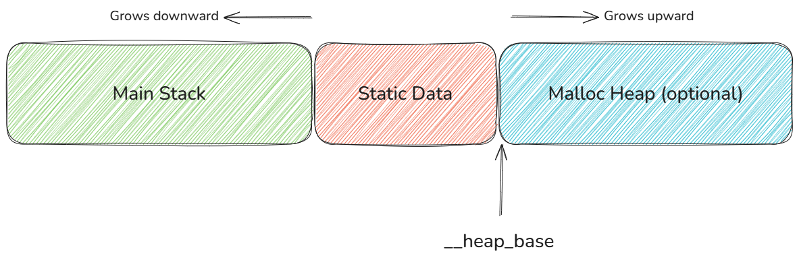

.. _managedc.linear.memory:

Wasm Linear Memory
===================

Wasm linear memory is a contiguous, byte-addressable memory region used in Wasm programs.
It is the main mechanism through which a Wasm module manages its memory and exchanges data with :ref:`the host <managedc.communication.managedc_memory>`.
This memory is represented as an array of bytes, indexed starting at zero, and is :ref:`dynamically resizable <managedc.instructions.partially_supported>`.

Wasm Linear Memory Layout
-------------------------

When a Wasm module is compiled, its memory is divided into different regions as following:

* **Static Data region**: Reserved for constants and global variables.
* **Auxiliary Stack region**: Used for temporary allocations and some local variables, grows downward (toward lower memory addresses).
* **Heap region**: Dynamic memory allocations, grows upward.

   Wasm Linear Memory Layout

.. note:: 

    The boundary between the auxiliary stack + the Static Data regions and the heap region is marked by the special Wasm global ``__heap_base``

Wasm Linear Memory Size
-----------------------

WebAssembly organizes linear memory in pages, where each page is **64 KiB** (65,536 bytes).

This page-based structure allows for efficient memory allocation and potential growth during runtime. 
However, the page size value is less suitable for embedded environments, where memory resources are more limited.

Given the following Wasm module:

.. code:: wat

    (module
        (memory $mem 2 10)
        (export "memory" (memory $mem))
    )

This linear memory of this module should have an initial Size of **2 pages** (128 KiB), and a maximum Size of **10 pages** (640 KiB).

To minimize the size of allocated memory, a Wasm module should:

* Export the the Wasm global ``__heap_base``, using the linker option ``-Wl,--export=__heap_base`` like the following Wasm module,

.. code:: wat

    (module
        (memory $mem 2 10)
        (global $heap_base (i32.const 1024))
        (export "memory" (memory $mem))
        (export "__heap_base" (global $heap_base))
    )

* Avoid using the ``memory.size`` and ``memory.grow`` instructions (do not use malloc/free function in the Managed C code).

When this requirements are met the memory is allocated up to ``__heap_base``, (i.e **1024 bytes** for the above Wasm module).