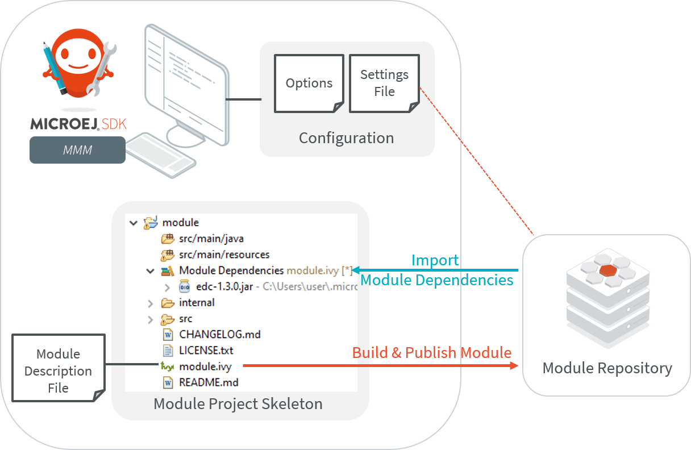
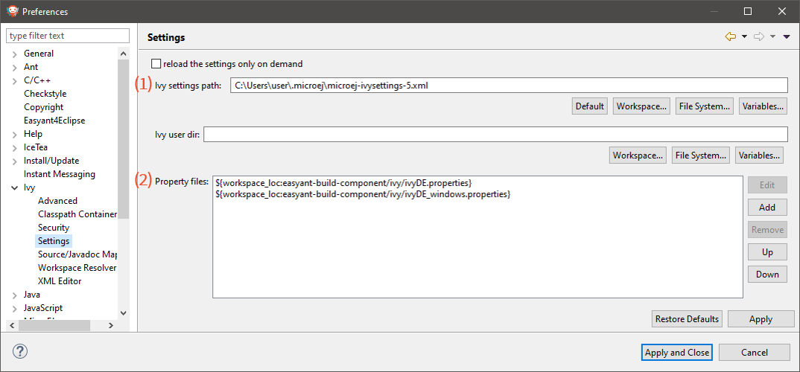

.. _mmm:

MicroEJ Module Manager
======================

Introduction
------------

Modern electronic device design involves many parts and teams to
collaborate to finally obtain a product to be sold on its market.
MicroEJ encourages modular design which involves various stake holders:
hardware engineers, UX designers, graphic designers, drivers/BSP
engineers, software engineers, etc.

Modular design is a design technique that emphasizes separating the
functionality of an application into independent, interchangeable
modules. Each module contains everything necessary to execute only one
aspect of the desired functionality. In order to have team members
collaborate internally within their team and with other teams, MicroEJ
provides a powerful modular design concept, with smart module
dependencies, controlled by the MicroEJ Module Manager (MMM). MMM frees
engineers from the difficult task of computing module dependencies.
Engineers specify the bare minimum description of the module
requirements.

The following schema introduces the main concepts detailed in this chapter.

   MMM Overview

MMM is based on the following tools:

-  Apache Ivy (`<http://ant.apache.org/ivy>`_) for dependencies
   resolution and module publication;

-  Apache EasyAnt
   (`<https://ant.apache.org/easyant/history/trunk/reference.html>`_) for
   module build from source code.

.. _mmm_specification:

Specification
-------------

MMM provides a non ambiguous semantic for dependencies
resolution. Please consult the MMM specification available on
`<https://developer.microej.com/packages/documentation/TLT-0831-SPE-MicroEJModuleManager-2.0-E.pdf>`_.

.. _mmm_module_skeleton:

Module Project Skeleton
-----------------------

In MicroEJ SDK, a new MicroEJ module project is created as following:

- Select :guilabel:`File` > :guilabel:`New` > :guilabel:`Project...`,
- Select :guilabel:`MicroEJ` > :guilabel:`MicroEJ Module Project` [#warning_check_former_sdk_versions]_,
- Fill the module information (project name, module organization, name and revision),
- Select one of the suggested skeletons depending on the desired :ref:`module nature <module_nature_skeleton_mapping>`,
- Click on :guilabel:`Finish`.

The project is created and a set of files and directories are generated from the selected skeleton.

.. note:: 
  When an empty Eclipse project already exists or when the skeleton has to be created within an existing directory, 
  the MicroEJ module is created as following:

  - In the `Package Explorer`, click on the parent project or directory,
  - Select :guilabel:`File` > :guilabel:`New` > :guilabel:`Other...`,
  - Select :guilabel:`EasyAnt` > :guilabel:`EasyAnt Skeleton`.

.. _mmm_module_description:

Module Description File
-----------------------

A module description file is an Ivy configuration file named ``module.ivy``, located at the root
of each MicroEJ module project. 
It describes the :ref:`module nature <module_natures>` (also called build type) and dependencies to other modules.

.. code-block:: xml

   <ivy-module version="2.0" xmlns:ea="http://www.easyant.org" xmlns:m="http://ant.apache.org/ivy/extra" 
                             xmlns:ej="https://developer.microej.com" ej:version="2.0.0"> 
       <info organisation="[organisation]" module="[name]" status="integration" revision="[version]">
           <ea:build organisation="com.is2t.easyant.buildtypes" module="[buildtype_name]" revision="[buildtype_version]">
               <ea:property name="[buildoption_name]" value="[buildoption_value]"/>
           </ea:build>
       </info>
       
       <configurations defaultconfmapping="default->default;provided->provided">
           <conf name="default" visibility="public"/>
           <conf name="provided" visibility="public"/>
           <conf name="documentation" visibility="public"/>
           <conf name="source" visibility="public"/>
           <conf name="dist" visibility="public"/>
           <conf name="test" visibility="private"/>
       </configurations>
       
       <publications>
       </publications>
       
       <dependencies>
         <dependency org="[dep_organisation]" name="[dep_name]" rev="[dep_version]"/>
       </dependencies>
   </ivy-module>        

Enable MMM Semantic
~~~~~~~~~~~~~~~~~~~

The MMM semantic is enabled in a module by adding the MicroEJ XML
namespace and the ``ej:version`` attribute in the ``ivy-module`` node:

.. code-block:: xml

   <ivy-module xmlns:ej="https://developer.microej.com" ej:version="2.0.0">

.. note::

   Multiple namespaces can be declared in the ``ivy-module`` node.

MMM semantic is enabled in the module created with the
:ref:`mmm_module_skeleton`.

Module Dependency
~~~~~~~~~~~~~~~~~

Module dependencies are added to the ``dependencies`` node as follow:

.. code-block:: xml
   :emphasize-lines: 2

   <dependencies>
     <dependency org="[dep_organisation]" name="[dep_name]" rev="[dep_version]"/>
   </dependencies>

When no matching rule is specified, the default matching rule is
``compatible``.

Dependency Matching Rule
++++++++++++++++++++++++

The following matching rules are specified by MMM:

.. list-table::
   :widths: 2 2 3
   :header-rows: 1

   * - Name
     - Range Notation
     - Semantic
   * - compatible
     - [M.m.p-RC, (M+1).0.0-RC[
     - Equal or up to next major version.  Default if not set.
   * - equivalent
     - [M.m.p-RC, M.(m+1).0-RC [
     - Equal or up to next minor version
   * - greaterOrEqual
     - [M.m.p-RC, ∞[
     - Equal or greater versions
   * - perfect
     - [M.m.p-RC, M.m.(p+1)-RC[
     - Exact match (strong dependency)

Set the matching rule of a given dependency with ``ej:match="matching rule"``.  For example:

.. code-block:: xml

   <dependency org="[dep_organisation]" name="[dep_name]" rev="[dep_version]" ej:match="perfect" />

Dependency Visibility
+++++++++++++++++++++

- A dependency declared ``public`` is transitively resolved by upper
  modules.  The default when not set.
- A dependency declared ``private`` is only used by the module itself,
  typically for:

   - Bundling the content into the module
   - Testing the module

The visibility is set by the configurations declared in the
``configurations`` node.  For example:

.. code-block:: xml
   :emphasize-lines: 2

   <configurations defaultconfmapping="default->default;provided->provided">
       <conf name="[conf_name]" visibility="private"/>
   </configurations>

The configuration of a dependency is specified by setting the ``conf``
attribute, for example:

.. code-block:: xml

   <dependency org="[dep_organisation]" name="[dep_name]" rev="[dep_version]" conf="[conf_name]->*" />

Automatic Update Before Resolution
~~~~~~~~~~~~~~~~~~~~~~~~~~~~~~~~~~

The Easyant plugin ``ivy-update`` can be used to automatically update
the version (attribute ``rev``) of every module dependencies declared.

.. code-block:: xml
   :emphasize-lines: 2

   <info organisation="[organisation]" module="[name]" status="integration" revision="[version]">
       <ea:plugin org="com.is2t.easyant.plugins" name="ivy-update" revision="1.+" />
   </info>

When the plugin is enabled, for each module dependency, MMM will check
the version declared in the module file and update it to the highest
version available which satisfies the matching rule of the dependency.

.. _mmm_build_options:

Build Options
~~~~~~~~~~~~~

MMM Build Options can be set with:

.. code-block:: xml

   <ea:property name="[buildoption_name]" value="[buildoption_value]"/>

The following build options are globally available:

.. list-table:: Build Options
   :widths: 1 5 3
   :header-rows: 1

   * - Property Name
     - Description
     - Default Value
   * - ``target``
     - Path to the build directory ``target~``.
     - ``${basedir}/target~``

Refer to the documentation of :ref:`module_natures` for specific build
options.

.. _mmm_configuration:

MicroEJ Module Manager Configuration 
-------------------------------------

By default, when starting an empty workspace, MicroEJ SDK is configured to import dependencies
from :ref:`MicroEJ Central Repository <central_repository>` and to publish built modules to a local folder.
The repository configuration is stored in a :ref:`settings file <mmm_settings_file>` (``ivysettings.xml``), and the default one
is located at ``$USER_HOME\.microej\microej-ivysettings-[VERSION].xml``

.. _mmm_preferences_page:

Preferences Page
~~~~~~~~~~~~~~~~

The MMM preferences page in the MicroEJ SDK is available at :guilabel:`Window` > :guilabel:`Preferences` > :guilabel:`MicroEJ` > :guilabel:`Module Manager` [#warning_check_former_sdk_versions]_.

   .. figure:: images/mmm_preferences_5-2_annotated.png
      :alt: MMM Preferences Page
      :align: center

      MMM Preferences Page

This page allows to configure the following elements:

1. ``Settings File``: the file describing how to connect :ref:`module repositories <module_repository>`. See the :ref:`settings file <mmm_settings_file>` section.
2. ``Options``: files declaring MMM options. See the :ref:`Options <mmm_options>` section.
3. ``Use Module repository as Build repository``: 
   the :ref:`settings file <mmm_settings_file>` for connecting the build repository in place of the one bundled in MicroEJ SDK.
   This option shall not be enabled by default and is reserved for advanced configuration.
4. ``Build repository Settings File``:
   the :ref:`settings file <mmm_settings_file>` for connecting the build repository in place of the one bundled in MicroEJ SDK.
   This option is automatically initialized the first time MicroEJ SDK is launched. 
   It shall not be modified by default and is reserved for advanced configuration.
5. ``Set verbose mode``: to enable advanced debug traces when building a module.
6. ``Runtime JRE``: the Java Runtime Environment that executes the build process.
7. ``Max build history size``: the maximum number of previous builds available in :guilabel:`Build Module` shortcut list:
   
   .. figure:: images/mmm_shortcut_build_module.png
      :align: center

.. _mmm_settings_file:

Settings File
~~~~~~~~~~~~~

The settings file is an XML file that describes how MMM connects local or online :ref:`module repositories <module_repository>`.
The file format is described in `Apache Ivy documentation <https://ant.apache.org/ivy/history/2.5.0/settings.html>`_.

To configure MMM to a custom settings file (usually from an :ref:`offline repository <repository_offline>`):

1. Set :guilabel:`Settings file` to a custom ``ivysettings.xml`` settings file [#warning_check_former_sdk_versions]_,
2. Click on :guilabel:`Apply and Close` button

If the workspace is not empty, it is recommended to trigger a full resolution
and rebuild all the projects using this new repository configuration:

1. Clean caches
   
   - In the Package Explorer, right-click on a project;
   - Select :guilabel:`Ivy` > :guilabel:`Clean all caches`.
2. Resolve projects using the new repository
   
   To resolve all the workspace projects, click on the :guilabel:`Resolve All` button in the toolbar:

   .. figure:: images/mmm_shortcut_resolveAll.png
      :align: center

   To only resolve a subset of the workspace projects:
   
   - In the Package Explorer, select the desired projects,
   - Right-click on a project and select :guilabel:`Ivy` > :guilabel:`Clean all caches`.
3. Trigger Add-On Library processors for automatically generated source code
   
   - Select :guilabel:`Project` > :guilabel:`Clean...`,
   - Select :guilabel:`Clean all projects`,
   - Click on :guilabel:`Clean` button.

.. _mmm_options:

Options
~~~~~~~

Options can be used to parameterize a :ref:`module description file <mmm_module_description>` or a :ref:`settings file <mmm_settings_file>`.
Options are declared as key/value pairs in a `standard Java properties file <https://en.wikipedia.org/wiki/.properties>`_, and are expanded using the ``${my_property}`` notation.

A typical usage in a :ref:`settings file <mmm_settings_file>` is for extracting repository server credentials, such as HTTP Basic access authentication:

1. Declare options in a properties file

   .. figure:: images/mmm_preferences_options_settings_declaration.png
      :align: center

2.  Register this property file to MMM options

   .. figure:: images/mmm_preferences_options_settings_register.png
      :align: center

3. Use this option in a :ref:`settings file <mmm_settings_file>`

   .. figure:: images/mmm_preferences_options_settings_usage.png
      :align: center

A typical usage in a :ref:`module description file <mmm_module_description>` is for factorizing dependency versions across multiple modules projects:

1. Declare an option in a properties file

   .. figure:: images/mmm_preferences_options_declaration.png
      :align: center

2. Register this property file to MMM options

   .. figure:: images/mmm_preferences_options_register.png
      :align: center

3. Use this option in a :ref:`module description file <mmm_module_description>`

   .. figure:: images/mmm_preferences_options_usage.png
      :align: center

.. _mmm_build_kit:

Build Kit
---------

The Module Manager build kit is the consistent set of tools and scripts required for building modules. 

It is bundled with MicroEJ SDK and can be exported to run in headless mode using the following steps: [#warning_check_former_sdk_versions]_

- Select :guilabel:`File` > :guilabel:`Export` > :guilabel:`MicroEJ` > :guilabel:`Module Manager Build Kit`,
- Choose an empty :guilabel:`Target directory`,
- Click on the :guilabel:`Finish` button.

Once the build kit is fully exported, the directory content shall look like:

.. figure:: images/mmm_extract_build_kit.png
      :align: center

To go further with headless builds, please consult `Tool-CommandLineBuild <https://github.com/MicroEJ/Tool-CommandLineBuild>`_ for command line builds, 
and this :ref:`tutorial <tutorial_setup_automated_build_using_jenkins_and_artifactory>` to setup MicroEJ modules build in continuous integration environments).

.. [#warning_check_former_sdk_versions] If using MicroEJ SDK versions lower than ``5.2.0``, please refer to the :ref:`following section <mmm_former_sdk>`.

.. _mmm.cli:

MMM CLI
-------

The MicroEJ SDK also provides a new Command Line Interface (CLI).
It allows to perform all the main development operations without the MicroEJ SDK.
This CLI is the good tool if you want to work in a terminal or in any other IDE.

The following operations are supported:

- creating a module project
- building a module project
- running the project application on the simulator
- publishing a module in a module repository

.. _mmm.cli.installation:

Installation
~~~~~~~~~~~~

The steps to install MMM CLI are:

- download `the MMM CLI archive <https://artifactory.cross/microej-cross5-release/com/microej/cli/mmm-cli/0.1.0/mmm-cli-0.1.0.zip>`_
- extract the archive in any directory
- add the ``bin`` directory of the created directory to the ``PATH`` environment variable of your machine
- make sure the ``JAVA_HOME`` environment variable is set and points to a JRE/JDK installation or that ``java`` executable is in the ``PATH`` environment variable (Java 8 is required)
- confirm that the installation works fine by executing the command ``mmm --version``. The result should display the MMM CLI version.

Usage
~~~~~

In order to use the MMM CLI for your project:

- go to the root folder of your project
- run the command mmm [<subcommand>]

where ``subcommand`` is the subcommand to execute (for example ``mmm build``).
The available subcommands are:

- init : create a project
- build : build the project
- publish : publish the project
- run : run the application on the simulator
- help : display the help for a subcommand
- no subcommand : executes Easyant with any target

The available options are:

- ``--help`` (``-h``) : display the MMM CLI help
- ``--version`` (``-V``) : display the MMM CLI version
- ``--build-repository-settings-file`` (``-b``) : path of the Ivy settings file for build artifacts. Defaults to ``${user.home}/.microej/microej-ivysettings-5.xml``.
- ``--repository-settings-file`` (``-r``) : path of the Ivy settings file for module artifacts. Defaults to ``${user.home}/.microej/microej-ivysettings-5.xml``.
- ``--ivy-file`` (``-f``) : path of the project's Ivy file. Defaults to ``./module.ivy``.
- ``--targets`` (``-t``) : Easyant targets of the build. Available only with no subcommand (for example ``mmm -t verify``). Defaults to ``clean package``.
- ``--verbose`` (``-v``) : verbose mode. Disabled by default. Add this option to enable verbose mode.
- ``-Dxxx=yyy`` : any additional option passed as system properties.

Shared configuration
~~~~~~~~~~~~~~~~~~~~

In order to share configuration across several projects, these parameters can be defined in the file ``${user.home}/.microej/.mmmconfig``.
This file uses the TOML format. Options names are the same, except the character ``_`` is used as a separator instead of ``-``.
Here is an example:

.. code:: toml

   build_repository_settings_file = "/home/johndoe/ivy-configuration/ivysettings.xml"
   module_repository_settings_file = "/home/johndoe/ivy-configuration/ivysettings.xml"
   ivy_file = "ivy.xml"

   [options]
   "buildRequesterUserId" = "johndoe"
   "artifacts.resolver" = "fetchAll"
   "artifactory.cross.username" = "johndoe"
   "artifactory.cross.password" = "xxxxxxxxxxxxxxxxxxxxxxxxxx"

Options defined in the [options] section are passed as system properties.

.. warning:: 
   - it is mandatory to use quotes for values in the TOML file
   - if you use Windows paths, backslashes must be doubled in TOML file, for example ``C:\\Users\\johndoe\\ivysettings.xml``

Options defined directly in the command line have a higher priority than the ones defined in the configuration file.
So if the same option is defined in both locations, the value defined in the command line is used.

Subcommands
~~~~~~~~~~~

.. _mmm.cli.commands.init:

**init**

The subcommand ``init`` creates a project (executes Easyant with ``skeleton:generate`` target).
The skeleton and project information must be passed with the following system properties:

- ``skeleton.org``: organisation of the skeleton module. Defaults to ``org.apache.easyant.skeletons``.
- ``skeleton.module``: name of the skeleton module. Mandatory, no default.
- ``skeleton.rev``: revision of the skeleton module. Mandatory, no default.
- ``project.org``: organisation of the project module. Mandatory, no default.
- ``project.module``: name of the project module. Mandatory, no default.
- ``project.rev``: revision of the project module. Defaults to ``0.1``.
- ``skeleton.target.dir``: relative path of the project directory (created if it does not exist). Defaults to the current directory.

For example

.. code:: console

   mmm init -Dskeleton.org=com.is2t.easyant.skeletons -Dskeleton.module=microej-javalib -Dskeleton.rev=4.2.8 -Dproject.org=com.mycompany -Dproject.module=myproject -Dproject.rev=1.0.0 -Dskeleton.target.dir=myproject

If one of these properties is missing, it will be asked in interactive mode:

.. code:: console

   $ mmm init -Dskeleton.org=com.is2t.easyant.skeletons -Dskeleton.module=microej-javalib -Dskeleton.rev=4.2.8 -Dproject.org=com.mycompany -Dproject.module=myproject -Dproject.rev=1.0.0
   
   ...
   
   -skeleton:check-generate:
      [input] skipping input as property skeleton.org has already been set.
      [input] skipping input as property skeleton.module has already been set.
      [input] skipping input as property skeleton.rev has already been set.
      [input] The path where the skeleton project will be unzipped [/home/tdelhomenie/microej/working/skeleton]

To force the non-interactive mode, the property ``skeleton.interactive.mode`` must be set to ``false``.
In non-interactive mode the default values are used for missing non-mandatory properties, and the creation fails if mandatory properties are missing.

.. code:: console

   $ mmm init -Dskeleton.org=com.is2t.easyant.skeletons -Dskeleton.module=microej-javalib -Dskeleton.rev=4.2.8 -Dproject.org=com.mycompany -Dskeleton.target.dir=myproject -Dskeleton.interactive.mode=false
   
   ...
   
   * Problem Report:

   expected property 'project.module': Module name of YOUR project

.. _mmm.cli.commands.build:

**build**

The subcommand ``build`` builds the project (executes Easyant with ``clean package`` target).
For example

.. code:: console

   mmm build -f ivy.xml -v

builds the project with the Ivy file ivy.xml and in verbose mode.

.. _mmm.cli.commands.publish:

**publish**

The subcommand ``publish`` publishes the project. This subcommand accepts the publication target as a parameter, amongst these values:

- ``local`` (default value) : executes the ``clean publish-local`` Easyant target, which publishes the project with the resolver referenced by the property ``local.resolver`` in the Ivy settings.
- ``shared`` : executes the ``clean publish-shared`` Easyant target, which publishes the project with the resolver referenced by the property ``shared.resolver`` in the Ivy settings.
- ``release`` : executes the ``clean release`` Easyant target, which publishes the project with the resolver referenced by the property ``release.resolver`` in the Ivy settings.

For example

.. code:: console

   mmm publish local

publishes the project using the local resolver.

.. _mmm.cli.commands.run:

**run**

The subcommand ``run`` runs the application on the simulator (executes Easyant with ``compile simulator:run`` target).
It has the following requirements:

- the application to run on the simulator must have one of the following build types:

  - ``build-application``, starting from version ``7.1.0``
  - ``build-microej-javalib``, starting from version ``4.2.0``
  - ``build-firmware-singleapp``, starting with version ``1.3.0``

- the property ``application.main.class`` must be set to the Fully Qualified Name of the application main class (for example ``com.mycompany.Main``)
- the platform must be referenced using one of these options:

  - set the ``property platform-loader.target.platform.file`` to a Platform file absolute path (``*.jpf``)
  - set the ``property platform-loader.target.platform.dir`` to a Platform directory absolute path
  - declare a dependency in module.ivy
  - copy/paste a platform file into the folder defined by the property ``platform-loader.target.platform.dropins`` (by default its value is ``dropins``)

- a properties file (with any name) under a folder ``build`` must be available in the project (for example ``build/common.properties``). It allows to customize simulator configuration.
- the application artifacts must be available before running the simulator, so the ``mmm build`` command must be executed **before** running the simulator the first time or after a clean.

**help**

The subcommand ``help`` displays the help for a subcommand.
For example

.. code:: console

   mmm help run

displays the help of the subcommand ``run``.

Troubleshooting
~~~~~~~~~~~~~~~

**Run fails with ``Target "simulator:run" does not exist``**

If the following message appears when executing the run subcommand:

.. code:: console

   * Problem Report:

   Target "simulator:run" does not exist in the project "my-app".

it means that the subcommand ``run`` is not supported by the build type of your application.
Make sure it is one of the following ones:

- ``build-application``, with version ``7.1.0`` or higher
- ``build-microej-javalib``, with version ``4.2.0`` or higher
- ``build-firmware-singleapp``, with version ``1.3.0`` or higher

.. _mmm_former_sdk:

Former MicroEJ SDK Versions
---------------------------

This section describes MMM configuration elements for MicroEJ SDK versions lower than ``5.2.0``.

New MicroEJ Module Project
~~~~~~~~~~~~~~~~~~~~~~~~~~

The New MicroEJ Module Project wizard is available at :guilabel:`File` > :guilabel:`New` > :guilabel:`Project...`, :guilabel:`EasyAnt` > :guilabel:`EasyAnt Project`.

Preferences Pages
~~~~~~~~~~~~~~~~~

MMM Preferences Pages are located in two dedicated pages. The following pictures show the options mapping using the same options numbers declared in :ref:`Preferences Page <mmm_preferences_page>`.

Ivy Preferences Page
++++++++++++++++++++

The Ivy Preferences Page is available at :guilabel:`Window` > :guilabel:`Preferences` > :guilabel:`Ivy` > :guilabel:`Settings`.

Easyant Preferences Page
++++++++++++++++++++++++

The Easyant Preferences Page is available at :guilabel:`Window` > :guilabel:`Preferences` > :guilabel:`EasyAnt4Eclipse`.

.. figure:: images/mmm_preferences_up_to_5-1_ea4eclipse_annotated.png
   :align: center

Export the Build Kit
++++++++++++++++++++

- Create an empty directory (e.g. ``mmm_sdk_[version]_build_kit``),
- Locate your SDK installation plugins directory (by default, ``C:\Program Files\MicroEJ\MicroEJ SDK-[version]\rcp\plugins`` on Windows OS),
- Open the file ``com.is2t.eclipse.plugin.easyant4e_[version].jar`` with an archive manager,
- Extract the directory ``lib`` to the target directory,
- Open the file ``com.is2t.eclipse.plugin.easyant4e.offlinerepo_[version].jar`` with an archive manager,
- Navigate to directory ``repositories``,
- Extract the file named ``microej-build-repository.zip`` for MicroEJ SDK ``5.x`` or ``is2t_repo.zip`` for MicroEJ SDK ``4.1.x`` to the target directory.

..
   | Copyright 2008-2020, MicroEJ Corp. Content in this space is free 
   for read and redistribute. Except if otherwise stated, modification 
   is subject to MicroEJ Corp prior approval.
   | MicroEJ is a trademark of MicroEJ Corp. All other trademarks and 
   copyrights are the property of their respective owners.
