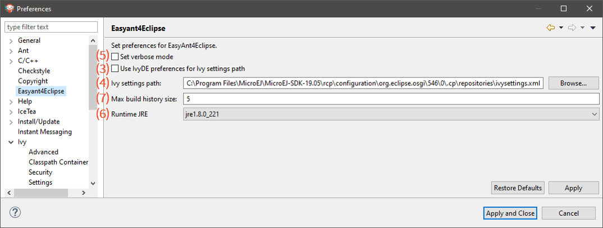
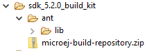

.. _mmm:

MicroEJ Module Manager
======================

Introduction
------------

Modern electronic device design involves many parts and teams to
collaborate to finally obtain a product to be sold on its market.
MicroEJ encourages modular design which involves various stake holders:
hardware engineers, UX designers, graphic designers, drivers/BSP
engineers, software engineers, etc.

Modular design is a design technique that emphasizes separating the
functionality of an application into independent, interchangeable
modules. Each module contains everything necessary to execute only one
aspect of the desired functionality. In order to have team members
collaborate internally within their team and with other teams, MicroEJ
provides a powerful modular design concept, with smart module
dependencies, controlled by the MicroEJ Module Manager (MMM). MMM frees
engineers from the difficult task of computing module dependencies.
Engineers specify the bare minimum description of the module
requirements.

The following schema introduces the main concepts detailed in this chapter.

.. figure:: images/mmm_flow.png
   :alt: MMM Overview
   :align: center
   :scale: 70%

   MMM Overview

MMM is based on the following tools:

-  Apache Ivy (`<http://ant.apache.org/ivy>`_) for dependencies
   resolution and module publication;

-  Apache EasyAnt
   (`<https://ant.apache.org/easyant/history/trunk/reference.html>`_) for
   module build from source code.

.. _mmm_specification:

Specification
-------------

MMM provides a non ambiguous semantic for dependencies
resolution. Please consult the MMM specification available on
`<https://developer.microej.com/packages/documentation/TLT-0831-SPE-MicroEJModuleManager-2.0-E.pdf>`_.

.. _mmm_module_skeleton:

Module Project Skeleton
-----------------------

In MicroEJ SDK, a new MicroEJ module project is created as follows:

- Select :guilabel:`File` > :guilabel:`New` > :guilabel:`Project...`,
- Select :guilabel:`MicroEJ` > :guilabel:`Module Project` [#warning_check_sdk_5_2]_,
- Fill the module information (project name, module organization, name and revision),
- Select one of the suggested skeletons depending on the desired :ref:`module nature <module_natures>`,
- Click on :guilabel:`Finish`.

The project is created and a set of files and directories are generated from the selected skeleton.

.. note:: 
  When an empty Eclipse project already exists or when the skeleton has to be created within an existing directory, 
  the MicroEJ module is created as follows:

  - In the `Package Explorer`, click on the parent project or directory,
  - Select :guilabel:`File` > :guilabel:`New` > :guilabel:`Other...`,
  - Select :guilabel:`EasyAnt` > :guilabel:`EasyAnt Skeleton`.

.. _mmm_module_description:

Module Description File
-----------------------

A module description file is an Ivy configuration file named ``module.ivy``, located at the root
of each MicroEJ module project. 
It describes the :ref:`module nature <module_natures>` (also called build type) and dependencies to other modules.

.. code-block:: xml

   <ivy-module version="2.0" xmlns:ea="http://www.easyant.org" xmlns:m="http://ant.apache.org/ivy/extra" 
                             xmlns:ej="https://developer.microej.com" ej:version="2.0.0"> 
       <info organisation="[organisation]" module="[name]" status="integration" revision="[version]">
           <ea:build organisation="com.is2t.easyant.buildtypes" module="[buildtype_name]" revision="[buildtype_version]">
               <ea:property name="[buildoption_name]" value="[buildoption_value]"/>
           </ea:build>
       </info>
       
       <configurations defaultconfmapping="default->default;provided->provided">
           <conf name="default" visibility="public"/>
           <conf name="provided" visibility="public"/>
           <conf name="documentation" visibility="public"/>
           <conf name="source" visibility="public"/>
           <conf name="dist" visibility="public"/>
           <conf name="test" visibility="private"/>
       </configurations>
       
       <publications>
       </publications>
       
       <dependencies>
         <dependency org="[dep_organisation]" name="[dep_name]" rev="[dep_version]"/>
       </dependencies>
   </ivy-module>        

Enable MMM Semantic
~~~~~~~~~~~~~~~~~~~

The MMM semantic is enabled in a module by adding the MicroEJ XML
namespace and the ``ej:version`` attribute in the ``ivy-module`` node:

.. code-block:: xml

   <ivy-module xmlns:ej="https://developer.microej.com" ej:version="2.0.0">

.. note::

   Multiple namespaces can be declared in the ``ivy-module`` node.

MMM semantic is enabled in the module created with the
:ref:`mmm_module_skeleton`.

.. _mmm_module_dependencies:

Module Dependencies
~~~~~~~~~~~~~~~~~~~

Module dependencies are added to the ``dependencies`` node as follow:

.. code-block:: xml
   :emphasize-lines: 2

   <dependencies>
     <dependency org="[dep_organisation]" name="[dep_name]" rev="[dep_version]"/>
   </dependencies>

When no matching rule is specified, the default matching rule is
``compatible``.

Dependency Matching Rule
++++++++++++++++++++++++

The following matching rules are specified by MMM:

.. list-table::
   :widths: 2 2 3
   :header-rows: 1

   * - Name
     - Range Notation
     - Semantic
   * - compatible
     - [M.m.p-RC, (M+1).0.0-RC[
     - Equal or up to next major version.  Default if not set.
   * - equivalent
     - [M.m.p-RC, M.(m+1).0-RC [
     - Equal or up to next minor version
   * - greaterOrEqual
     - [M.m.p-RC, ∞[
     - Equal or greater versions
   * - perfect
     - [M.m.p-RC, M.m.(p+1)-RC[
     - Exact match (strong dependency)

Set the matching rule of a given dependency with ``ej:match="matching rule"``.  For example:

.. code-block:: xml

   <dependency org="[dep_organisation]" name="[dep_name]" rev="[dep_version]" ej:match="perfect" />

Dependency Visibility
+++++++++++++++++++++

- A dependency declared ``public`` is transitively resolved by upper
  modules.  The default when not set.
- A dependency declared ``private`` is only used by the module itself,
  typically for:

   - Bundling the content into the module
   - Testing the module

The visibility is set by the configurations declared in the
``configurations`` node.  For example:

.. code-block:: xml
   :emphasize-lines: 2

   <configurations defaultconfmapping="default->default;provided->provided">
       <conf name="[conf_name]" visibility="private"/>
   </configurations>

The configuration of a dependency is specified by setting the ``conf``
attribute, for example:

.. code-block:: xml

   <dependency org="[dep_organisation]" name="[dep_name]" rev="[dep_version]" conf="[conf_name]->*" />

Automatic Update Before Resolution
~~~~~~~~~~~~~~~~~~~~~~~~~~~~~~~~~~

The Easyant plugin ``ivy-update`` can be used to automatically update
the version (attribute ``rev``) of every module dependencies declared.

.. code-block:: xml
   :emphasize-lines: 2

   <info organisation="[organisation]" module="[name]" status="integration" revision="[version]">
       <ea:plugin org="com.is2t.easyant.plugins" name="ivy-update" revision="1.+" />
   </info>

When the plugin is enabled, for each :ref:`module dependency <mmm_module_dependencies>`, MMM will check
the version declared in the module file and update it to the highest
version available which satisfies the matching rule of the dependency.

.. _mmm_build_options:

Build Options
~~~~~~~~~~~~~

MMM build options can be set with:

.. code-block:: xml

   <ea:property name="[buildoption_name]" value="[buildoption_value]"/>

The following build options are globally available:

.. list-table:: Build Options
   :widths: 1 5 3
   :header-rows: 1

   * - Property Name
     - Description
     - Default Value
   * - ``target``
     - Path of the build directory ``target~``.
     - ``${basedir}/target~``

Refer to the documentation of :ref:`module_natures` for specific build
options.

.. _mmm_configuration:

MicroEJ Module Manager Configuration 
-------------------------------------

By default, when starting an empty workspace, MicroEJ SDK is configured to import dependencies
from :ref:`MicroEJ Central Repository <central_repository>` and to publish built modules to a local directory.
The repository configuration is stored in a :ref:`settings file <mmm_settings_file>` (``ivysettings.xml``), and the default one
is located at ``$USER_HOME\.microej\microej-ivysettings-[VERSION].xml``

.. _mmm_preferences_page:

Preferences Page
~~~~~~~~~~~~~~~~

The MMM preferences page in the MicroEJ SDK is available at :guilabel:`Window` > :guilabel:`Preferences` > :guilabel:`MicroEJ` > :guilabel:`Module Manager` [#warning_check_sdk_5_2]_.

   .. figure:: images/mmm_preferences_5-2_annotated.png
      :alt: MMM Preferences Page
      :align: center

      MMM Preferences Page

This page allows to configure the following elements:

1. ``Settings File``: the file describing how to connect :ref:`module repositories <module_repository>`. See the :ref:`settings file <mmm_settings_file>` section.
2. ``Options``: files declaring MMM options. See the :ref:`Options <mmm_options>` section.
3. ``Use Module repository as Build repository``: 
   the :ref:`settings file <mmm_settings_file>` for connecting the build repository in place of the one bundled in MicroEJ SDK.
   This option shall not be enabled by default and is reserved for advanced configuration.
4. ``Build repository Settings File``:
   the :ref:`settings file <mmm_settings_file>` for connecting the build repository in place of the one bundled in MicroEJ SDK.
   This option is automatically initialized the first time MicroEJ SDK is launched. 
   It shall not be modified by default and is reserved for advanced configuration.
5. ``Set verbose mode``: to enable advanced debug traces when building a module.
6. ``Runtime JRE``: the Java Runtime Environment that executes the build process.
7. ``Max build history size``: the maximum number of previous builds available in :guilabel:`Build Module` shortcut list:
   
   .. figure:: images/mmm_shortcut_build_module.png
      :align: center

.. _mmm_settings_file:

Settings File
~~~~~~~~~~~~~

The settings file is an XML file that describes how MMM connects local or online :ref:`module repositories <module_repository>`.
The file format is described in `Apache Ivy documentation <https://ant.apache.org/ivy/history/2.5.0/settings.html>`_.

To configure MMM to a custom settings file (usually from an :ref:`offline repository <repository_offline>`):

1. Set :guilabel:`Settings file` to a custom ``ivysettings.xml`` settings file [#warning_check_sdk_5_2]_,
2. Click on :guilabel:`Apply and Close` button

If the workspace is not empty, it is recommended to trigger a full resolution
and rebuild all the projects using this new repository configuration:

1. Clean caches
   
   - In the Package Explorer, right-click on a project;
   - Select :guilabel:`Ivy` > :guilabel:`Clean all caches`.
2. Resolve projects using the new repository
   
   To resolve all the workspace projects, click on the :guilabel:`Resolve All` button in the toolbar:

   .. figure:: images/mmm_shortcut_resolveAll.png
      :align: center

   To only resolve a subset of the workspace projects:
   
   - In the Package Explorer, select the desired projects,
   - Right-click on a project and select :guilabel:`Ivy` > :guilabel:`Clean all caches`.
3. Trigger Add-On Library processors for automatically generated source code
   
   - Select :guilabel:`Project` > :guilabel:`Clean...`,
   - Select :guilabel:`Clean all projects`,
   - Click on :guilabel:`Clean` button.

.. _mmm_options:

Options
~~~~~~~

Options can be used to parameterize a :ref:`module description file <mmm_module_description>` or a :ref:`settings file <mmm_settings_file>`.
Options are declared as key/value pairs in a `standard Java properties file <https://en.wikipedia.org/wiki/.properties>`_, and are expanded using the ``${my_property}`` notation.

A typical usage in a :ref:`settings file <mmm_settings_file>` is for extracting repository server credentials, such as HTTP Basic access authentication:

1. Declare options in a properties file

   .. figure:: images/mmm_preferences_options_settings_declaration.png
      :align: center

2.  Register this property file to MMM options

   .. figure:: images/mmm_preferences_options_settings_register.png
      :align: center

3. Use this option in a :ref:`settings file <mmm_settings_file>`

   .. figure:: images/mmm_preferences_options_settings_usage.png
      :align: center

A typical usage in a :ref:`module description file <mmm_module_description>` is for factorizing dependency versions across multiple modules projects:

1. Declare an option in a properties file

   .. figure:: images/mmm_preferences_options_declaration.png
      :align: center

2. Register this property file to MMM options

   .. figure:: images/mmm_preferences_options_register.png
      :align: center

3. Use this option in a :ref:`module description file <mmm_module_description>`

   .. figure:: images/mmm_preferences_options_usage.png
      :align: center

.. _mmm_module_build:

Module Build
------------

In MicroEJ SDK, the build of a MicroEJ module project can be started as follows:

  - In the `Package Explorer`, right-click on the project,
  - Select :guilabel:`Build Module`.

   .. figure:: images/mmm_build_module.png
      :alt: Module build
      :align: center

      Module Build

The build of a module can take time depending on

   - the :ref:`module nature <module_natures>` to build, 
   - the number and the size of module dependencies to download,
   - the repository connection bandwidth, ...

The module build logs are redirected to the integrated console. 

Alternatively, the build of a MicroEJ module project can be started from the build history:

   .. figure:: images/mmm_build_module_istory.png
      :alt: Module Build History
      :align: center

      Module Build History

.. _mmm_build_kit:

Build Kit
---------

The Module Manager Build Kit is a consistent set of tools, scripts, configuration and artifacts required for building modules in command-line mode.
Starting from MicroEJ SDK ``5.4.0``, it also contains a :ref:`mmm_cli` (CLI).
The Build Kit allows to work in headless mode (e.g. in a terminal) and to build your modules using a Continuous Integration tool.

The Build Kit is bundled with MicroEJ SDK and can be exported using the following steps: [#warning_check_sdk_5_3]_

- Select :guilabel:`File` > :guilabel:`Export` > :guilabel:`MicroEJ` > :guilabel:`Module Manager Build Kit`,
- Choose an empty :guilabel:`Target directory`,
- Click on the :guilabel:`Finish` button.

Once the Build Kit is fully exported, the directory content shall look like:

.. code-block:: console

  /
  ├─ bin
  │  ├─ mmm
  │  └─ mmm.bat
  ├─ conf
  ├─ lib
  ├─ microej-build-repository
  │  ├─ ant-contrib
  │  ├─ com
  │  ├─ ...
  │  └─ ivysettings.xml
  ├─ microej-module-repository
  │  └─ ivysettings.xml
  └─ release.properties

- Add the ``bin`` directory of the Build Kit directory to the ``PATH`` environment variable of your machine. 
- Make sure the ``JAVA_HOME`` environment variable is set and points to a JRE/JDK installation or that ``java`` executable is in the ``PATH`` environment variable (Java 8 is required)
- Confirm that the installation works fine by executing the command ``mmm --version``. The result should display the MMM CLI version.

The ``mmm`` tool can run on any supported :ref:`Operating Systems <system-requirements>`:

- on Windows, either in the command prompt using the Windows batch script ``mmm.bat`` or in `MinGW environments <https://en.wikipedia.org/wiki/MinGW>`_ such as `Git BASH <https://gitforwindows.org/>`_ using the bash script ``mmm``.
- on Mac OS X and Linux distributions using the bash script ``mmm``.

The build repository (``microej-build-repository`` directory) contains scripts and tools for building modules. It is specific to a MicroEJ SDK version and shall not be modified by default.

The module repository (``microej-module-repository`` directory) contains a default :ref:`mmm_settings_file` for importing modules from :ref:`central_repository` and this local repository (modules that are locally built will be published to this directory).
You can override with custom settings or by extracting an :ref:`offline repository <repository_offline>`.

To go further with headless builds, please consult :ref:`the next chapter <mmm_cli>` for command line builds, 
and this :ref:`tutorial <tutorial_setup_automated_build_using_jenkins_and_artifactory>` to setup MicroEJ modules build in continuous integration environments.

.. [#warning_check_sdk_5_2] If using MicroEJ SDK versions lower than ``5.2.0``, please refer to the :ref:`following section <mmm_former_sdk_5_2>`.
.. [#warning_check_sdk_5_3] If using MicroEJ SDK versions lower than ``5.4.0``, please refer to the :ref:`following section <mmm_former_sdk_5_2_to_5_3>`.

.. _mmm_cli:

Command Line Interface
----------------------

Starting from version ``5.4.0``, MicroEJ SDK provides a Command Line Interface (CLI).
Please refer to the :ref:`Build Kit <mmm_build_kit>` section for installation details.

The following operations are supported by the MMM CLI:

- creating a module project
- cleaning a module project
- building a module project
- running a MicroEJ Application project on the Simulator
- publishing a module in a module repository

Usage
~~~~~

In order to use the MMM CLI for your project:

- go to the root directory of your project
- run the following command 

  .. code-block:: console

     mmm [OPTION]... [COMMAND]

where ``COMMAND`` is the command to execute (for example ``mmm build``).
The available commands are:

- ``help``: display help information about the specified command
- ``init``: create a new project
- ``clean``: clean the project
- ``build``: build the project
- ``publish``: build the project and publish the module
- ``run``: run the MicroEJ Application project on the Simulator

.. _mmm_cli_options:

The available options are:

- ``--help`` (``-h``): show the help message and exit
- ``--version`` (``-V``): print version information and exit
- ``--build-repository-settings-file`` (``-b``): path of the Ivy settings file for build scripts and tools. Defaults to ``${CLI_HOME}/microej-build-repository/ivysettings.xml``.
- ``--module-repository-settings-file`` (``-r``): path of the Ivy settings file for modules. Defaults to ``${CLI_HOME}/microej-module-repository/ivysettings.xml``.
- ``--ivy-file`` (``-f``): path of the project's Ivy file. Defaults to ``./module.ivy``.
- ``--verbose`` (``-v``): verbose mode. Disabled by default. Add this option to enable verbose mode.
- ``-Dxxx=yyy``: any additional option passed as system properties.

When no command is specified, MMM CLI executes Easyant with custom targets using the ``--targets`` (``-t``) option (defaults to ``clean,package``).

Shared configuration
~~~~~~~~~~~~~~~~~~~~

In order to share configuration across several projects, these parameters can be defined in the file ``${user.home}/.microej/.mmmconfig``.
This file uses the `TOML <https://toml.io>`__ format.
Parameters names are the same than the ones passed as system properties, except the character ``_`` is used as a separator instead of ``-``.
The parameters defined in the [options] section are passed as system properties.
Here is an example:

.. code:: toml

   build_repository_settings_file = "/home/johndoe/ivy-configuration/ivysettings.xml"
   module_repository_settings_file = "/home/johndoe/ivy-configuration/ivysettings.xml"
   ivy_file = "ivy.xml"

   [options]
   my.first.property = "value1"
   my.second.property = "value2"

.. warning:: 
   - TOML values must be surrounded with double quotes 
   - Backslash characters (``\``) must be doubled (for example a Windows path ``C:\\Users\\johndoe\\ivysettings.xml``)

Command line options take precedence over those defined in the configuration file.
So if the same option is defined in both locations, the value defined in the command line is used.

Commands
~~~~~~~~

.. _mmm_cli.commands.init:

**init**

The command ``init`` creates a new project (executes Easyant with ``skeleton:generate`` target).
The skeleton and project information must be passed with the following system properties:

- ``skeleton.org``: organisation of the skeleton module. Defaults to ``com.is2t.easyant.skeletons``.
- ``skeleton.module``: name of the skeleton module. Mandatory, defaults to ``microej-javalib``.
- ``skeleton.rev``: revision of the skeleton module. Mandatory, defaults to ``+`` (meaning the latest released version).
- ``project.org``: organisation of the project module. Mandatory, defaults to ``com.mycompany``.
- ``project.module``: name of the project module. Mandatory, defaults to ``myproject``.
- ``project.rev``: revision of the project module. Defaults to ``0.1.0``.
- ``skeleton.target.dir``: relative path of the project directory (created if it does not exist). Mandatory, defaults to the current directory.

For example

.. code:: console

   mmm init -Dskeleton.org=com.is2t.easyant.skeletons -Dskeleton.module=microej-javalib -Dskeleton.rev=4.2.8 -Dproject.org=com.mycompany -Dproject.module=myproject -Dproject.rev=1.0.0 -Dskeleton.target.dir=myproject

If one of these properties is missing, it will be asked in interactive mode:

.. code:: console

   $ mmm init -Dskeleton.org=com.is2t.easyant.skeletons -Dskeleton.module=microej-javalib -Dskeleton.rev=4.2.8 -Dproject.org=com.mycompany -Dproject.module=myproject -Dproject.rev=1.0.0
   
   ...
   
   -skeleton:check-generate:
      [input] skipping input as property skeleton.org has already been set.
      [input] skipping input as property skeleton.module has already been set.
      [input] skipping input as property skeleton.rev has already been set.
      [input] The path where the skeleton project will be unzipped [/home/tdelhomenie/microej/working/skeleton]

To force the non-interactive mode, the property ``skeleton.interactive.mode`` must be set to ``false``.
In non-interactive mode the default values are used for missing non-mandatory properties, and the creation fails if mandatory properties are missing.

.. code:: console

   $ mmm init -Dskeleton.org=com.is2t.easyant.skeletons -Dskeleton.module=microej-javalib -Dskeleton.rev=4.2.8 -Dproject.org=com.mycompany -Dskeleton.target.dir=myproject -Dskeleton.interactive.mode=false
   
   ...
   
   * Problem Report:

   expected property 'project.module': Module name of YOUR project

.. _mmm_cli.commands.build:

**clean**

The command ``clean`` cleans the project (executes Easyant with ``clean`` target).
For example

.. code:: console

   mmm clean

cleans the project.

.. _mmm.cli.commands.init:

**init**

The subcommand ``init`` creates a project (executes Easyant with ``skeleton:generate`` target).
The skeleton and project information must be passed with the following system properties:

- ``skeleton.org``: organisation of the skeleton module. Defaults to ``org.apache.easyant.skeletons``.
- ``skeleton.module``: name of the skeleton module. Mandatory, no default.
- ``skeleton.rev``: revision of the skeleton module. Mandatory, no default.
- ``project.org``: organisation of the project module. Mandatory, no default.
- ``project.module``: name of the project module. Mandatory, no default.
- ``project.rev``: revision of the project module. Defaults to ``0.1``.
- ``skeleton.target.dir``: relative path of the project directory (created if it does not exist). Defaults to the current directory.

For example

.. code:: console

   mmm init -Dskeleton.org=com.is2t.easyant.skeletons -Dskeleton.module=microej-javalib -Dskeleton.rev=4.2.8 -Dproject.org=com.mycompany -Dproject.module=myproject -Dproject.rev=1.0.0 -Dskeleton.target.dir=myproject

If one of these properties is missing, it will be asked in interactive mode:

.. code:: console

   $ mmm init -Dskeleton.org=com.is2t.easyant.skeletons -Dskeleton.module=microej-javalib -Dskeleton.rev=4.2.8 -Dproject.org=com.mycompany -Dproject.module=myproject -Dproject.rev=1.0.0
   
   ...
   
   -skeleton:check-generate:
      [input] skipping input as property skeleton.org has already been set.
      [input] skipping input as property skeleton.module has already been set.
      [input] skipping input as property skeleton.rev has already been set.
      [input] The path where the skeleton project will be unzipped [/home/tdelhomenie/microej/working/skeleton]

To force the non-interactive mode, the property ``skeleton.interactive.mode`` must be set to ``false``.
In non-interactive mode the default values are used for missing non-mandatory properties, and the creation fails if mandatory properties are missing.

.. code:: console

   $ mmm init -Dskeleton.org=com.is2t.easyant.skeletons -Dskeleton.module=microej-javalib -Dskeleton.rev=4.2.8 -Dproject.org=com.mycompany -Dskeleton.target.dir=myproject -Dskeleton.interactive.mode=false
   
   ...
   
   * Problem Report:

   expected property 'project.module': Module name of YOUR project

.. _mmm.cli.commands.build:

**build**

The command ``build`` builds the project (executes Easyant with ``clean,package`` targets).
For example

.. code:: console

   mmm build -f ivy.xml -v

builds the project with the Ivy file ivy.xml and in verbose mode.

.. _mmm_cli.commands.publish:

**publish**

The command ``publish`` builds the project and publishes the module. This command accepts the publication target as a parameter, amongst these values:

- ``local`` (default value): executes the ``clean,publish-local`` Easyant target, which publishes the project with the resolver referenced by the property ``local.resolver`` in the :ref:`mmm_settings_file`.
- ``shared``: executes the ``clean,publish-shared`` Easyant target, which publishes the project with the resolver referenced by the property ``shared.resolver`` in the :ref:`mmm_settings_file`.
- ``release``: executes the ``clean,release`` Easyant target, which publishes the project with the resolver referenced by the property ``release.resolver`` the :ref:`mmm_settings_file`.

For example

.. code:: console

   mmm publish local

builds the project and publishes the module using the local resolver.

.. _mmm_cli.commands.run:

**run**

The command ``run`` runs the application on the Simulator (executes Easyant with ``compile,simulator:run`` targets).
It has the following requirements:

- to run on the Simulator, the project must be configured with one of the following :ref:`module_natures`:

  - :ref:`module_natures.sandboxed_application`
  - :ref:`module_natures.standalone_application`
  - :ref:`module_natures.addon_lib`

- the property ``application.main.class`` must be set to the Fully Qualified Name of the application main class (for example ``com.mycompany.Main``)
- a MicroEJ Platform must be provided (see :ref:`platform_selection` section)
- :ref:`application_options` must be defined using properties file under in the ``build`` directory (see :ref:`define_option_in_properties_file` section)
- the module must have been built once before running the Simulator. So the ``mmm build`` command must be executed before running the Simulator the first time or after a project clean (``mmm clean`` command).
  
  .. note::

     The next times, it is not required to rebuild the module if source code files have been modified. The content of ``src/main/java`` and ``src/main/resources`` folders are automatically compiled by ``mmm run`` command before running the Simulator. 

For example

.. code:: console

   mmm run -D"platform-loader.target.platform.file"="/path/to/the/platform.zip"

runs the application on the given platform.

The Simulator can be launched in debug mode by setting the property ``execution.mode`` of the application file ``build/commons.properties`` to ``debug``:

.. code:: properties

   execution.mode=debug

The debug port can be defined with the property ``debug.port``.
Go to :ref:`Simulator Debug options section <simulator-remote-debug-options>` for more details.

**help**

The command ``help`` displays the help for a command.
For example

.. code:: console

   mmm help run

displays the help of the command ``run``.

Troubleshooting
---------------

.. _mmm_unresolved_dependency:

Unresolved Dependency
~~~~~~~~~~~~~~~~~~~~~

If the following message appears when resolving module dependencies:

.. code:: console

   :: problems summary ::
   :::: WARNINGS
      module not found: com.mycompany#mymodule;[M.m.p-RC,M.m.(p+1)-RC[

   		::::::::::::::::::::::::::::::::::::::::::::::

   		::          UNRESOLVED DEPENDENCIES         ::

   		::::::::::::::::::::::::::::::::::::::::::::::

   		:: com.mycompany#mymodule;[M.m.p-RC,M.m.(p+1)-RC[: not found

   		::::::::::::::::::::::::::::::::::::::::::::::

First, check that either a released module ``com.mycompany/mymodule/M.m.p`` or a snapshot module ``com.mycompany/mymodule/M.m.p-RCYYYYMMDD-HHMM`` exists in your module repository.

- If the module does not exist, 
  
  - if it is declared as a :ref:`direct dependency <mmm_module_dependencies>`, the module repository is not compatible with your source code. 
    You can either check if an other module version is available in the repository or add the missing module to the repository.
  - otherwise, this is likely a missing transitive module dependency. The module repository is not consistent.
    Check the module repository settings file and that consistency check has been enabled during the module repository build (see :ref:`module_repository_consistency`).

- If the module exists, this may be either a configuration issue or a network connection error. 
  We have to find the cause in the resolution logs with the :ref:`verbose mode option <mmm_cli_options>` enabled:

  For URL repositories, find:
  
  .. code:: console
        
        trying https://[MY_REPOSITORY_URL]/[MY_REPOSITORY_NAME]/com.mycompany/mymodule/
        tried https://[MY_REPOSITORY_URL]/[MY_REPOSITORY_NAME]/com.mycompany/mymodule/

  For filesystem repository, find:

  .. code:: console
     
        trying [MY_REPOSITORY_PATH]/com.mycompany/mymodule/
        tried [MY_REPOSITORY_PATH]/com.mycompany/mymodule/
      
  If your module repository URL or filesystem path does not appear, check your :ref:`settings file <mmm_settings_file>`. This is likely a missing resolver.

  Otherwise, if your module repository is an URL, this may be a network connection error between MMM (the client) and the module repository (the server).
  First, check for :ref:`invalid_certificate` issue.
  
  Otherwise, the next step is to debug at the HTTP level:
  
  .. code:: console
     
     HTTP response status: [RESPONSE_CODE] url=https://[MY_REPOSITORY_URL]/com.mycompany/mymodule/
     CLIENT ERROR: Not Found url=https://[MY_REPOSITORY_URL]/com.mycompany/mymodule/

  Depending on the HTTP error code:
  
  - ``401 Unauthorized``: check your `settings file credentials <https://ant.apache.org/ivy/history/2.5.0/settings/credentials.html>`_ configuration.
  - ``404 Not Found``: add the following options to log raw HTTP traffic:

    .. code-block:: shell
      
       -Dorg.apache.commons.logging.Log=org.apache.commons.logging.impl.SimpleLog -Dorg.apache.commons.logging.simplelog.showdatetime=true -Dorg.apache.commons.logging.simplelog.log.org.apache.http=DEBUG -Dorg.apache.commons.logging.simplelog.log.org.apache.http.wire=ERROR

    Particularly, Ivy requires the HTTP ``HEAD`` request which may be disabled by some servers.

.. _invalid_certificate:

Invalid Certificate
~~~~~~~~~~~~~~~~~~~
         
If the following message appears when resolving module dependencies:

.. code:: console
         
   HttpClientHandler: sun.security.validator.ValidatorException: PKIX path building failed: sun.security.provider.certpath.SunCertPathBuilderException: unable to find valid certification path to requested target url=[artifactory address]
         
The server may use a self-signed certificate that has to be added to the JRE trust store that is running MicroEJ Module Manager. Here is a way to do it: 
         
#. Install `Keystore Explorer <http://keystore-explorer.org/downloads.html>`_,
#. Start Keystore Explorer, and open file ``[JRE_HOME]/lib/security/cacerts`` or ``[JDK_HOME]/jre/lib/security/cacerts`` with the password ``changeit``. You may not have the right to modify this file. Edit rights if needed before opening it,
#. Click on :guilabel:`Tools`, then :guilabel:`Import Trusted Certificate`,
#. Select your certificate,
#. Save the ``cacerts`` file.

If the problem still occurs, add the following option to enable SSL protocol traces:

      .. code-block:: shell
   
         -Djavax.net.debug=all

This is useful to detect advanced errors such as:

- invalid certificate chain: one of root or intermediate certificate may be missing in the JRE/JDK truststore.
- TLS protocol negotiation issues.

Target "simulator:run" does not exist
~~~~~~~~~~~~~~~~~~~~~~~~~~~~~~~~~~~~~

If the following message appears when executing the ``mmm run`` command:

.. code:: console

   * Problem Report:

   Target "simulator:run" does not exist in the project "my-app".

it means that the command ``run`` is not supported by the build type declared by your module project.
Make sure it is one of the following ones:

- ``build-application``, with version ``7.1.0`` or higher
- ``build-microej-javalib``, with version ``4.2.0`` or higher
- ``build-firmware-singleapp``, with version ``1.3.0`` or higher

.. _meta_build:

Meta Build
----------

A Meta Build is a module allowing to build other modules.
It is typically used in a project containing multiple modules.
The Meta Build module serves as an entry point to build all the modules of the project.

Meta Build creation
~~~~~~~~~~~~~~~~~~~

- In the MicroeEJ SDK, select :guilabel:`File` > :guilabel:`New` > :guilabel:`Module Project`.

   .. figure:: images/sdk_new_module.png
      :alt: New Meta Build Project
      :align: center

      New Meta Build Project

- Fill in the fields ``Project name``, ``Organization``, ``Module`` and ``Revision``, then select the ``Skeleton`` named ``microej-meta-build``
- Click on :guilabel:`Finish`. A template project is automatically created and ready to use.

Meta Build configuration
~~~~~~~~~~~~~~~~~~~~~~~~

The main element to configure in a meta build is the list of modules to build.
This is done in 2 files, located at the root folder:

- ``public.modules.list`` which contains the list of the modules relative paths to build and publish.
- ``private.modules.list`` which contains the list of the modules relative paths to build.
  These modules are not published but only stored in a private and local repository in order to be fetched by the public modules.

The format of these files is a plain text file with one module path by line, for example:

.. code::

   module1
   module2
   module3

These paths are relative to the meta build root folder, which is set by default to the parent folder of the meta build module (``..``).
For this reason, a meta build module is generally created at the same level of the other modules to build.
Here is a typical structure of a meta build:

.. code-block::

  /
  ├─ module1
  │  ├─ ...
  │  └─ module.ivy
  ├─ module2
  │  ├─ ...
  │  └─ module.ivy
  ├─ module3
  │  ├─ ...
  │  └─ module.ivy
  └─ metabuild
     ├─ private.modules.list
     ├─ public.modules.list
     └─ module.ivy

The modules build order is calculated based on the dependency information.
If a module is a dependency of another module, it is built first.

For a complete list of configuration options, please refer to :ref:`Meta Build Module Nature <module_natures.meta_build>` section.

.. _mmm_former_sdk_5_2:

Former MicroEJ SDK Versions (lower than 5.2.0)
----------------------------------------------

This section describes MMM configuration elements for MicroEJ SDK versions lower than ``5.2.0``.

New MicroEJ Module Project
~~~~~~~~~~~~~~~~~~~~~~~~~~

The New MicroEJ Module Project wizard is available at :guilabel:`File` > :guilabel:`New` > :guilabel:`Project...`, :guilabel:`EasyAnt` > :guilabel:`EasyAnt Project`.

Preferences Pages
~~~~~~~~~~~~~~~~~

MMM Preferences Pages are located in two dedicated pages. The following pictures show the options mapping using the same options numbers declared in :ref:`Preferences Page <mmm_preferences_page>`.

Ivy Preferences Page
++++++++++++++++++++

The Ivy Preferences Page is available at :guilabel:`Window` > :guilabel:`Preferences` > :guilabel:`Ivy` > :guilabel:`Settings`.

.. figure:: images/mmm_preferences_up_to_5-1_ivy_settings_annotated.png
   :align: center

Easyant Preferences Page
++++++++++++++++++++++++

The Easyant Preferences Page is available at :guilabel:`Window` > :guilabel:`Preferences` > :guilabel:`EasyAnt4Eclipse`.

Build Kit
~~~~~~~~~

- Create an empty directory (e.g. ``mmm_sdk_[version]_build_kit``),
- Locate your SDK installation plugins directory (by default, ``C:\Program Files\MicroEJ\MicroEJ SDK-[version]\rcp\plugins`` on Windows OS),
- Open the file ``com.is2t.eclipse.plugin.easyant4e_[version].jar`` with an archive manager,
- Extract the directory ``lib`` to the target directory,
- Open the file ``com.is2t.eclipse.plugin.easyant4e.offlinerepo_[version].jar`` with an archive manager,
- Navigate to directory ``repositories``,
- Extract the file named ``microej-build-repository.zip`` for MicroEJ SDK ``5.x`` or ``is2t_repo.zip`` for MicroEJ SDK ``4.1.x`` to the target directory.

.. _mmm_former_sdk_5_2_to_5_3:

Former MicroEJ SDK Versions (from 5.2.0 to 5.3.x)
-------------------------------------------------

Build Kit
~~~~~~~~~

The Build Kit is bundled with MicroEJ SDK and can be exported using the following steps:

- Select :guilabel:`File` > :guilabel:`Export` > :guilabel:`MicroEJ` > :guilabel:`Module Manager Build Kit`,
- Choose an empty :guilabel:`Target directory`,
- Click on the :guilabel:`Finish` button.

Once the Build Kit is fully exported, the directory content shall look like:

..
   | Copyright 2008-2021, MicroEJ Corp. Content in this space is free 
   for read and redistribute. Except if otherwise stated, modification 
   is subject to MicroEJ Corp prior approval.
   | MicroEJ is a trademark of MicroEJ Corp. All other trademarks and 
   copyrights are the property of their respective owners.
