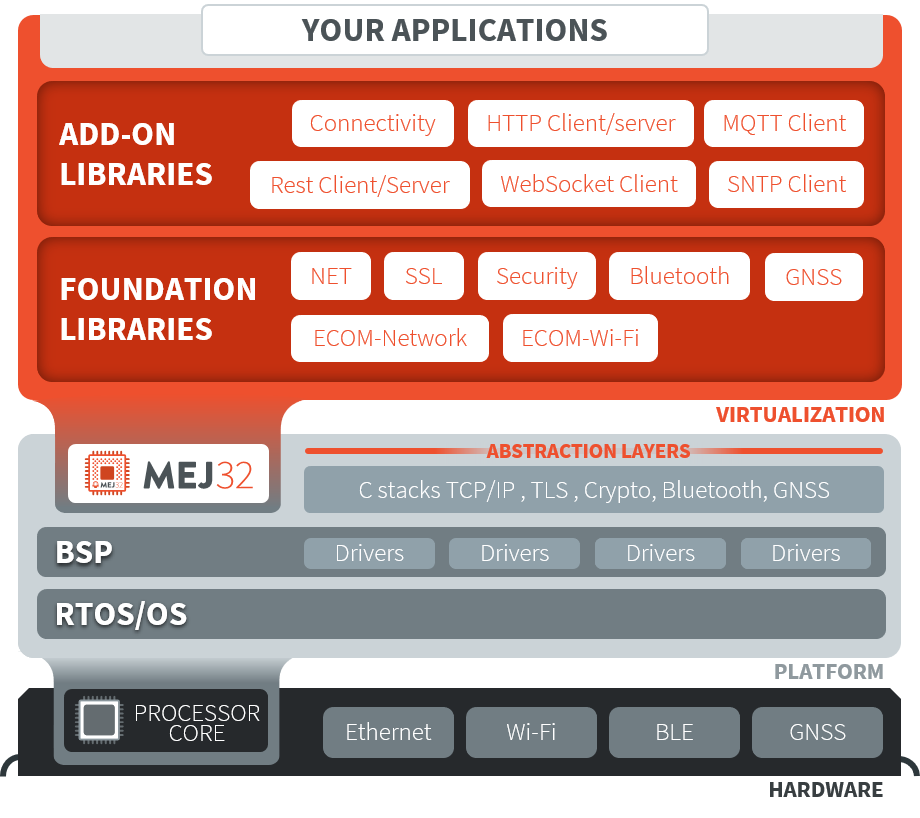

.. _networking:

Networking
==========

This section presents networking libraries.

The following schema shows the overall architecture and modules:

   Network Libraries Overview

Foundation Libraries
---------------------

.. list-table::
   :header-rows: 1
   :widths: 10 40 15 40

   *  -  Name
      -  Description
      -  Module Link
      -  Use
   
   *  -  ``Bluetooth``
      -  Bluetooth Low Energy (BLE) based on the Generic Attribute Profile (GATT).
      -  `bluetooth <https://repository.microej.com/modules/ej/api/bluetooth/>`_
      -  - `Bluetooth utility Library <https://repository.microej.com/modules/ej/library/iot/bluetooth-util/>`_

   *  -  ``ECOM-Network``
      -  Network interfaces management and IP configurations.
      -  `ecom-network <https://repository.microej.com/modules/ej/api/ecom-network/>`_
      - 

   *  -  ``ECOM-WIFI``
      -  Wi-Fi connectivity.
      -  `ecom-wifi <https://repository.microej.com/modules/ej/api/ecom-wifi/>`_
      -  - `Wi-Fi setup Example  <https://github.com/MicroEJ/Example-Wi-Fi-Setup>`_
         - `Wi-Fi utility Library <https://repository.microej.com/modules/ej/library/iot/wifi-util/>`_

   *  -  ``NET``
      -  Client and Server raw TCP/IP sockets.
      -  `net <https://repository.microej.com/modules/ej/api/net/>`_
      -  -  `NET Example <https://github.com/MicroEJ/Example-Standalone-Foundation-Libraries/tree/master/com.microej.example.foundation.net.helloworld>`_
         -  `NET utility Library <https://repository.microej.com/modules/ej/library/iot/net-util/>`_

   *  -  ``Security``
      -  Cryptographic operations.
      -  `security <https://repository.microej.com/modules/ej/api/security/>`_
      - 

   *  -  ``SSL``
      -  Client and Server secure sockets layer using Transport Layer Security (TLS) protocols.
      -  `ssl <https://repository.microej.com/modules/ej/api/ssl/>`_
      -  -  `SSL mutual client Example <https://github.com/MicroEJ/Example-Sandboxed-IOT/tree/master/com.microej.example.iot.ssl.mutual>`_
         -  `SSL mutual server Example <https://github.com/MicroEJ/Example-Sandboxed-IOT/tree/master/com.microej.example.iot.ssl.mutual.server>`_
         -  `SSL utility Library <https://repository.microej.com/modules/ej/library/iot/ssl-util/>`_

IoT Libraries
-------------

.. list-table::
   :header-rows: 1
   :widths: 10 40 15 40

   *  -  Name
      -  Description
      -  Module Link
      -  Use

   *  -  ``Android Connectivity`` 
      -  Network connection state and notifications.
      -  `android-connectivity <https://repository.microej.com/modules/ej/library/iot/android-connectivity/>`_
      -  - `Connectivity Example <https://github.com/MicroEJ/Example-Sandboxed-IOT/tree/master/com.microej.example.iot.androidconnectivity>`_

   *  -  ``HTTP Client``
      -  OpenJDK HTTP client.
      -  `httpclient <https://repository.microej.com/modules/ej/library/eclasspath/httpclient/>`_, `httpsclient <https://repository.microej.com/modules/ej/library/eclasspath/httpsclient/>`_
      -  - `HTTP client README <https://repository.microej.com/modules/ej/library/eclasspath/httpclient/1.3.0/README-1.3.0.md>`_
         - See also `REST client Example <https://github.com/MicroEJ/Example-Sandboxed-IOT/tree/master/com.microej.example.iot.ssl.rest>`_
   
   *  -  ``HTTP Server (Hoka)``
      -  Tiny footprint yet extensible web server. 
      -  `hoka <https://repository.microej.com/modules/ej/library/iot/hoka/>`_
      -  - `Hoka user manual <https://github.com/MicroEJ/LibraryJava-hoka/blob/master/hoka/user-manual.rst>`_
         - `Hoka Example <https://github.com/MicroEJ/Example-Hoka>`_   

   *  -  ``MQTT Client``
      -  Eclipse Paho MQTT 3.1.1 client.
      -  `mqtt <https://repository.microej.com/modules/org/eclipse/paho/mqttv3-microej/>`_, `mqtt-ssl <https://repository.microej.com/modules/org/eclipse/paho/mqttv3-ssl-microej/>`_
      -  - `MQTT publish Example <https://github.com/MicroEJ/Example-Sandboxed-IOT/tree/master/com.microej.example.iot.mqtt.publisher>`_  
         - `MQTT subscribe Example <https://github.com/MicroEJ/Example-Sandboxed-IOT/tree/master/com.microej.example.iot.ssl.mqtt.subscriber>`_

   *  -  ``REST Client``
      -  REpresentational State Tranfer (REST) client.
      -  `restclient <https://repository.microej.com/modules/ej/library/iot/restclient/>`_
      -  - `REST client README <https://repository.microej.com/modules/ej/library/iot/restclient/1.1.0/README-1.1.0.md>`_
         - `REST client Example <https://github.com/MicroEJ/Example-Sandboxed-IOT/tree/master/com.microej.example.iot.ssl.rest>`_

   *  -  ``REST Server``
      -  REpresentational State Tranfer (REST) server using on Hoka HTTP Server.
      -  `restserver <https://repository.microej.com/modules/ej/library/iot/restserver/>`_
      -  - `REST server Example <https://github.com/MicroEJ/Example-Sandboxed-IOT/tree/master/com.microej.example.iot.dynamic-restserver>`_

   *  -  ``SNTP Client``
      -  Simple Network Time Protocol (SNTP) client, used to retrieve the current time from an NTP server.
      -  `sntpclient <https://repository.microej.com/modules/ej/library/iot/sntpclient/>`_
      -  - `SNTP client README <https://repository.microej.com/modules/ej/library/iot/sntpclient/1.3.0/README-1.3.0.md>`_

   *  -  ``WebSocket Client``
      -  WebSocket client (RFC 6455).
      -  `websocket <https://repository.microej.com/modules/ej/library/iot/websocket/>`_, `websocket-secure <https://repository.microej.com/modules/ej/library/iot/websocket-secure/>`_
      -  - `WebSocket client README <https://repository.microej.com/modules/ej/library/iot/websocket/2.0.0/README-2.0.0.md>`_
         - `WebSocket client Example <https://github.com/MicroEJ/Example-Sandboxed-IOT/tree/master/com.microej.example.iot.ssl.websocket>`_  

Data Serialization Libraries
-----------------------------

.. list-table::
   :header-rows: 1
   :widths: 10 40 15 40

   *  -  Name
      -  Description
      -  Module Link
      -  Use

   *  -  ``CBOR``
      -  Concise Binary Object Representation (CBOR) encoder and decoder (RFC 7049).
      -  `cbor <https://repository.microej.com/modules/ej/library/iot/cbor/>`_
      -  - `CBOR Tutorial <tutorial_cbor>`_

   *  -  ``JSON``
      -  JavaScript Object Notation (JSON) encoder and decoder.
      -  `json <https://repository.microej.com/modules/ej/library/iot/json/>`_
      -  - `README <https://repository.microej.com/modules/ej/library/iot/json/1.0.0/README-1.0.0.md>`_
         - `JSON Tutorial <tutorial_json>`_

   *  -  ``Protocol Buffers``
      -  Google Protocol Buffers 3 encoder and decoder, supporting files compiled by ``protoc`` with lite plugin.
      -  `protobuf3 <https://repository.microej.com/modules/com/google/protobuf3/>`_
      -  - `Protobuf3 Example <https://github.com/MicroEJ/Demo-Protobuf3>`_

   *  -  ``XML``
      -  eXtensible Markup Language encoder and decoder (`kXML 3 <http://kxml.sourceforge.net/about.shtml>`_).
      -  `kxml2 <https://repository.microej.com/modules/org/kxml2/kxml2/>`_
      - - `XML Tutorial <tutorial_xml>`_

Cloud Agent Libraries
----------------------

.. list-table::
   :header-rows: 1
   :widths: 10 40 15 40

   *  -  Name
      -  Description
      -  Module Link
      -  Use

   *  -  ``AWS IoT Core``
      -  AWS IoT Core client, providing publish/subscribe functionalities.
      -  `aws-iot <https://repository.microej.com/modules/ej/library/iot/aws/aws-iot/>`_
      -  - `AWS IoT Core README <https://repository.microej.com/modules/ej/library/iot/aws/aws-iot/1.2.0/README-1.2.0.md>`_
         - `AWS IoT Core Example <https://github.com/MicroEJ/AWS>`_

   *  -  ``Google Cloud Platform Iot Core``
      -  Google Cloud Platform Iot Core client.
      -  `gcp-iotcore <https://repository.microej.com/modules/googlecloud/iotcore/>`_
      -  - `Google Cloud Platform Getting Started <https://developer.microej.com/features/iot-connectivity/get-started-google-cloud-iot-core-connectivity/>`_

..
   | Copyright 2008-2021, MicroEJ Corp. Content in this space is free
   for read and redistribute. Except if otherwise stated, modification
   is subject to MicroEJ Corp prior approval.
   | MicroEJ is a trademark of MicroEJ Corp. All other trademarks and
   copyrights are the property of their respective owners.
