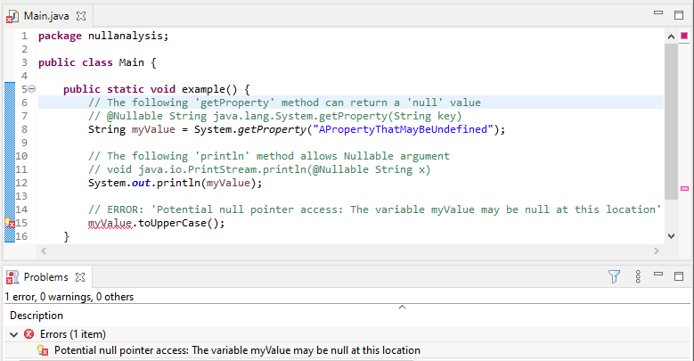
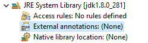
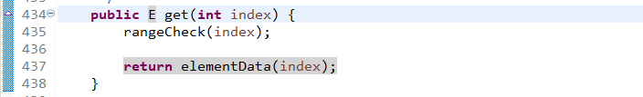
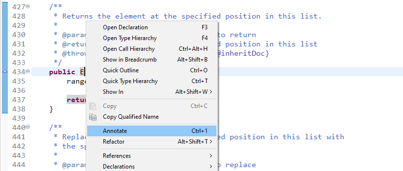
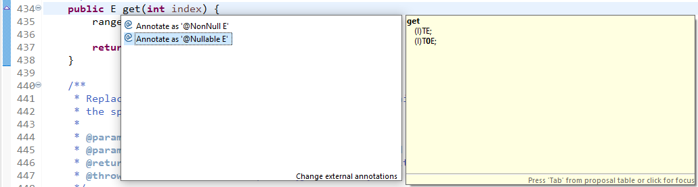

.. _null_analysis:

Null Analysis
=============

`NullPointerException <https://repository.microej.com/javadoc/microej_5.x/apis/java/lang/NullPointerException.html>`_ thrown at runtime is one of the most common causes for failure of Java programs.
The Null Analysis tool can detect such programming errors (misuse of potential ``null`` Java values) at compile-time.

The following example of code shows a typical Null Analysis error detection in MicroEJ SDK.

     
   Example of Null Analysis Detection

Principle
---------

The Null Analysis tool is based on Java annotations. Each Java field, method parameter and method return value must be marked to indicate whether it can be ``null`` or not.

Once the Java code is annotated, :ref:`module projects <mmm_module_skeleton>` must be configured to enable Null Analysis detection in MicroEJ SDK.

Java Code Annotation
---------------------

MicroEJ defines its own annotations:

- `@NonNullByDefault <https://repository.microej.com/javadoc/microej_5.x/apis/ej/annotation/NonNullByDefault.html>`_: Indicates that all fields, method return values or parameters can never be null in the annotated package or type.
  This rule can be overridden on each element by using the Nullable annotation.
  
- `@Nullable <https://repository.microej.com/javadoc/microej_5.x/apis/ej/annotation/Nullable.html>`_: Indicates that a field, local variable, method return value or parameter can be null.

- `@NonNull <https://repository.microej.com/javadoc/microej_5.x/apis/ej/annotation/NonNull.html>`_: Indicates that a field, local variable, method return value or parameter can never be null.

MicroEJ recommends annotating the Java code as follows:

- In each Java package, create a ``package-info.java`` file and annotate the Java package with ``@NonNullByDefault``.
  This is a common good practice to deal with non ``null`` elements by default to avoid undesired `NullPointerException <https://repository.microej.com/javadoc/microej_5.x/apis/java/lang/NullPointerException.html>`_.
  It enforces the behavior which is already widely outlined in Java coding rules.

  .. figure:: images/null_analysis_packageinfo.png

- In each Java type, annotate all fields, methods return values and parameters that can be null with ``@Nullable``.
  Usually, this information is already available as textual information in the field or method Javadoc comment. The following example of code shows where annotations must be placed:

  .. figure:: images/null_analysis_field_and_method.png

.. note::
   
   MicroEJ SDK ``5.3.0`` or higher requires annotations declared in `EDC-1.3.3 <https://repository.microej.com/modules/ej/api/edc/1.3.3/>`_ or higher. See `EDC 1.3.3 Changelog <https://repository.microej.com/modules/ej/api/edc/1.3.3/CHANGELOG-1.3.3.md>`_ for more details.

Module Project Configuration 
----------------------------

To enable the Null Analysis tool, a :ref:`module project <mmm_module_skeleton>` must be configured as follows:

- In the Package Explorer, right-click on the module project and select :guilabel:`Properties`,
- Navigate to :guilabel:`Java Compiler` > :guilabel:`Errors/Warnings`,
- In the :guilabel:`Null analysis` section, configure options as follows:

  .. figure:: images/null_analysis_project_configuration_checks.png

- Click on the :guilabel:`Configure...` link to configure MicroEJ annotations:
  
  - ``ej.annotation.Nullable``
  - ``ej.annotation.NonNull``
  - ``ej.annotation.NonNullByDefault``

  .. figure:: images/null_analysis_project_configuration_annotations.png

- In the :guilabel:`Annotations` section, check :guilabel:`Suppress optional errors with '@SuppressWarnings'` option:
  
  .. figure:: images/null_analysis_project_configuration_suppress_warnings.png

  This option allows to fully ignore Null Analysis errors in advanced cases using ``@SuppressWarnings("null")`` annotation.

If you have multiple projects to configure, you can then copy the content of the ``.settings`` folder to another :ref:`module project <mmm_module_skeleton>`.

.. figure:: images/null_analysis_settings_folder.png
   :alt: Null Analysis Settings Folder
     
   Null Analysis Settings Folder

.. warning::

   You may lose information if your target module project already has custom parameterization or if it was created with another MicroEJ SDK version. 
   In case of any doubt, please configure the options manually or merge with a text file comparator.

MicroEJ Libraries
-----------------

Many libraries available on :ref:`central_repository` are annotated with Null Analysis. If you are using a library which is not yet annotated, please contact :ref:`our support team <get_support>`.

For the benefit of Null Analysis, some APIs have been slightly constrained compared to the Javadoc description.
Here are some examples to illustrate the philosophy:

- `System.getProperty(String key, String def) <https://repository.microej.com/javadoc/microej_5.x/apis/java/lang/System.html#getProperty-java.lang.String-java.lang.String->`_ does not accept a ``null`` default value, which allows to ensure the returned value is always non ``null``.
- Collections of the Java Collections Framework that can hold ``null`` elements (e.g. `HashMap <https://repository.microej.com/javadoc/microej_5.x/apis/java/util/HashMap.html>`_) do not accept ``null`` elements. 
  This allows APIs to return ``null`` (e.g. `HashMap.get(Object) <https://repository.microej.com/javadoc/microej_5.x/apis/java/util/HashMap.html#get-java.lang.Object->`_) only when an element is not contained in the collection.

Implementations are left unchanged and still comply with the Javadoc description whether the Null Analysis is enabled or not. 
So if these additional constraints are not acceptable for your project, please disable Null Analysis.

External null annotations
-------------------------

In some situations, the null analysis will miss potential null access while using unannotated external libraries.
For instance : an ``ArrayList`` can contain null values, hence the ``get(int)`` method can return ``null`` values. However, this won't be taken into account by default during null analysis.

.. figure:: images/null_analysis_ArrayList_annotation_before.png

Manually annotate the ``get(int)`` method return type with **@Nullable** allows to detect the potential null access: 

.. figure:: images/null_analysis_ArrayList_annotation_after.png

Automatic annotation
~~~~~~~~~~~~~~~~~~~~

**~ For Eclipse IDE and it's derivatives ~**

An external annotations folder must be linked in order to enable automatic annotations.

Then the source code must be linked to the library to annotate. See `Manual annotation`_ in cases where the source code isn't available.

It is now possible to select a return or parameter type...

...and use the shortcut ``ctrl+1`` or right click and select *Annotate*.

An annotation can be set for the selected type:

Manual annotation
~~~~~~~~~~~~~~~~~

Eclipse External Annotations file creation
^^^^^^^^^^^^^^^^^^^^^^^^^^^^^^^^^^^^^^^^^^

Eclipse External Annotations (``.eea``) files follow the same construction rules as class files.

From the external annotations root folder,
a folder hierarchy corresponding to the package hierarchy of the class must be created:

**java.lang.String -> /java/lang/String.eea**

for inner classes, additional information is contained in the file name. Inner classes have a proper Eclipse External Annotations file :

**org.tool.a$1 -> /example/org/tool/a$1.eea**

Eclipse External Annotations file header
^^^^^^^^^^^^^^^^^^^^^^^^^^^^^^^^^^^^^^^^

*class <filepath but extension>*

example for file /example/org/tool/a$1.eea:

.. code-block:: text

    class /example/org/tool/a$1

Eclipse External Annotations file type/method
^^^^^^^^^^^^^^^^^^^^^^^^^^^^^^^^^^^^^^^^^^^^^

The construction is done as such:

.. code-block:: text

    <type/method name>
    <>
    <1 space><method descriptor>

*replace(char, char)* method of java/lang/String class :

.. code-block:: text

    class java/lang/String
    replace
     (CC)Ljava/lang/String;
     (CC)L1java/lang/String;

Placing the annotation
^^^^^^^^^^^^^^^^^^^^^^

0 represents the **@Nullable** annotation, and 1 represents the **@NonNull** annotation.
Eclipse External Annotations files are mostly based on JVM's specifications: https://docs.oracle.com/javase/specs/jvms/se7/html/jvms-4.html , 
it is the reference when writing type descriptors.

Descriptors:
^^^^^^^^^^^^

+ Basic types are replaced by the corresponding character **int -> I**
+ Object types are replaced by *L<typePath>;* **String -> Ljava/lang/String;**
+ Array types are replaced by *[<typeDescriptor>* **int [] -> [I**
+ **ArrayList<String> -> Ljava/util/ArrayList<Ljava/lang/String;>**
+ Parameterized types are replaced by *T<typeDescriptor>;* **T -> TT;**
+ Method descriptors are written *<returnTypeDescriptor>(<parametersTypeDescriptors>)* **int lastIndexOf(String str, int fromIndex) -> (Ljava/lang/String;I)I**
+ Everything is written in row without spaces  **[] [] ArrayList<String> -> [[Ljava/lang/ArrayList<Ljava/lang/String;>;**
+ Generic types input are replaced by *<typeDescriptor>* :

  In the following cases, nullable annotated descriptors are used as example.

  - **List<?> -> Ljava/util/List<*>; -> L0java/util/List<0*>;**
  - **List<? extends A> -> Ljava/util/List<+TA;>; -> L0java/util/List<+T0A;>;**
  - **List<? super A> -> Ljava/util/List<-TA;>; -> L0java/util/List<-T0A;>;**
  - **List<T> -> Ljava/util/List<TT;> -> L0java/util/List<T0T;>**
  - (ArrayList's to Array method) **public <T> T[] toArray(T[] a) -> <T:Ljava/lang/Object;>([TT;)[TT; -> <0T:Ljava/lang/Object;>([0T0T;)[0T0T;**

Update changes
~~~~~~~~~~~~~~

When editing ``.eea`` files manually it may be needed to clean the project **Project->Clean** for the changes to take place.
If the changes still aren't taken into account, the IDE must be restarted.

Sometimes a manual update can also be needed for automatic annotations.

Advanced Use
------------

For more information about Null Analysis and inter-procedural analysis, please visit `Eclipse JDT Null Analysis documentation <https://help.eclipse.org/2020-06/index.jsp?topic=/org.eclipse.jdt.doc.user/tasks/task-using_null_annotations.htm>`_.

..
   | Copyright 2008-2021, MicroEJ Corp. Content in this space is free 
   for read and redistribute. Except if otherwise stated, modification 
   is subject to MicroEJ Corp prior approval.
   | MicroEJ is a trademark of MicroEJ Corp. All other trademarks and 
   copyrights are the property of their respective owners.
