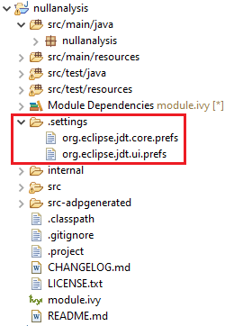
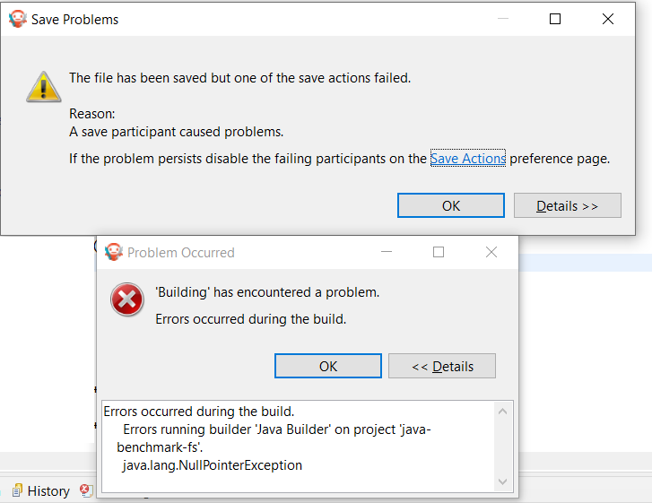

.. _null_analysis:

Null Analysis
=============

`NullPointerException`_ thrown at runtime is one of the most common causes for failure of Java programs.
The Null Analysis tool can detect such programming errors (misuse of potential ``null`` Java values) at compile-time.

The following example of code shows a typical Null Analysis error detection in MicroEJ SDK.

.. figure:: images/null_analysis_example.png
   :alt: Example of Null Analysis Detection
     
   Example of Null Analysis Detection

.. _NullPointerException: https://repository.microej.com/javadoc/microej_5.x/apis/java/lang/NullPointerException.html

Principle
---------

The Null Analysis tool is based on Java annotations. Each Java field, method parameter and method return value must be marked to indicate whether it can be ``null`` or not.

Once the Java code is annotated, :ref:`module projects <mmm_module_skeleton>` must be configured to enable Null Analysis detection in MicroEJ SDK.

Java Code Annotation
---------------------

MicroEJ defines its own annotations:

- `@NonNullByDefault`_: Indicates that all fields, method return values or parameters can never be null in the annotated package or type.
  This rule can be overridden on each element by using the Nullable annotation.
  
- `@Nullable`_: Indicates that a field, local variable, method return value or parameter can be null.

- `@NonNull`_: Indicates that a field, local variable, method return value or parameter can never be null.

MicroEJ recommends to annotate the Java code as follows:

- In each Java package, create a ``package-info.java`` file and annotate the Java package with ``@NonNullByDefault``.
  This is a common good practice to deal with non ``null`` elements by default to avoid undesired `NullPointerException`_.
  It enforces the behavior which is already widely outlined in Java coding rules.

  .. figure:: images/null_analysis_packageinfo.png

- In each Java type, annotate all fields, methods return values and parameters that can be null with ``@Nullable``.
  Usually, this information is already available as textual information in the field or method Javadoc comment. The following example of code shows where annotations must be placed:

  .. figure:: images/null_analysis_field_and_method.png

.. _@NonNullByDefault: https://repository.microej.com/javadoc/microej_5.x/apis/ej/annotation/NonNullByDefault.html
.. _@Nullable: https://repository.microej.com/javadoc/microej_5.x/apis/ej/annotation/Nullable.html
.. _@NonNull: https://repository.microej.com/javadoc/microej_5.x/apis/ej/annotation/NonNull.html
.. _EDC-1.3.3: https://repository.microej.com/modules/ej/api/edc/1.3.3/
.. _EDC 1.3.3 Changelog: https://repository.microej.com/modules/ej/api/edc/1.3.3/CHANGELOG-1.3.3.md

Module Project Configuration 
----------------------------

Requirements
~~~~~~~~~~~~

`EDC-1.3.3`_ or higher is required when MicroEJ SDK ``5.3.0`` or higher is used. See `EDC 1.3.3 Changelog`_ for more details.

Project configuration
~~~~~~~~~~~~~~~~~~~~~

To enable the Null Analysis tool, a :ref:`module project <mmm_module_skeleton>` must be configured as follows:

- In the Package Explorer, right-click on the module project and select :guilabel:`Properties`,
- Navigate to :guilabel:`Java Compiler` > :guilabel:`Errors/Warnings`,
- In the :guilabel:`Null analysis` section, configure options as follows:

  .. figure:: images/null_analysis_project_configuration_checks.png

- Click on the :guilabel:`Configure...` link to configure MicroEJ annotations:
  
  - ``ej.annotation.Nullable``
  - ``ej.annotation.NonNull``
  - ``ej.annotation.NonNullByDefault``

  .. figure:: images/null_analysis_project_configuration_annotations.png

- In the :guilabel:`Annotations` section, check :guilabel:`Suppress optional errors with '@SuppressWarnings'` option:
  
  .. figure:: images/null_analysis_project_configuration_suppress_warnings.png

  This option allows to fully ignore Null Analysis errors in advanced cases using ``@SuppressWarnings("null")`` annotation.

If you have multiple projects to configure, you can then copy the content of the ``.settings`` folder to an other :ref:`module project <mmm_module_skeleton>`.

     
   Null Analysis Settings Folder

.. warning::

   You may lose information if your target module project already has custom parameterization or if it was created with another MicroEJ SDK version. 
   In case of any doubt, please configure the options manually or merge with a text file comparator.

MicroEJ Libraries
-----------------

Many libraries available on :ref:`central_repository` are annotated with Null Analysis. If you are using a library which is not yet annotated, please contact :ref:`our support team <get_support>`.

For the benefit of Null Analysis, some APIs have been slightly constrained compared to the Javadoc description.
Here are some examples to illustrate the philosophy:

- `System.getProperty(String key, String def)`_ does not accept a ``null`` default value, which allows to ensure the returned value is always non ``null``.
- Collections of the Java Collections Framework that can hold ``null`` elements (e.g. `HashMap`_) do not accept ``null`` elements. 
  This allows APIs to return ``null`` (e.g. `HashMap.get(Object)`_) only when an element is not contained in the collection.

Implementations are left unchanged and still comply with the Javadoc description whether the Null Analysis is enabled or not. 
So if these additional constraints are not acceptable for your project, please disable Null Analysis.

.. _System.getProperty(String key, String def): https://repository.microej.com/javadoc/microej_5.x/apis/java/lang/System.html#getProperty-java.lang.String-java.lang.String-
.. _HashMap: https://repository.microej.com/javadoc/microej_5.x/apis/java/util/HashMap.html
.. _HashMap.get(Object): https://repository.microej.com/javadoc/microej_5.x/apis/java/util/HashMap.html#get-java.lang.Object-

Advanced Use
------------

For more information about Null Analysis and inter-procedural analysis, please visit `Eclipse JDT Null Analysis documentation <https://help.eclipse.org/2020-06/index.jsp?topic=/org.eclipse.jdt.doc.user/tasks/task-using_null_annotations.htm>`_.

Troubleshooting
---------------

The project cannot build anymore after Null Analysis setup
~~~~~~~~~~~~~~~~~~~~~~~~~~~~~~~~~~~~~~~~~~~~~~~~~~~~~~~~~~

.. code-block::

  java.lang.NullPointerException
    at org.eclipse.jdt.internal.compiler.lookup.BinaryTypeBinding.getMethods(BinaryTypeBinding.java:1348)
    at org.eclipse.jdt.internal.compiler.lookup.AnnotationBinding.setMethodBindings(AnnotationBinding.java:238)
    at org.eclipse.jdt.internal.compiler.lookup.LookupEnvironment.createAnnotation(LookupEnvironment.java:995)
    at org.eclipse.jdt.internal.compiler.lookup.AnnotationBinding.buildTargetAnnotation(AnnotationBinding.java:191)
    at org.eclipse.jdt.internal.compiler.lookup.AnnotationBinding.addStandardAnnotations(AnnotationBinding.java:79)
    at org.eclipse.jdt.internal.compiler.lookup.BinaryTypeBinding.retrieveAnnotations(BinaryTypeBinding.java:1698)
    at org.eclipse.jdt.internal.compiler.lookup.ReferenceBinding.getAnnotations(ReferenceBinding.java:1054)
    at org.eclipse.jdt.internal.compiler.lookup.BinaryTypeBinding.evaluateTypeQualifierDefault(BinaryTypeBinding.java:2021)
    at org.eclipse.jdt.internal.compiler.lookup.BinaryTypeBinding.getNonNullByDefaultValue(BinaryTypeBinding.java:1999)
    at org.eclipse.jdt.internal.compiler.lookup.BinaryTypeBinding.scanTypeForNullDefaultAnnotation(BinaryTypeBinding.java:1943)
    at org.eclipse.jdt.internal.compiler.lookup.BinaryTypeBinding.cachePartsFrom(BinaryTypeBinding.java:470)
    at org.eclipse.jdt.internal.compiler.lookup.LookupEnvironment.createBinaryTypeFrom(LookupEnvironment.java:1055)
    at org.eclipse.jdt.internal.compiler.lookup.LookupEnvironment.createBinaryTypeFrom(LookupEnvironment.java:1036)
    at org.eclipse.jdt.internal.compiler.Compiler.accept(Compiler.java:308)
    at org.eclipse.jdt.internal.compiler.lookup.LookupEnvironment.askForType(LookupEnvironment.java:326)
    at org.eclipse.jdt.internal.compiler.lookup.PackageBinding.getType(PackageBinding.java:195)
    at org.eclipse.jdt.internal.compiler.lookup.PackageBinding.initDefaultNullness(PackageBinding.java:325)
    at org.eclipse.jdt.internal.compiler.lookup.PackageBinding.getDefaultNullness(PackageBinding.java:339)
    at org.eclipse.jdt.internal.compiler.lookup.BinaryTypeBinding.scanTypeForNullDefaultAnnotation(BinaryTypeBinding.java:1965)
    at org.eclipse.jdt.internal.compiler.lookup.BinaryTypeBinding.cachePartsFrom(BinaryTypeBinding.java:470)
    at org.eclipse.jdt.internal.compiler.lookup.LookupEnvironment.createBinaryTypeFrom(LookupEnvironment.java:1055)
    at org.eclipse.jdt.internal.compiler.lookup.LookupEnvironment.createBinaryTypeFrom(LookupEnvironment.java:1036)
    at org.eclipse.jdt.internal.compiler.Compiler.accept(Compiler.java:308)
    at org.eclipse.jdt.internal.compiler.lookup.LookupEnvironment.askForType(LookupEnvironment.java:326)
    at org.eclipse.jdt.internal.compiler.lookup.LookupEnvironment.getType(LookupEnvironment.java:1705)
    at org.eclipse.jdt.internal.compiler.lookup.LookupEnvironment.getResolvedType(LookupEnvironment.java:1633)
    at org.eclipse.jdt.internal.compiler.lookup.LookupEnvironment.getResolvedJavaBaseType(LookupEnvironment.java:1645)
    at org.eclipse.jdt.internal.compiler.lookup.AnnotationBinding.buildTargetAnnotation(AnnotationBinding.java:134)
    at org.eclipse.jdt.internal.compiler.lookup.AnnotationBinding.addStandardAnnotations(AnnotationBinding.java:79)
    at org.eclipse.jdt.internal.compiler.lookup.BinaryTypeBinding.retrieveAnnotations(BinaryTypeBinding.java:1698)
    at org.eclipse.jdt.internal.compiler.lookup.ReferenceBinding.getAnnotations(ReferenceBinding.java:1054)
    at org.eclipse.jdt.internal.compiler.lookup.BinaryTypeBinding.evaluateTypeQualifierDefault(BinaryTypeBinding.java:2021)
    at org.eclipse.jdt.internal.compiler.lookup.BinaryTypeBinding.getNonNullByDefaultValue(BinaryTypeBinding.java:1999)
    at org.eclipse.jdt.internal.compiler.lookup.BinaryTypeBinding.scanTypeForNullDefaultAnnotation(BinaryTypeBinding.java:1943)
    at org.eclipse.jdt.internal.compiler.lookup.BinaryTypeBinding.cachePartsFrom(BinaryTypeBinding.java:470)
    at org.eclipse.jdt.internal.compiler.lookup.LookupEnvironment.createBinaryTypeFrom(LookupEnvironment.java:1055)
    at org.eclipse.jdt.internal.compiler.lookup.LookupEnvironment.createBinaryTypeFrom(LookupEnvironment.java:1036)
    at org.eclipse.jdt.internal.compiler.Compiler.accept(Compiler.java:308)
    at org.eclipse.jdt.internal.compiler.lookup.LookupEnvironment.askForType(LookupEnvironment.java:326)
    at org.eclipse.jdt.internal.compiler.lookup.PackageBinding.getType(PackageBinding.java:195)
    at org.eclipse.jdt.internal.compiler.lookup.PackageBinding.isViewedAsDeprecated(PackageBinding.java:314)
    at org.eclipse.jdt.internal.compiler.lookup.ReferenceBinding.isViewedAsDeprecated(ReferenceBinding.java:1745)
    at org.eclipse.jdt.internal.compiler.lookup.BinaryTypeBinding.cachePartsFrom(BinaryTypeBinding.java:566)
    at org.eclipse.jdt.internal.compiler.lookup.LookupEnvironment.createBinaryTypeFrom(LookupEnvironment.java:1055)
    at org.eclipse.jdt.internal.compiler.lookup.LookupEnvironment.createBinaryTypeFrom(LookupEnvironment.java:1036)
    at org.eclipse.jdt.internal.compiler.Compiler.accept(Compiler.java:308)
    at org.eclipse.jdt.internal.compiler.lookup.LookupEnvironment.askForType(LookupEnvironment.java:257)
    at org.eclipse.jdt.internal.compiler.lookup.LookupEnvironment.getType(LookupEnvironment.java:1703)
    at org.eclipse.jdt.internal.compiler.lookup.BinaryTypeBinding.getNonNullByDefaultValue(BinaryTypeBinding.java:1995)
    at org.eclipse.jdt.internal.compiler.lookup.BinaryTypeBinding.scanTypeForNullDefaultAnnotation(BinaryTypeBinding.java:1943)
    at org.eclipse.jdt.internal.compiler.lookup.BinaryTypeBinding.cachePartsFrom(BinaryTypeBinding.java:470)
    at org.eclipse.jdt.internal.compiler.lookup.LookupEnvironment.createBinaryTypeFrom(LookupEnvironment.java:1055)
    at org.eclipse.jdt.internal.compiler.lookup.LookupEnvironment.createBinaryTypeFrom(LookupEnvironment.java:1036)
    at org.eclipse.jdt.internal.compiler.Compiler.accept(Compiler.java:308)
    at org.eclipse.jdt.internal.compiler.lookup.LookupEnvironment.askForType(LookupEnvironment.java:326)
    at org.eclipse.jdt.internal.compiler.lookup.PackageBinding.getType(PackageBinding.java:195)
    at org.eclipse.jdt.internal.compiler.lookup.PackageBinding.initDefaultNullness(PackageBinding.java:325)
    at org.eclipse.jdt.internal.compiler.lookup.PackageBinding.getDefaultNullness(PackageBinding.java:339)
    at org.eclipse.jdt.internal.compiler.lookup.BinaryTypeBinding.scanTypeForNullDefaultAnnotation(BinaryTypeBinding.java:1965)
    at org.eclipse.jdt.internal.compiler.lookup.BinaryTypeBinding.cachePartsFrom(BinaryTypeBinding.java:470)
    at org.eclipse.jdt.internal.compiler.lookup.LookupEnvironment.createBinaryTypeFrom(LookupEnvironment.java:1055)
    at org.eclipse.jdt.internal.compiler.lookup.LookupEnvironment.createBinaryTypeFrom(LookupEnvironment.java:1036)
    at org.eclipse.jdt.internal.compiler.Compiler.accept(Compiler.java:308)
    at org.eclipse.jdt.internal.compiler.lookup.LookupEnvironment.askForType(LookupEnvironment.java:326)
    at org.eclipse.jdt.internal.compiler.lookup.LookupEnvironment.getType(LookupEnvironment.java:1705)
    at org.eclipse.jdt.internal.compiler.lookup.LookupEnvironment.getResolvedType(LookupEnvironment.java:1633)
    at org.eclipse.jdt.internal.compiler.lookup.LookupEnvironment.getResolvedJavaBaseType(LookupEnvironment.java:1645)
    at org.eclipse.jdt.internal.compiler.lookup.Scope.getJavaLangObject(Scope.java:2961)
    at org.eclipse.jdt.internal.compiler.lookup.ClassScope.connectSuperclass(ClassScope.java:1065)
    at org.eclipse.jdt.internal.compiler.lookup.ClassScope.connectTypeHierarchy(ClassScope.java:1246)
    at org.eclipse.jdt.internal.compiler.lookup.CompilationUnitScope.connectTypeHierarchy(CompilationUnitScope.java:367)
    at org.eclipse.jdt.internal.compiler.lookup.LookupEnvironment.completeTypeBindings(LookupEnvironment.java:518)
    at org.eclipse.jdt.internal.compiler.Compiler.internalBeginToCompile(Compiler.java:878)
    at org.eclipse.jdt.internal.compiler.Compiler.beginToCompile(Compiler.java:394)
    at org.eclipse.jdt.internal.compiler.Compiler.compile(Compiler.java:444)
    at org.eclipse.jdt.internal.compiler.Compiler.compile(Compiler.java:426)
    at org.eclipse.jdt.internal.core.builder.AbstractImageBuilder.compile(AbstractImageBuilder.java:386)
    at org.eclipse.jdt.internal.core.builder.BatchImageBuilder.compile(BatchImageBuilder.java:214)
    at org.eclipse.jdt.internal.core.builder.AbstractImageBuilder.compile(AbstractImageBuilder.java:318)
    at org.eclipse.jdt.internal.core.builder.BatchImageBuilder.build(BatchImageBuilder.java:79)
    at org.eclipse.jdt.internal.core.builder.JavaBuilder.buildAll(JavaBuilder.java:275)
    at org.eclipse.jdt.internal.core.builder.JavaBuilder.build(JavaBuilder.java:192)
    at org.eclipse.core.internal.events.BuildManager$2.run(BuildManager.java:832)
    at org.eclipse.core.runtime.SafeRunner.run(SafeRunner.java:45)
    at org.eclipse.core.internal.events.BuildManager.basicBuild(BuildManager.java:220)
    at org.eclipse.core.internal.events.BuildManager.basicBuild(BuildManager.java:263)
    at org.eclipse.core.internal.events.BuildManager$1.run(BuildManager.java:316)
    at org.eclipse.core.runtime.SafeRunner.run(SafeRunner.java:45)
    at org.eclipse.core.internal.events.BuildManager.basicBuild(BuildManager.java:319)
    at org.eclipse.core.internal.events.BuildManager.basicBuildLoop(BuildManager.java:371)
    at org.eclipse.core.internal.events.BuildManager.build(BuildManager.java:392)
    at org.eclipse.core.internal.events.AutoBuildJob.doBuild(AutoBuildJob.java:154)
    at org.eclipse.core.internal.events.AutoBuildJob.run(AutoBuildJob.java:244)
    at org.eclipse.core.internal.jobs.Worker.run(Worker.java:63)

You may encounter the two popup windows and the full stack trace above when your version of ``EDC`` is too old. To fix this issue, please use `EDC-1.3.3`_ or higher with MicroEJ SDK ``5.3.0`` or higher.

..
   | Copyright 2008-2023, MicroEJ Corp. Content in this space is free 
   for read and redistribute. Except if otherwise stated, modification 
   is subject to MicroEJ Corp prior approval.
   | MicroEJ is a trademark of MicroEJ Corp. All other trademarks and 
   copyrights are the property of their respective owners.
