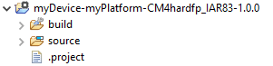

.. _platform_import:

MicroEJ Platform Import
=======================

A MicroEJ Platform is required to run a MicroEJ Standalone Application on the Simulator or build the Firmware binary for the target device.

The :ref:`platform-developer-guide` describes how to create a MicroEJ Platform from scratch for any kind of device. 
In addition, some MicroEJ Platforms are available for several commercial targets boards from main MCU/MPU chip manufacturers
at https://repository.microej.com/index.php?resource=JPF.

MicroEJ Platforms are distributed in two packages:

- source files imported in the workspace, called `Platforms in Workspace`. This is the default case.
- binary files imported in the :ref:`MicroEJ repository <workspace>`, ending with the ``.jpf`` extension. As of MicroEJ SDK ``5.3.0``, this package is deprecated.

Source Platform Import
----------------------

Import from Folder
~~~~~~~~~~~~~~~~~~

This section applies when the Platform files are already available on a local folder. 
This is likely the case when the files are checked out from a Version Control System, such as a local git repository clone. 

.. note::

   If you are going to import a Platform from MicroEJ Github, you can follow the specific :ref:`github` section instead (the projects will be automatically imported).

- Select :guilabel:`File` > :guilabel:`Import…` > :guilabel:`General` >
  :guilabel:`Existing Projects into Workspace` > :guilabel:`Select
  root directory` > :guilabel:`Browse…`.
- Select the root directory. The wizard will automatically discover projects to import.
- Click on :guilabel:`Finish` button.

Import from Zip File
~~~~~~~~~~~~~~~~~~~~

This sections applies when the Platform files are packaged in a ``.zip`` file. 

- Select :guilabel:`File` > :guilabel:`Import…` > :guilabel:`General` >
  :guilabel:`Existing Projects into Workspace` > :guilabel:`Select
  archive file` > :guilabel:`Browse…`.
- Select the zip of the project (e.g. ``x.zip``). The wizard will automatically discover projects to import.
- Click on :guilabel:`Finish` button.

Platform Build
~~~~~~~~~~~~~~

MicroEJ Platforms are usually shared with only the Platform configuration files. 
Once the projects are imported, follow the platform-specific documentation to build the Platform.

Once imported or built, a Platform project should be available as following:

   MicroEJ Platform Project

The ``source`` folder contains the Platform content which can be set to the ``target.platform.dir`` option.

Binary Platform Import
----------------------

After downloading the MicroEJ Platform ``.jpf`` file, launch MicroEJ SDK to import the MicroEJ Platform:

-  Open the Platform view in MicroEJ SDK, select :guilabel:`Window` >
   :guilabel:`Preferences` > :guilabel:`MicroEJ` > :guilabel:`Platforms`. The
   view should be empty on a fresh install of the tool

   .. figure:: images/platformImport.png
      :alt: MicroEJ Platform Import
      :align: center
      :width: 797px
      :height: 468px

      MicroEJ Platform Import

-  Press :guilabel:`Import...` button.

-  Choose :guilabel:`Select File...` and use the :guilabel:`Browse` option
   to navigate to the ``.jpf`` file containing your MicroEJ Platform, 
   then read and accept the license agreement to proceed.

   .. figure:: images/platformSelect.png
      :alt: MicroEJ Platform Selection
      :align: center
      :width: 569px
      :height: 636px

      MicroEJ Platform Selection

-  The MicroEJ Platform should now appear in the :guilabel:`Platforms` view,
   with a green valid mark.

   .. figure:: images/platformList.png
      :alt: MicroEJ Platform List
      :align: center
      :width: 797px
      :height: 468px

      MicroEJ Platform List

..
   | Copyright 2008-2020, MicroEJ Corp. Content in this space is free 
   for read and redistribute. Except if otherwise stated, modification 
   is subject to MicroEJ Corp prior approval.
   | MicroEJ is a trademark of MicroEJ Corp. All other trademarks and 
   copyrights are the property of their respective owners.
