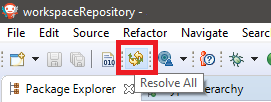

Modules Repository
==================

This section describes how to build and use a MicroEJ modules repository. 

A MicroEJ modules repository is a MicroEJ module that bundles a set of MicroEJ modules. 
It is often called an offline repository as it can distributed as a zip file
including the settings file for a local configuration of MicroEJ SDK.
It can also be imported in `MicroEJ Forge <https://www.microej.com/product/forge/>`_.

A modules repository takes its input modules from other of repositories, usually the :ref:`MicroEJ Central Repository <central_repository>` 
which is itself built by MicroEJ Corp. as a MicroEJ modules repository.

Create a Repository Project
---------------------------

In MicroEJ SDK, first create a new project using the ``artifact-repository`` :ref:`skeleton <mmm_module_skeleton>`.

- The ``ivysettings.xml`` file describes how MicroEJ SDK will fetch the content of this repository when it is extracted locally on file system. 
  This file will be packaged at the root of the zip file and does not need to be modified.

- The ``module.ivy`` file describes how to build repository and lists the module dependencies that will be included in this repository.

Once extracted, the modules repository is a tree structure where modules organization and name are mapped to folders.

   .. figure:: images/repository-tree.*
      :alt: Example of MicroEJ Module Repository Tree
      :align: center

      Example of MicroEJ Module Repository Tree

Configure Resolver for Input Modules 
------------------------------------

MicroEJ Module Manager (MMM) needs to fetch dependencies to build the modules repository. 
The location fetched by MMM is defined by a resolver.
The resolver is configured with the parameter ``bar.populate.from.resolver``. The preset value is the resolver
provided by default in MicroEJ SDK configuration, which is connected to :ref:`MicroEJ Central Repository <central_repository>`.

.. code-block:: xml

   <ea:property name="bar.populate.from.resolver" value="MicroEJChainResolver"/>

The ``MicroEJChainResolver`` defined in ``$USER_HOME\.microej\microej-ivysettings-[VERSION].xml`` is an URL resolver that points to MicroEJ Central Repository.

To ensure the repository will be compliant with the :ref:`MMM specification <mmm_specification>`, add the following option:

.. code-block:: xml

   <ea:property name="bar.check.as.v2.module" value="true"/>

The module defines other advanced options that do not need to be modified by default. 
Please consult the options description in the ``module.ivy`` generated by the skeleton.

Include Modules
---------------

Modules bundled into the modules repository must be declared in the ``dependencies`` element of the ``module.ivy`` file.

Include a Single Module
~~~~~~~~~~~~~~~~~~~~~~~

To add a module, declare the module dependency using the ``artifacts`` configuration.

For example, to add the ``ej.api.edc`` library version ``1.2.3``, copy the following line:

.. code-block:: xml

    <dependencies>
      <dependency conf="artifacts->*" transitive="false" org="ej.api" name="edc" rev="1.2.3" />
        
      <!-- ... other dependencies ... -->
    </dependencies>

.. note::

   We recommended to manually describe each dependency of the modules repository, to keep full control
   of the included modules as well as included modules versions.
   Module dependencies can still be transitively included by setting the dependency attribute to ``transitive="true"``. 
   In this case, the included module versions are those that have been resolved when the module was built.

Multiple versions the same module can be included by declaring each dependency using a different configuration.
The ``artifacts`` configuration has to be derived with a new name as many times as there are different versions to include.

.. code-block:: xml
   :emphasize-lines: 3,4,11,12

   <configurations defaultconfmapping="default->default;provided->provided">
     <conf name="artifacts" visibility="private"/>
     <conf name="artifacts_1" visibility="private"/>
     <conf name="artifacts_2" visibility="private"/>

     <!-- ... other configurations ... 
   </configurations>

   <dependencies>
      <dependency conf="artifacts->*" transitive="false" org="ej.api" name="edc" rev="1.0.0" />
      <dependency conf="artifacts_1->*" transitive="false" org="ej.api" name="edc" rev="2.0.0" />
      <dependency conf="artifacts_2->*" transitive="false" org="ej.api" name="edc" rev="3.0.0" />
        
      <!-- ... other dependencies ... -->
    </dependencies>

Include a Modules Repository
~~~~~~~~~~~~~~~~~~~~~~~~~~~~

To add all the modules already included in an other modules repository, 
declare the modules repository dependency using the ``repository`` configuration.

.. code-block:: xml

    <dependencies>
      <dependency conf="repository->*" transitive="false" org="ej.repository" name="microej-4.1" rev="1.10.0" />
        
      <!-- ... other dependencies ... -->
    </dependencies>

Build the Repository
--------------------

In the Package Explorer, right-click on the repository project and select ``Build Module``.

The build consists of two steps:

1. Gathers all module dependencies. The whole repository content is created
   under ``target~/mergedArtifactsRepository`` folder.
2. Checks the repository consistency. For each module, it tries to fetch it from this repository
   and fails the build if at least one of the dependencies cannot be resolved.

The repository module ``.zip`` file is built in the ``target~/artifacts/`` folder. 
This is file is also published possibly with the ``CHANGELOG.md``, ``LICENSE.txt`` and ``README.md``.

Configure the Offline Repository in MicroEJ SDK
-----------------------------------------------

By default, when starting an empty workspace, MicroEJ SDK is configured to fetch dependencies
from :ref:`MicroEJ Central Repository <central_repository>`. 

To configure it to fetch from a modules repository:

1. Unzip the modules repository ``.zip`` file to the folder of your choice.
2. In MicroEJ SDK, select ``Window > Preferences > Ivy > Settings``
3. Set ``Ivy settings path`` to the ``ivysettings.xml`` located at the root
   of the folder where the repository has been extracted.

If the workspace is not empty, it is necessary to trigger a full resolution
and rebuild all the projects using this new repository:

1. Clean caches
   
   - In the Package Explorer, right-click on a project 
   - Select :guilabel:`Ivy` > :guilabel:`Clean all caches`
2. Resolve projects using the new repository
   
To resolve all the workspace projects, click on the :guilabel:`Resolve All` button in the toolbar:

To only resolve a subset of projects can be resolved:
   
   - In the Package Explorer, select the desired projects
   - Right-click on a project and select :guilabel:`Ivy` > :guilabel:`Clean all caches`
   
3. Trigger the Add-On libraries processors for source code generation
   
   - Select :guilabel:`Project` > :guilabel:`Clean...`
   - Select :guilabel:`Clean all projects`
   - Click on the :guilabel:`Clean` button

..
   | Copyright 2008-2020, MicroEJ Corp. Content in this space is free 
   for read and redistribute. Except if otherwise stated, modification 
   is subject to MicroEJ Corp prior approval.
   | MicroEJ is a trademark of MicroEJ Corp. All other trademarks and 
   copyrights are the property of their respective owners.
