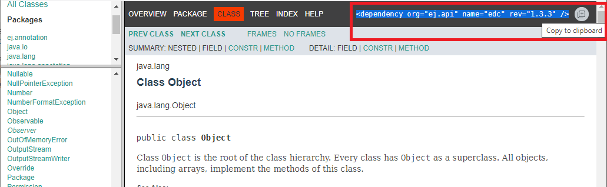

.. _module_repository:

Module Repository
=================

A module repository is a module that bundles a set of modules in a portable ZIP file. 
It is a tree structure where modules organizations and names are mapped to folders.

   .. figure:: images/repository-tree.*
      :alt: Example of MicroEJ Module Repository Tree
      :align: center

      Example of MicroEJ Module Repository Tree

A module repository takes its input modules from other repositories, usually the :ref:`MicroEJ Central Repository <central_repository>` 
which is itself built by MicroEJ Corp. as a module repository.

A module repository is often called an offline repository as it includes the settings file for a local configuration in MicroEJ SDK.
It can also be imported in `MicroEJ Forge <https://www.microej.com/product/forge/>`_.

Create a Repository Project
---------------------------

In the SDK, first create a new :ref:`module project <mmm_module_skeleton>` using the ``artifact-repository`` skeleton.

- The ``ivysettings.xml`` :ref:`settings file <mmm_settings_file>` describes how to import the modules of this repository when it is extracted locally on file system. 
  This file will be packaged at the root of the zip file and does not need to be modified.

- The ``module.ivy`` file describes how to build repository and lists the module dependencies that will be included in this repository.

Configure Resolver for Input Modules 
------------------------------------

MicroEJ Module Manager (MMM) needs to import dependencies to build the module repository. 
The location fetched by MMM is defined by a resolver.
The resolver is configured with the parameter ``bar.populate.from.resolver``. The preset value is the resolver
provided by default in MicroEJ SDK configuration, which is connected to :ref:`MicroEJ Central Repository <central_repository>`.

.. code-block:: xml

   <ea:property name="bar.populate.from.resolver" value="MicroEJChainResolver"/>

The ``MicroEJChainResolver`` is a URL resolver defined in ``$USER_HOME\.microej\microej-ivysettings-[VERSION].xml`` that points to MicroEJ Central Repository.

.. _module_repository_consistency:

Configure Consistency Check
---------------------------

The module repository consistency check consists in verifying that each declared module can be imported using the settings file provided by the repository.
Especially, it ensures that all module transitive dependencies are also available.

It is enabled by default to avoid further issues for repository users such as :ref:`mmm_unresolved_dependency`. This is done by the following option:

.. code-block:: xml

   <ea:property name="skip.retrieve.checker" value="false"/>

Moreover, to ensure the repository will be compliant with the :ref:`MMM specification <mmm_specification>`, add the following option:

.. code-block:: xml

   <ea:property name="bar.check.as.v2.module" value="true"/>

Advanced Options
----------------

There are other advanced options that do not need to be modified by default. 
These options are described in the ``module.ivy`` generated by the skeleton.

See also :ref:`module_natures.module_repository` for more details.

Include Modules
---------------

Modules bundled into the module repository must be declared in the ``dependencies`` element of the ``module.ivy`` file.

Include a Single Module
~~~~~~~~~~~~~~~~~~~~~~~

To add a module, declare the :ref:`module dependency <mmm_module_dependencies>` using the ``artifacts`` configuration:

.. code-block:: xml
   :emphasize-lines: 2

   <dependencies>
      <dependency conf="artifacts->*" transitive="false" org="[module_org]" name="[module_name]" rev="[module_version]" />
        
      <!-- ... other dependencies ... -->
   </dependencies>

For example, to add the ``ej.api.edc`` library version ``1.2.3``, write the following line:

.. code-block:: xml

   <dependency conf="artifacts->*" transitive="false" org="ej.api" name="edc" rev="1.2.3" />

.. note::

   We recommended to manually describe each dependency of the module repository, in order to keep full control
   of the included modules as well as included modules versions.
   Module dependencies can still be transitively included by setting the dependency attribute ``transitive`` to ``true``. 
   In this case, the included module versions are those that have been resolved when the module was built.

Multiple versions of the same module can be included by declaring each dependency using a different configuration.
The ``artifacts`` configuration has to be derived with a new name as many times as there are different versions to include.

.. code-block:: xml
   :emphasize-lines: 3,4,11,12

   <configurations defaultconfmapping="default->default;provided->provided">
      <conf name="artifacts" visibility="private"/>
      <conf name="artifacts_1" visibility="private"/>
      <conf name="artifacts_2" visibility="private"/>

      <!-- ... other configurations ... -->
   </configurations>

   <dependencies>
      <dependency conf="artifacts->*" transitive="false" org="[module_org]" name="[module_name]" rev="[module_version_1]" />
      <dependency conf="artifacts_1->*" transitive="false" org="[module_org]" name="[module_name]" rev="[module_version_2]" />
      <dependency conf="artifacts_2->*" transitive="false" org="[module_org]" name="[module_name]" rev="[module_version_3]" />
        
      <!-- ... other dependencies ... -->
   </dependencies>

Include a Module Repository
~~~~~~~~~~~~~~~~~~~~~~~~~~~

To add all the modules already included in an other module repository,
add the configuration ``repository`` if it does not exist:

.. code-block:: xml
   :emphasize-lines: 3

   <configurations defaultconfmapping="default->default;provided->provided">
      <!-- ... other configurations ... -->
      <conf name="repository" visibility="private" description="Repository to be embedded in the repository" />

   </configurations>

Then declare the module repository dependency using the ``repository``
configuration:

.. code-block:: xml
   :emphasize-lines: 2

   <dependencies>
      <dependency conf="repository->*" transitive="false" org="[repository_org]" name="[repository_name]" rev="[repository_version]" />
        
      <!-- ... other dependencies ... -->
   </dependencies>

Generate Javadoc
----------------

An overall Javadoc can be generated beside the included modules. It is built from of all Java elements of all libraries included in the module repository.

Javadoc generation is disabled in the ``module.ivy`` generated by the skeleton.
To enable javadoc generation, remove ``skip.javadoc`` option or set it to ``false``.

There are also javadoc specific options such as Java packages exclusion. Please refer to ``*javadoc*`` options of :ref:`module_natures.module_repository` reference documentation.

As of :ref:`SDK 5.3.0 <changelog-5.3.0>`, the :ref:`module dependency <mmm_module_dependencies>` line that defines a Java type is shown in the top menu. 

      Example of Javadoc Module Dependency

Build the Repository
--------------------

In the Package Explorer, right-click on the repository project and select ``Build Module``.

The build consists of two steps:

1. Gathers all module dependencies. The whole repository content is created
   under ``target~/mergedArtifactsRepository`` folder.
2. Checks the repository consistency. For each module, it tries to import it from this repository
   and fails the build if at least one of the dependencies cannot be resolved.

The module repository ``.zip`` file is built in the ``target~/artifacts/`` folder. 
This file may be published along with a ``CHANGELOG.md``, ``LICENSE.txt`` and ``README.md``.

.. _repository_offline:

Use the Offline Repository
--------------------------

By default, when starting an empty workspace, MicroEJ SDK is configured to import dependencies
from :ref:`MicroEJ Central Repository <central_repository>`. 

To configure MicroEJ SDK to import dependencies from a local module repository, follow these steps:

1. Open the :ref:`MMM preferences page <mmm_preferences_page>`: :guilabel:`Window` > :guilabel:`Preferences` > :guilabel:`MicroEJ` > :guilabel:`Module Manager`.
2. In :guilabel:`Module Manager` group, click on :guilabel:`Import Repository`.
3. Select the module repository ``.zip`` file, and then click on :guilabel:`Finish`.

The import may take some time. The module repository is unzipped in the folder ``${user.dir}/.microej/repositories``, and the settings are updated. 

..
   | Copyright 2020-2022, MicroEJ Corp. Content in this space is free 
   for read and redistribute. Except if otherwise stated, modification 
   is subject to MicroEJ Corp prior approval.
   | MicroEJ is a trademark of MicroEJ Corp. All other trademarks and 
   copyrights are the property of their respective owners.
