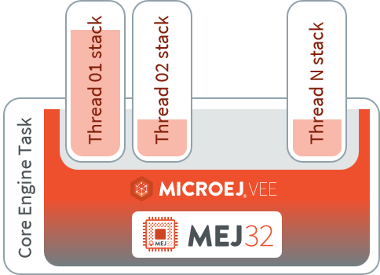
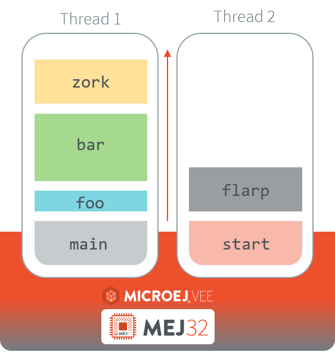
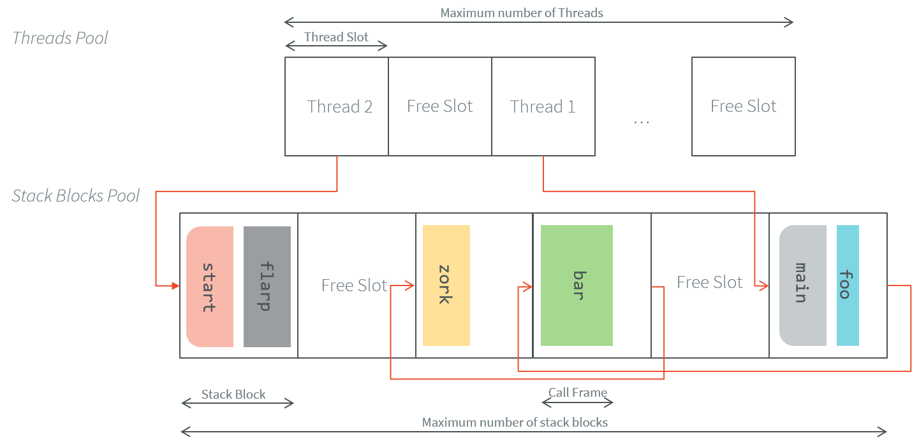

MicroEJ Runtime
===============

.. _mjvm_javalanguage:

Language
--------

MicroEJ allows to develop Applications in the `Java® Language Specification version 7 <https://docs.oracle.com/javase/specs/jls/se7/jls7.pdf>`_ with :ref:`some limitations <java_limitations>`, and supports code extensions written in :ref:`JavaScript <javascript>`.

Basically, Java source code is compiled by the Java compiler [1]_ into the binary format specified in the JVM specification [2]_. 
This binary code is linked by a tool named :ref:`SOAR <soar>` before execution: ``.class`` files and some other application-related files (see :ref:`Classpath <chapter.microej.classpath>` chapter) are linked to produce the final binary file that the :ref:`Core Engine <core_engine>` will execute.

.. note:: When opened in the SDK 5, make sure that the Compiler Compliance Level of your project is set to 1.7 to ensure the bytecode produced by the Java compiler is compatible with MicroEJ. The Compliance Level can be changed from the menu: :guilabel:`Window` > :guilabel:`Preferences` > :guilabel:`Java` > :guilabel:`Compiler`.

.. [1]
   The JDT compiler from the Eclipse IDE.

.. [2]
   Tim Lindholm & Frank Yellin, The Java™ Virtual Machine Specification, Second Edition, 1999

.. _java_lambdas:

Java Lambdas
~~~~~~~~~~~~

.. note::

   This feature is available for SDK 6 only and requires an Architecture version ``8.0.0`` or higher.

Starting from SDK 6 ``1.0.0``, it is possible to use Java lambdas in the code of your Application. This feature is disabled by default, you can enable it as follows:

- Apply the `Foojay Toolchains Plugin <https://github.com/gradle/foojay-toolchains>`__ in the ``settings.gradle.kts`` file of your project::

    plugins {
        id("org.gradle.toolchains.foojay-resolver-convention").version("0.9.0")
    }

- Set the project property ``java.lambdas.enabled`` to ``true`` in command line with the ``-P`` argument:

.. code:: console
   
   $ ./gradlew runOnSimulator -Pjava.lambdas.enabled=true

or by adding it in the ``gradle.properties`` file of your project::

    java.lambdas.enabled=true

.. _runtime_core_libraries:

Core Libraries
--------------

This section describes the core libraries which make up the runtime.
Theses Foundation Libraries are tightly coupled with the Core Engine.

.. _runtime_edc:

Embedded Device Configuration (EDC)
~~~~~~~~~~~~~~~~~~~~~~~~~~~~~~~~~~~

The Embedded Device Configuration specification defines the minimal
standard runtime environment for embedded devices. 

This module is always required in the build path of an Application project; 
and all others libraries depend on it. This library provides a set of options.
Refer to the chapter :ref:`application_options` which lists all available options.

**Specification Summary:**

.. include:: edc_spec_summary.rst

.. _runtime_bon:

Beyond Profile (BON)
~~~~~~~~~~~~~~~~~~~~~

This profile defines a suitable and flexible approach to fully control both memory usage 
and startup sequences on devices with limited memory resources, while remaining within the boundaries of Java semantics.

More precisely, it allows:

-  Controlling the initialization sequence in a deterministic way.

-  Defining persistent, immutable, read-only objects (that may be placed
   into non-volatile memory areas), and which do not require copies to
   be made in RAM to be manipulated.

-  Defining immortal, read-write objects that are always alive.

-  Accessing compile-time :ref:`constants <section.classpath.elements.constants>`.

Read the :ref:`Beyond Profile specification <bon_specification>` for more details.

**Specification Summary:**

.. include:: bon_spec_summary.rst

.. _runtime_sni:

Simple Native Interface (SNI)
~~~~~~~~~~~~~~~~~~~~~~~~~~~~~

SNI provides a simple mechanism for implementing native Java methods in the C language.

SNI allows you to:

-  Call a C function from a Java method.
-  Share memory between C and Java using Immortal arrays (see the :ref:`runtime_bon` to learn about immortal objects).

SNI also provides some Java APIs to manipulate some data arrays between Java world and the native (C) world.

Read the :ref:`Simple Native Interface specification <sni_specification>` for more details.

**Specification Summary:**

.. include:: sni_spec_summary.rst

.. _runtime_kf:

Kernel & Features (KF)
~~~~~~~~~~~~~~~~~~~~~~

The Kernel & Features semantic (KF) extends the runtime for managing Multi-Sandboxed Applications.

Read the :ref:`kf_specification` for more details, the :ref:`Multi-Sandbox capability <multisandbox>` of the Core Engine
and more generally the :ref:`kernel-developer-guide` chapter.

**Specification Summary:**

.. include:: kf_spec_summary.rst

Specifications
~~~~~~~~~~~~~~

.. toctree::
   :maxdepth: 1
   
   bon
   ../VEEPortingGuide/sni
   ../KernelDeveloperGuide/kf

.. _runtime_gt: 

Scheduler
---------

The Core Engine implements a multi-threaded environment without relying on native OS capabilities.
It includes a built-in scheduler and adopts a `Green Threads model <https://en.wikipedia.org/wiki/Green_threads>`_, enabling full control over thread management.
This design ensures that the scheduling policy is entirely portable and remains independent of the underlying RTOS or operating system on which the Core Engine runs.

   Green Threads Model Overview

For more details refer to the :ref:`Core Engine Theading Integration <core_engine_threading_integration>` section.

Scheduling Policy
~~~~~~~~~~~~~~~~~

The Core Engine defines the following scheduling semantic:

-  preemptive for different priorities,
-  round-robin for same priorities,
-  "priority inheritance protocol" when priority inversion occurs. This protocol raises the priority of a thread that is holding a monitor needed by a higher-priority thread,
   to the priority of that higher-priority thread (until exiting the monitor).

.. _runtime_threads_and_stacks:

Threads and Stacks Allocation
~~~~~~~~~~~~~~~~~~~~~~~~~~~~~

A thread requires a stack to execute. The stack holds an ordered list of call frames (one for each method currently called).
Each call frame contains runtime data for the corresponding method invocation, including slots for local variables and parameters.
The size of a call frame depends on the method’s content and complexity.

The following figure illustrates an example of thread execution, showing each thread with its associated stack of call frames:

**Core Engine Memory Allocation**

Memory for threads and their stacks is statically defined at link time. 
The Application developer is responsible for configuring these sizes. 
This design ensures that thread creation and stack operations remain lightweight and avoid any reliance on dynamic memory allocation or underlying RTOS/OS mechanisms at runtime.

- Thread Allocation: The maximum number of threads is specified via the :ref:`maximum number of threads option <option_number_of_threads>`.
- Stack Allocation: Each thread stack is composed of fixed-size blocks, which are allocated from a shared pool. 
  This approach ensures efficient memory reuse and eliminates fragmentation during execution. 
  The Application developer defines the :ref:`number of blocks in the pool <option_number_of_stack_blocks>` and the :ref:`size of each stack block <option_stack_block_size>`.

**Thread and Call Stack Behavior**

A Core Engine thread slot is only assigned when the thread is started by calling the `Thread.start()`_ method. 
At that point, it is assigned one stack block from the stack pool to begin execution.
Each method call pushes a call frame onto the stack. 
If a call frame cannot fit into the currently allocated stack block, the thread acquires an additional block from the pool.
Stacks dynamically grow by acquiring more blocks, as needed by the call depth. 
However, once a block is allocated to a thread, it remains associated with that thread until it is terminatied, even if the thread's stack depth decreases.

A thread remains active as long as it is executing. Its status can be checked by calling the `Thread.isAlive()`_ method for example. 
Once a thread is terminated (either by returning from its `Runnable.run()`_ method or due to an uncaught exception), its thread slot and all associated stack blocks are released.
The released thread slot and stack blocks can then be used by other threads.

The following figure illustrates a possible memory layout for the previously described thread example, showing how call frames can span across multiple fixed-size stack blocks within each thread's stack:

**Thread and Stack Memory Errors**

If there is insufficient memory to start a thread using the `Thread.start()`_ method, the Core Engine may throw one of the following exceptions:

- ``InternalLimitsError : too many java alive thread``: The maximum number of alive threads is reached. Check the :ref:`maximum number of threads option <option_number_of_threads>`.
- ``OutOfMemoryError: Stack space``: The stack pool is exhausted and no additional block can be allocated. Check the :ref:`number of stack blocks option <option_number_of_stack_blocks>` or the :ref:`stack block size option <option_stack_block_size>`.

If a method call requires more stack space than is available, the following exceptions may be thrown:

- ``StackOverflowError: EDC-1.3:E=-1``: The stack pool is exhausted and no additional block can be allocated. Check the :ref:`number of stack blocks option <option_number_of_stack_blocks>` or the :ref:`stack block size option <option_stack_block_size>`.
- ``StackOverflowError: EDC-1.3:E=-2``: The next call frame is too large to fit in a single stack block. Check the :ref:`stack block size option <option_stack_block_size>`.
- ``StackOverflowError: EDC-1.3:E=-3``: The thread has reached the maximum number of stack blocks it is allowed to use. Check the :ref:`the maximum number of blocks per thread option <option_maximum_number_of_stack_blocks_per_thread>`.

.. _Thread.start(): https://repository.microej.com/javadoc/microej_5.x/apis/java/lang/Thread.html#start--
.. _Thread.isAlive(): https://repository.microej.com/javadoc/microej_5.x/apis/java/lang/Thread.html#isAlive--
.. _Runnable.run(): https://repository.microej.com/javadoc/microej_5.x/apis/java/lang/Runnable.html#run()--

.. _runtime_gc: 

Managed Heap & Garbage Collector
--------------------------------

The Core Engine includes a state-of-the-art memory management
system, the Garbage Collector (GC). It manages a bounded piece of RAM
memory, devoted to the Managed world. The GC automatically frees dead Java
objects, and defragments the memory in order to optimize RAM usage. This
is done transparently while the Application keep running.

See also :ref:`Garbage Collector options <options_gc>` for more details.

Death Notification
~~~~~~~~~~~~~~~~~~

Most objects are reclaimable objects. Sometimes, they interact with the
native or system resources using handles. Those handles represent underlying data
that needs to be closed/freed/acknowledged/… when the object that holds
the handle dies.

The Application can get notified when an object is dead through the use of `WeakReference`_ objects. 
When such objects get their weak reference set to ``null`` by the system, they are
added to the `ReferenceQueue`_ they were assigned to at their creation.

Death Notification Actions
~~~~~~~~~~~~~~~~~~~~~~~~~~

Once an object has expired, it cannot be brought to life again. It is
the responsibility of the application to make provisions for all actions
that have to be taken on an object death. Such provisions are
materialized by subclasses of the `WeakReference`_ class.

`ReferenceQueue.poll()`_ and `ReferenceQueue.remove()`_ methods allow the
execution of a hook at the death of the object referenced by the weak
reference. The first one returns ``null`` when queue is empty whereas the
second one blocks while the queue is empty.

The Application is responsible of the execution of such hook.

.. _java_limitations:

Limitations
-----------

Primitive Types
~~~~~~~~~~~~~~~

Getting a Class instance of a primitive type is not supported:

- ``boolean.class``,
- ``byte.class``,
- ``char.class``,
- ``short.class``,
- ``int.class``,
- ``long.class``,
- ``float.class``,
- ``double.class``.

On Architecture ``8.x``, you will get the following dedicated error message:

.. code-block::

    SOAR-L ERROR :
    [M79] - Unsupported access to the Class instance of a primitive type (found 'boolean.class' in method 'com.mycompany.MyClass.myMethod()void')

On Architecture ``7.x`` you will get the following default error message:

.. code-block::

    No such field TYPE at com/mycompany/MyClass.myMethod()V.

.. _architecture_characteristics:

Architecture Characteristics
----------------------------

The Application can retrieve some characteristics of the Architecture on which it is running.
Architecture characteristics are automatically provided as :ref:`constants <section.classpath.elements.constants>`. Here are the most notable ones:

-  ``com.microej.architecture.capability=[tiny|single|multi]``: :ref:`Core Engine Capability <core_engine_capabilities>`
-  ``com.microej.architecture.name=[architecture_uid]``: Architecture name.
-  ``com.microej.architecture.level=[eval|prod]``: Usage level (Evaluation or Production).
-  ``com.microej.architecture.toolchain=[toolchain_uid]``: Toolchain name.
-  ``com.microej.architecture.version=[M.m.p]``: Architecture version.

See also :ref:`Architecture Naming Convention <architecture_naming_convention>` for more details.

The following code prints the formatted Architecture characteristics on standard output. You can copy-paste and adapt it to your needs.

.. code-block:: java
      
      String name = Constants.getString("com.microej.architecture.name");
      String version = Constants.getString("com.microej.architecture.version");
      String buildLabel = Constants.getString("com.microej.architecture.buildLabel");

      String usage = Constants.getString("com.microej.architecture.level");
      String usageStr;
      if (usage.equals("prod") || usage.equals("dev")) {
      	usageStr = "Production";
      } else if (usage.equals("eval")) {
      	usageStr = "Evaluation";
      } else {
      	usageStr = usage;
      }

      String capability = Constants.getString("com.microej.architecture.capability");
      String capabilityStr;
      if (capability.equals("multi")) {
      	capabilityStr = "Multi";
      } else if (capability.equals("tiny")) {
      	capabilityStr = "Tiny";
      } else if (capability.equals("single") || capability.equals("mono")) {
      	capabilityStr = "Mono";
      } else {
      	capabilityStr = capability;
      }

      String isaStr = Constants.getString("com.microej.architecture.architecturePrintableName");
      String toolchainName = Constants.getString("com.microej.architecture.toolchainPrintableName");
      String toolchainFullName = Constants.getString("com.microej.architecture.toolchain");

      System.out.println("- Name:                         " + name);
      System.out.println("- Version:                      " + version + " (" + buildLabel + ")");
      System.out.println("- Usage:                        " + usageStr);
      System.out.println("- Core Engine Capability:       " + capabilityStr + "-Sandbox");
      System.out.println("- Instruction Set Architecture: " + isaStr);
      System.out.println("- Compilation Toolchain:        " + toolchainName + " (" + toolchainFullName + ")");

.. _WeakReference: https://repository.microej.com/javadoc/microej_5.x/apis/java/lang/ref/WeakReference.html
.. _ReferenceQueue: https://repository.microej.com/javadoc/microej_5.x/apis/java/lang/ref/ReferenceQueue.html
.. _ReferenceQueue.poll(): https://repository.microej.com/javadoc/microej_5.x/apis/java/lang/ref/ReferenceQueue.html#poll--
.. _ReferenceQueue.remove(): https://repository.microej.com/javadoc/microej_5.x/apis/java/lang/ref/ReferenceQueue.html#remove--

..
   | Copyright 2008-2025, MicroEJ Corp. Content in this space is free 
   for read and redistribute. Except if otherwise stated, modification 
   is subject to MicroEJ Corp prior approval.
   | MicroEJ is a trademark of MicroEJ Corp. All other trademarks and 
   copyrights are the property of their respective owners.
