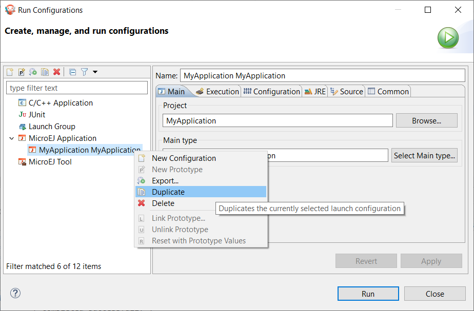
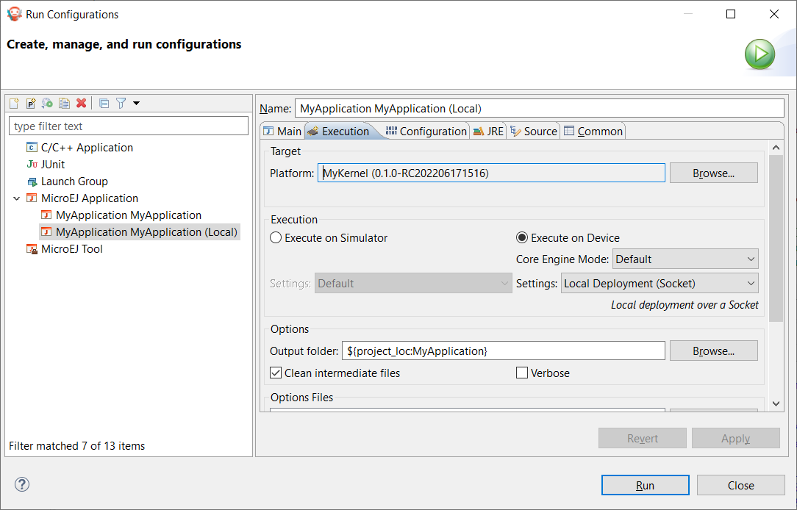

.. _chapter.application.deploy:

Run on the Device
=================

The deployment of a Sandboxed Application on a device depends on the Kernel implementation. We can group them in two categories:

- Local Deployment: the device is connected to the developer's computer, the SDK builds the ``.fo`` from the workspace project classes and transfers it on the device (recommended during application development).
- Remote Deployment: the Application is built, then the device connects a Repository where the Application is stored, and deploys it over the air using a device management system (production deployment).

In both cases, deploying a Sandboxed Application requires that a Multi-Sandbox Firmware is running on the device.
Please refer to the :ref:`kernel-developer-guide` to learn how to build it or browse 
the `Resources Repository <https://repository.microej.com/index.php?resource=FIRM&topic=ALL&version=ANY&edition=ANY>`_ 
for Multi-Sandbox demo Firmware available for popular hardware evaluation kits.

Local Deployment
----------------

Deploying a Application on a device locally is the easiest way to test it since it only requires:

- the Application project sources imported in the SDK,
- the device programmed with a Multi-Sandbox Firmware that provides the Local Deployment capability (you can browse the `Resources Repository <https://repository.microej.com/index.php?resource=FIRM&topic=ALL&version=ANY&edition=ANY>`_
  for available demos of such Multi-Sandbox Firmware),
- the device connected to the developer's computer either on the same network (LAN) or using a serial wire, depending on the Firmware capabilities.

If these prerequisites are fulfilled:

- duplicate the Run Configuration created in the chapter :ref:`chapter.application.sim`,

   Duplicate Run Configuration

- rename the duplicated Run Configuration, for example by prefixing by ``(Local)``,
- in the ``Execution`` tab, modify the ``Execution`` mode to ``Execute on Device``,
- select the option ``Local Deployment (Socket)`` in the ``Settings`` list.
  Note that depending on the device capability, the virtual device may implement a local deployment over a Comm Port.

   Configure Run Configuration

- go to the ``Configuration`` tab,
- select the item ``Local Deployment (Socket)``,
- set the IP address of the device in the ``Host`` field,
- click on the ``Run`` button to deploy the Application on the board.

The Console output should be::

   =============== [ Initialization Stage ] ===============
   =============== [ Converting fonts ] ===============
   =============== [ Converting images ] ===============
   =============== [ Build Application ] ===============
   =============== [ Completed Successfully ] ===============
   =============== [ Deploy on 192.168.0.7:4000 ] ===============
   =============== [ Completed Successfully ] ===============
   
   SUCCESS

The Application is deployed on the device and automatically started.
You can use a Serial terminal to get the traces of the Application::

   KERNEL Hello World!
   => Starting Feature MyApplication
   Feature MyApplication started!

Remote Deployment
-----------------

Remote Deployment requires to build and publish the Sandboxed Application module.
To do so, in the SDK, right-click on the Sandboxed Application project and click on ``Build Module``.

The build process will display messages in the console, ending up the following message:

::

    [echo] project hello published locally with version 0.1.0-RC201907091602

    BUILD SUCCESSFUL

    Total time: 1 minute 6 seconds

The files produced by the build process are located in a dedicated
``target~/artifacts`` folder in the project and is published to the 
target module repository declared in :ref:`MicroEJ Module Manager settings file <mmm_settings_file>`.

The file that ends with `.wpk` (the WPK file) is a portable file that contains all necessary binary data to build `.fo` files on any compatible Multi-Sandbox Firmware.
Then, the WPK file can be published to a `MICROEJ FORGE instance <https://www.microej.com/product/forge/>`_.
Please contact :ref:`our support team <get_support>` if you want to get more information on MICROEJ FORGE and automated Applications deployment through a device management system.

..
   | Copyright 2022, MicroEJ Corp. Content in this space is free 
   for read and redistribute. Except if otherwise stated, modification 
   is subject to MicroEJ Corp prior approval.
   | MicroEJ is a trademark of MicroEJ Corp. All other trademarks and 
   copyrights are the property of their respective owners.
