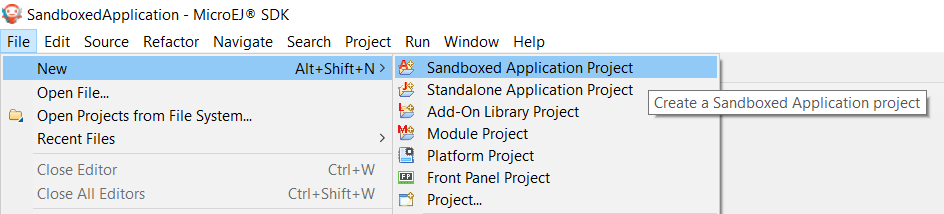
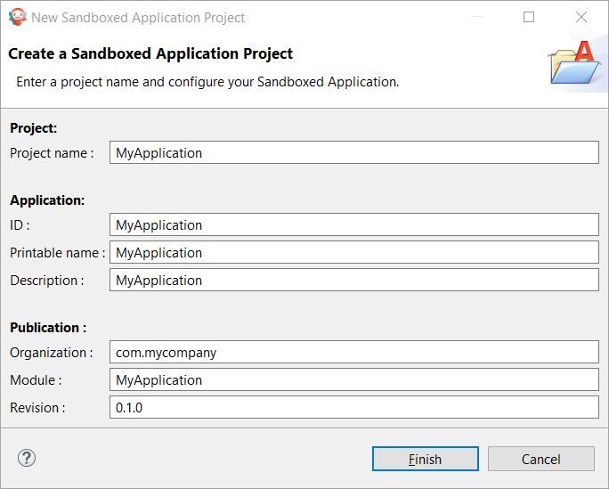

.. _chapter.application.firstApplication:

Create a First Application
==========================

Now that the :ref:`purposes of the Sandboxed Applications have been explained <sandboxed_application>`, let's create a first application.

A Sandboxed Application project can be created in the SDK with the menu :guilabel:`File` > :guilabel:`New` > :guilabel:`Sandboxed Application Project`.

   Sandboxed Application Project Creation Menu

The project creation window is displayed:

   Sandboxed Application Project Creation Form

Once the Application information are fulfilled and validated, the project is created with the following structure:

``src/main/java``
    Application Java sources;

``src/main/resources``
    Application resources (raw resources, images, fonts, nls);

``module.ivy``
    :ref:`Module description file <mmm_module_description>`, containing build information and dependencies of the project.

The next sections describe the required files to have your first basic Application.

Entry Point
-----------

A Sandboxed Application must contain a class implementing the ``ej.kf.FeatureEntryPoint`` interface in the ``src/main/java`` folder:

.. code:: java

    package com.mycompany;

    import ej.kf.FeatureEntryPoint;

    public class MyApplication implements FeatureEntryPoint {

        @Override
        public void start() {
            System.out.println("Feature MyApplication started!");
        }

        @Override
        public void stop() {
            System.out.println("Feature MyApplication stopped!");
        }
    }

This class is the entry point of the Application.
The method ``start`` is called when the Application is started.
It is considered as the main method of the Sandboxed Application.
The method ``stop`` is called when the Application is stopped.
Please refer to the :ref:`kernel_application_lifecycle` chapter to learn more about the Applications lifecycle.

The ``src/main/java`` folder is also the place to add all the other Java classes of the Application.

Configuration
-------------

A Sandboxed Application project must contain a file with the ``.kf`` extension in the ``src/main/resources`` folder.
This file contains the configuration of the Application.
Here is an example:

.. code:: properties

    name=MyApplication
    entryPoint=com.mycompany.MyApplication
    types=*
    version=0.1.0

It contains the following properties:

- **name**: the name of the Application
- **entryPoint**: the Full Qualified Name of the class implementing ``ej.kf.FeatureEntryPoint``
- **types**: this property defined the types included in the Application and must always be :literal:`* \ ` (do not forget the space at the end)
- **version**: the version of the Application

SSL Certificate
---------------

A Sandboxed Application requires a certificate for identification.
It must be located in the ``src/main/resources`` folder of the project.
The project created by the SDK provides a sample certificate.
This certificate is sufficient for testing, but it is recommended to provide your own.

Module Descriptor
-----------------

The ``module.ivy`` file is the :ref:`Module description file <mmm_module_description>` which contains the project information 
and declares all the libraries required by the Application.
See :ref:`mmm` for more information.

The dependencies must contain at least a module containing the ``ej.kf.FeatureEntryPoint`` class, for example the KF library:

.. code:: xml

    <dependency org="ej.api" name="kf" rev="1.6.1" />

..
   | Copyright 2022-2023, MicroEJ Corp. Content in this space is free 
   for read and redistribute. Except if otherwise stated, modification 
   is subject to MicroEJ Corp prior approval.
   | MicroEJ is a trademark of MicroEJ Corp. All other trademarks and 
   copyrights are the property of their respective owners.
