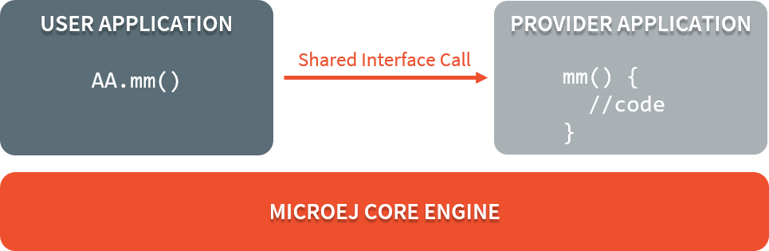
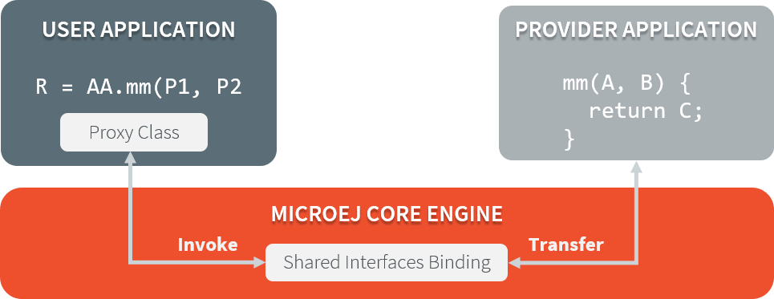
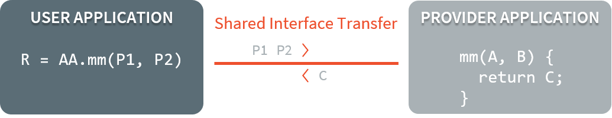

.. _chapter.shared.interfaces:

Shared Interfaces
=================

.. _section.shared.interfaces.contract:

Principle
---------

The Shared Interface mechanism provided by the Core Engine is an
object communication bus based on plain Java interfaces where method
calls are allowed to cross Sandboxed Applications boundaries
without relying on Kernel APIs.

The Shared Interface mechanism is the cornerstone for designing reliable
Service Oriented Architectures. Communication is based
on the sharing of interfaces defining APIs (Contract Oriented
Programming).

The basic schema:

-  A provider application publishes an implementation for a shared
   interface into a system registry.

-  A user application retrieves the implementation from the system
   registry and directly calls the methods defined by the shared
   interface.

   Shared Interface Call Mechanism

The Shared Interface mechanism is based on automatic proxy objects
created by the Core Engine. This offers a reliable
way for users to handle broken links in case the provider application
has been stopped or uninstalled.

Applications with a Shared Interface must provide a dedicated
implementation (called the Proxy class implementation). Its main goal is
to perform the remote invocation and provide a reliable implementation
regarding the interface contract even if the remote application fails to
fulfill its contract (unexpected exceptions, application killed, …). The
Core Engine will allocate instances of this Proxy class when an
implementation (of the Shared Interface) owned by another application is
being transferred to this application.

   Shared Interfaces Proxy Overview

This mecanism is formally specified in the :ref:`[KF] specification <kf_specification>`.

.. _section.shared.interfaces.element:

Shared Interface Usage
----------------------

Usage of a Shared Interface follows these steps:

#. Define the Shared Interface:

   #. Define the Java interface
   #. Implement the proxy for the interface
   #. Register the interface as a Shared Interface
#. From the provider application,

   #. Create an instance of this Shared Interface
   #. Register the instance to a KF service registry
#. From the consumer application,

   #. Retrieve a proxy of the instance from the KF service registry
   #. Call methods of the instance proxy.

Define the Shared Interface
~~~~~~~~~~~~~~~~~~~~~~~~~~~

Define the Java Interface
^^^^^^^^^^^^^^^^^^^^^^^^^

The definition of a Shared Interface starts by defining a standard Java
interface. For example:

.. code:: java

   package mypackage;
   public interface MyInterface {
       void foo();
   }

A Shared Interface includes all methods it declares, along with those inherited from its super types. 
It can extend any interface, including Feature interfaces (which may or may not be declared as Shared Interfaces) and Kernel interfaces.

Some restrictions apply to Shared Interfaces compared to standard Java
interfaces:

* Types for parameters and return values must be :ref:`transferable types <section.transferable.types>`;
* Thrown exceptions must be classes owned by the Kernel.

Implement the Proxy Class
^^^^^^^^^^^^^^^^^^^^^^^^^

A proxy class is implemented and executed on the client side.

with the following specification:

-  its fully qualified name is the shared interface fully qualified name append with ``Proxy``.
-  it extends the `Proxy`_ class.
-  it implements the Shared Interface
-  it provides an implementation of all interface methods

Each method of the implemented interface must be defined according to the
following pattern:

.. code:: java

   package mypackage;

   public class MyInterfaceProxy extends Proxy<MyInterface> implements MyInterface {
       @Override
       public void foo(){
           try {
               invoke(); // perform remote invocation
           } catch (Throwable e) {
               // Handle any errors thrown during the remote call, including dead Feature.               
               // Implement a behavior that complies with the method specification.
               // i.e. return a valid error code or throw a documented exception.
               // Logging traces for debug can also be added here.
           }
       }
   }

Each implemented method of the proxy class is responsible for performing
the remote call and catching all errors from the server side and to
provide an appropriate answer to the client application call according
to the interface method specification (contract).

The :ref:`Proxy class implementation <section.proxy.implementation>`
section documents how to perform the remote invocation.

Register the Shared Interface
^^^^^^^^^^^^^^^^^^^^^^^^^^^^^

To declare an interface as a Shared Interface, it must be registered in
a Shared Interfaces identification file. A Shared Interface
identification file is an XML file with the ``.si`` filename extension
and the following format:

::

   <sharedInterfaces>
       <sharedInterface name="mypackage.MyInterface"/>
   </sharedInterfaces>

Shared Interface identification files must be placed at the root of the
application classpath, typically it is defined in the
``src/main/resources`` folder.

Use the Shared Interface at Runtime
~~~~~~~~~~~~~~~~~~~~~~~~~~~~~~~~~~~

Projects Structure
^^^^^^^^^^^^^^^^^^

Both the consumer and the provider applications must have the Java
interface, the proxy class and the identification file on the classpath
in order to be able to use the Shared Interface.

Typically, the 3 files can be defined in an Add-On Library that both
application projects depend on.

Create and Share an instance of a Shared Interface
^^^^^^^^^^^^^^^^^^^^^^^^^^^^^^^^^^^^^^^^^^^^^^^^^^

The provider application can instantiate the Java interface. For
example:

.. code:: java

   MyInterface myInstance = new MyInterface() {
       @Override
       public void foo() {
           System.out.println("Hello world!");
       }
   };

In order to share the instance with other applications, the provider application must register the instance with some registry owned by the Kernel (see :ref:`Communication between Kernel and Feature <kernel_service_registry>` for details) like so:

.. code:: java

   ServiceFactory.register(MyInterface.class, myInstance);

Retrieve and Use a Proxy of a Shared Interface Instance
^^^^^^^^^^^^^^^^^^^^^^^^^^^^^^^^^^^^^^^^^^^^^^^^^^^^^^^

The consumer application can then retrieve the instance from the Kernel registry like so:

.. code:: java

   MyInterface otherAppInstance = ServiceFactory.getService(MyInterface.class);
   // otherAppInstance is actually an instance of the proxy class owned by the consumer application

Then it can call the interface methods transparently:

.. code:: java

   otherAppInstance.foo(); // remote invocation through the proxy

.. _section.transferable.types:

Transferable Types
------------------

In the process of a cross-application method call, parameters and return
value of methods declared in a Shared Interface must be transferred back
and forth between application boundaries.

   Shared Interface Parameters Transfer

The following table describes the rules applied depending on the element
to be transferred.

.. _table.si.transfer.rules:

.. list-table:: Shared Interface Types Transfer Rules
   :widths: 19 14 10 29
   :header-rows: 1

   - 

      - Type
      - Owner
      - Instance Owner
      - Rule

   - 

      - Base type
      - N/A
      - N/A
      - Passing by value. (``boolean``, ``byte``, ``short``, ``char``,
        ``int``, ``long``, ``double``, ``float``)

   - 

      - Any Class, Array or Interface
      - Kernel
      - Kernel
      - Passing by reference

   - 

      - Any Class, Array or Interface
      - Kernel
      - Application
      - Kernel specific. Converted to a target Feature object if the Kernel has registered a
        :ref:`Kernel type converter <kernelconverter>`, otherwise Forbidden.

   - 

      - Array of base types
      - Any
      - Application
      - Clone by copy

   - 

      - Arrays of references
      - Any
      - Application
      - Clone and transfer rules applied again on each element (recursively)

   - 

      - Shared Interface
      - Application
      - Application
      - Passing by indirect reference (Proxy creation). 

   - 

      - Any Class, Array or Interface
      - Application
      - Application
      - Forbidden

Objects created by an Application which type is owned by the Kernel
can be transferred to another Application provided this has been
authorized by the Kernel. When an argument transfer is forbidden, the call is
abruptly stopped and an `java.lang.IllegalAccessError`_ is thrown by the
:ref:`Core Engine <core_engine>`.

.. _java.lang.IllegalAccessError: https://repository.microej.com/javadoc/microej_5.x/apis/java/lang/IllegalAccessError.html

The list of Kernel types that can be transferred is Kernel specific, so you have to consult your Kernel specification.
The table below lists some well-known types that your Kernel likely can allow to be transferred through a Shared Interface, along with their behaviors. [#1]_.

.. list-table:: Transfer Rules for well-known Kernel Types
   :header-rows: 1

   -  - Type
      - Rule
   -  - `java.lang.Boolean <https://repository.microej.com/javadoc/microej_5.x/apis/java/lang/Boolean.html>`_
      - Clone by copy
   -  - `java.lang.Byte <https://repository.microej.com/javadoc/microej_5.x/apis/java/lang/Byte.html>`_
      - Clone by copy
   -  - `java.lang.Character <https://repository.microej.com/javadoc/microej_5.x/apis/java/lang/Character.html>`_
      - Clone by copy
   -  - `java.lang.Short <https://repository.microej.com/javadoc/microej_5.x/apis/java/lang/Short.html>`_
      - Clone by copy
   -  - `java.lang.Integer <https://repository.microej.com/javadoc/microej_5.x/apis/java/lang/Integer.html>`_
      - Clone by copy
   -  - `java.lang.Float <https://repository.microej.com/javadoc/microej_5.x/apis/java/lang/Float.html>`_
      - Clone by copy
   -  - `java.lang.Long <https://repository.microej.com/javadoc/microej_5.x/apis/java/lang/Long.html>`_
      - Clone by copy
   -  - `java.lang.Double <https://repository.microej.com/javadoc/microej_5.x/apis/java/lang/Double.html>`_
      - Clone by copy
   -  - `java.lang.String <https://repository.microej.com/javadoc/microej_5.x/apis/java/lang/String.html>`_
      - Clone by copy
   -  - `java.io.InputStream <https://repository.microej.com/javadoc/microej_5.x/apis/java/io/InputStream.html>`_
      - Create a Proxy reference
   -  - `java.util.Date <https://repository.microej.com/javadoc/microej_5.x/apis/java/util/Date.html>`_
      - Clone by copy
   -  - `java.util.List<T> <https://repository.microej.com/javadoc/microej_5.x/apis/java/util/List.html>`_
      - Clone by copy with recursive element conversion
   -  - `java.util.Map<K,V> <https://repository.microej.com/javadoc/microej_5.x/apis/java/util/Map.html>`_
      - Clone by copy with recursive keys and values conversion

.. [#1] For these types to be transferable, a dedicated :ref:`Kernel Type Converter <kernel_type_converter>` must have been registered in the Kernel.

.. _section.proxy.implementation:

Implementing the Proxy Class
----------------------------

Remote invocation methods are defined in the super class `ej.kf.Proxy`_
and are named ``invokeXXX()`` where ``XXX`` is the kind of return type.

.. _ej.kf.Proxy: https://repository.microej.com/javadoc/microej_5.x/apis/ej/kf/Proxy.html

.. list-table:: Proxy Remote Invocation Built-in Methods
   :widths: 31 41
   :header-rows: 1

   - 

      - Invocation Method
      - Usage

   - 

      - void `invoke()`_
      - Remote invocation for a proxy method that returns void

   - 

      - Object `invokeRef()`_
      - Remote invocation for a proxy method that returns a reference

   - 

      - boolean `invokeBoolean()`_, byte `invokeByte()`_, char `invokeChar()`_,
        short `invokeShort()`_, int `invokeInt()`_, long `invokeLong()`_, double
        `invokeDouble()`_, float `invokeFloat()`_
      - Remote invocation for a proxy method that returns a base type

.. _invoke(): https://repository.microej.com/javadoc/microej_5.x/apis/ej/kf/Proxy.html#invoke--
.. _invokeRef(): https://repository.microej.com/javadoc/microej_5.x/apis/ej/kf/Proxy.html#invokeRef--
.. _invokeBoolean(): https://repository.microej.com/javadoc/microej_5.x/apis/ej/kf/Proxy.html#invokeBoolean--
.. _invokeByte(): https://repository.microej.com/javadoc/microej_5.x/apis/ej/kf/Proxy.html#invokeByte--
.. _invokeChar(): https://repository.microej.com/javadoc/microej_5.x/apis/ej/kf/Proxy.html#invokeChar--
.. _invokeShort(): https://repository.microej.com/javadoc/microej_5.x/apis/ej/kf/Proxy.html#invokeShort--
.. _invokeInt(): https://repository.microej.com/javadoc/microej_5.x/apis/ej/kf/Proxy.html#invokeInt--
.. _invokeLong(): https://repository.microej.com/javadoc/microej_5.x/apis/ej/kf/Proxy.html#invokeLong--
.. _invokeDouble(): https://repository.microej.com/javadoc/microej_5.x/apis/ej/kf/Proxy.html#invokeDouble--
.. _invokeFloat(): https://repository.microej.com/javadoc/microej_5.x/apis/ej/kf/Proxy.html#invokeFloat--

As this class is part of the Application, the developer has
the full control on the Proxy implementation and is free to insert
additional code such as logging calls and errors for example. It is also
possible to have different proxy implementations for the same Shared
Interface in different applications.

.. _Proxy: https://repository.microej.com/javadoc/microej_5.x/apis/ej/kf/Proxy.html

..
   | Copyright 2008-2024, MicroEJ Corp. Content in this space is free 
   for read and redistribute. Except if otherwise stated, modification 
   is subject to MicroEJ Corp prior approval.
   | MicroEJ is a trademark of MicroEJ Corp. All other trademarks and 
   copyrights are the property of their respective owners.
