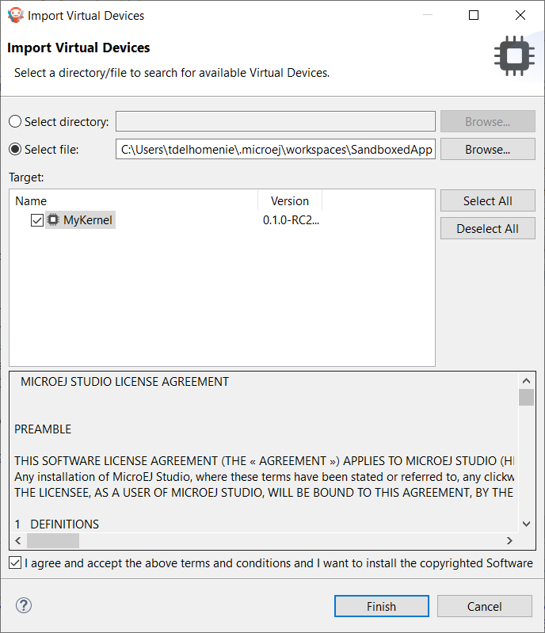
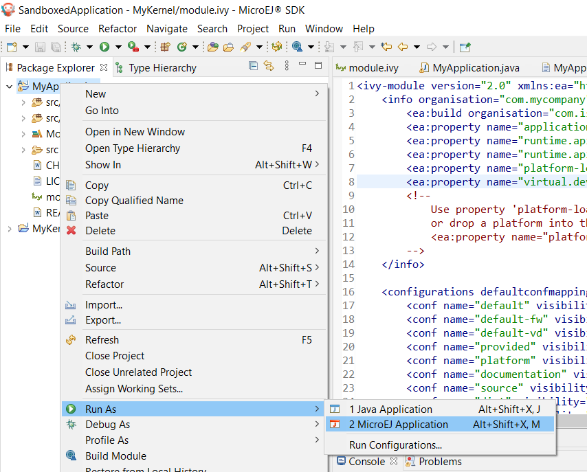

.. _chapter.application.sim:

Run on the Simulator
====================

.. note::
   This page is releated to the version 5 and lower of the SDK. 
   If you use the SDK 6, please refer to the page :ref:`sdk_6_run_on_simulator`.

Once :ref:`a Sandboxed Application project has been created <chapter.application.firstApplication>`, it can be tested on the Simulator.

The Simulator requires a Virtual Device to execute the Application.
Please refer to the :ref:`kernel-developer-guide` to learn how to get or create one.

From the SDK
------------

In order to test a Sandboxed Application in the SDK, the first thing to do is to import the Virtual Device of the Multi-Sandbox Executable:

- go to :guilabel:`Window` > :guilabel:`Preferences` > :guilabel:`MicroEJ` > :guilabel:`Virtual Devices`
- click on :guilabel:`Import...`
- the Virtual Device can be provided as a folder or as a ``.vde`` file, select the adequate format and the Virtual Device resource
- check the License checkbox to accept it
- click on :guilabel:`Finish`

   Virtual Device Import

Now the Application can be executed by right-clicking on its project, then clicking on :guilabel:`Run As` > :guilabel:`MicroEJ Application`.

   Sandboxed Application Run

If there is only one Virtual Device imported in the SDK, it is automatically used to execute the Application.
Otherwise, you have to select the one you want to use.

With the Application created in the section :ref:`chapter.application.firstApplication`, the output should be::

   =============== [ Initialization Stage ] ===============
   =============== [ Converting fonts ] ===============
   =============== [ Converting images ] ===============
   =============== [ Launching on Simulator ] ===============
   KERNEL Hello World!
   => Starting Feature MyApplication
   Feature MyApplication started!
   =============== [ Completed Successfully ] ===============

   SUCCESS

Run Multiple Sandboxed Applications 
~~~~~~~~~~~~~~~~~~~~~~~~~~~~~~~~~~~

It is possible to execute additional Sandboxed Applications besides the main Sandboxed Application project.
This is typically useful when you want to test the integration of a Sandboxed Application that communicates with an other one, 
for example through a :ref:`Shared Interface <chapter.shared.interfaces>`.

The additional Sandboxed Applications must have been previously built in its binary format (WPK, see :ref:`remote_deployment_wpk` section). Then, to include them:

- Select the Sandboxed Application project,
- Create the ``META-INF/wpk`` folders,
- Drop any ``*.wpk`` files in the ``META-INF/wpk`` folder.
  
Your Sandboxed Application project shall look like:
  
  .. figure:: images/sandboxed-application-wpk-dropins.png

Now, when launching the Sandboxed Application project, these additional Sandboxed Applications will also be executed on the Virtual Device.

From the Command Line Interface
-------------------------------

An Sandboxed Application can also be launched on the Simulator via the Command Line Interface.
Before continuing, make sure :ref:`the Command Line Interface is installed and correctly configured <mmm_cli>`.

In your favorite terminal application, go to the root folder of the Application and execute the following commands::

   mmm build
   mmm run -Dplatform-loader.target.platform.file=/path/to/the/virtual-device.vde

With the Application created in the section :ref:`chapter.application.firstApplication`, the output should be::

   MicroEJ Simulator is being launched. Relax and enjoy...
   =============== [ Initializing Easyant ] ===============
   =============== [ Resolving and retrieving dependencies ] ===============
   =============== [ Compiling sources ] ===============
   =============== [ Loading platform ] ===============
   =============== [ Initialization Stage ] ===============
   =============== [ Converting fonts ] ===============
   =============== [ Converting images ] ===============
   =============== [ Launching on Simulator ] ===============
   KERNEL Hello World!
   => Starting Feature MyApplication
   Feature MyApplication started!
   =============== [ Completed Successfully ] ===============
   
   SUCCESS

Note that the Virtual Device location can also be configured in the ``module.ivy`` file of the Sandboxed Application project::

   <ea:property name="platform-loader.target.platform.file" value="/path/to/the/virtual-device.vde"/>

The Virtual Device can also be provided differently, for example from a dependency in the ``module.ivy`` file.
Refer to the :ref:`platform_selection` section for the list of available capabilities.

..
   | Copyright 2022-2023, MicroEJ Corp. Content in this space is free 
   for read and redistribute. Except if otherwise stated, modification 
   is subject to MicroEJ Corp prior approval.
   | MicroEJ is a trademark of MicroEJ Corp. All other trademarks and 
   copyrights are the property of their respective owners.
