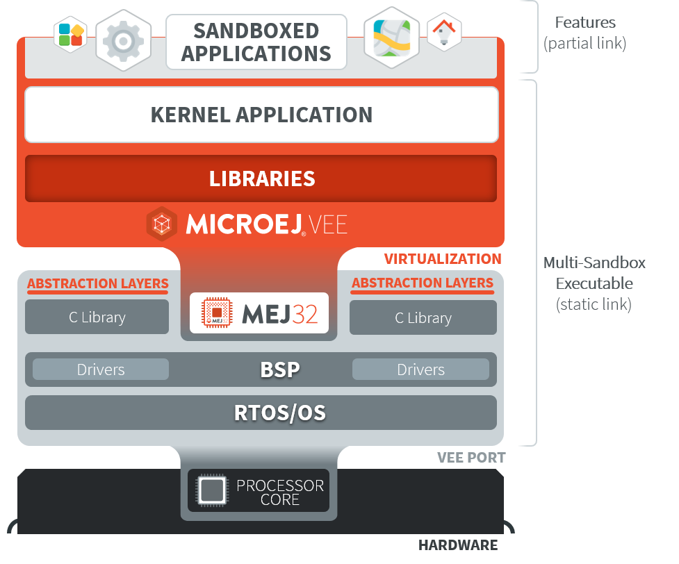
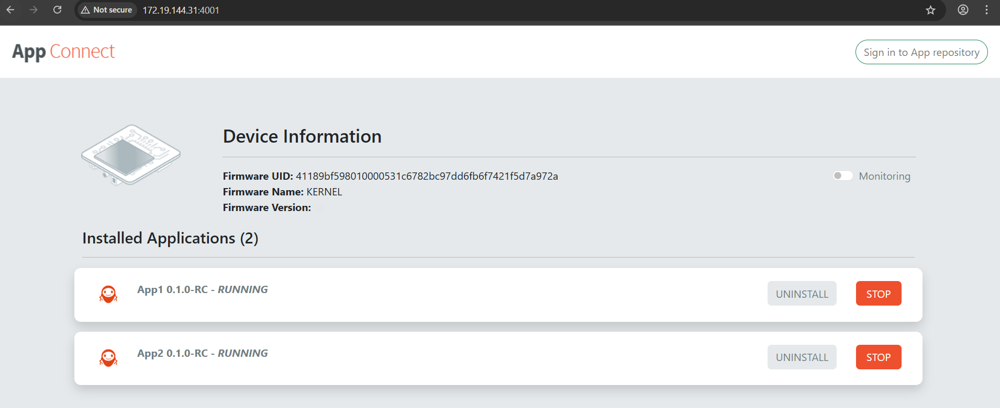

.. _sandboxed_application:

Sandboxed Application
=====================

.. toctree::
   :maxdepth: 2
   :hidden:

   sandboxedAppFundamentalConcepts
   sandboxedAppSharedInterface

A Sandboxed Application is an Application that is partially linked, then deployed and executed over a Multi-Sandbox Executable.

Typical use cases for a Sandboxed Application are:

- over the air provisioning: the Application is dynamically installed or updated on a fleet of heterogenous devices.
- modularization: a monolithic application is split into multiple Sandboxed Applications; each of them can be started or stopped separately.

The following figure shows the general process of building a Sandboxed Application.

.. figure:: images/link_application_simple.png
   :alt: Sandboxed Application Link Flow
   :align: center
   :scale: 80%

   Sandboxed Application Link Flow

Please refer to the :ref:`kernel-developer-guide` to learn more on writing Kernel Applications and building Multi-Sandbox Executable and Virtual Devices.

AppConnect Application Management
=================================

**AppConnect** is an embedded library designed to simplify the management of on-board Sandboxed Applications directly on the device.
It provides services to install, start, stop, and uninstall applications, as well as to retrieve metadata about both deployed applications and the target device.
The library includes a full-fledged HTTP server, providing a comprehensive REST API along with a web-based graphical interface.

AppConnect supports four modes of interaction:

- Web App — See :ref:`web_app_section`.
- REST API — See :ref:`rest_api_section`.
- HTTP CLI — See :ref:`http_cli_section`.
- Serial Shell — See :ref:`serial_shell_section`.

.. _web_app_section:

AppConnect Web App
------------------

Installed Applications are listed on the Web UI, and they can be started, stopped, or uninstalled.

The screenshot below highlights the following elements.

1. Device information that displays the firmware UID, name and version.
2. CPU and RAM monitoring when supported by the device and the applications.
3. The current state of each application (``INSTALLED``, ``RUNNING`` , or ``STOPPED``).
4. Action buttons to start, stop, or uninstall applications.
5. Connection to the MicroEJ App Store.

.. _rest_api_section:

AppConnect REST API
-------------------

The REST API exposes the following endpoints to manage the board and its installed applications:

Device Information
^^^^^^^^^^^^^^^^^^

Retrieve information about the current device, including forge evaluation settings (URL, username, password) and the runtime type (board, simulator).

**Endpoint:** ``GET /api/device``.

List Installed Applications
^^^^^^^^^^^^^^^^^^^^^^^^^^^

Return a list of Applications installed on the device along with their metadata. Metadata includes the Application name, description, and current `state <https://docs.microej.com/en/latest/KernelDeveloperGuide/kf.html#feature-lifecycle>`_.

**Endpoint:** ``GET /api/app``.

Get Application Icon
^^^^^^^^^^^^^^^^^^^^

Return the Application icon (if it is set in the Application's metadata).

**Endpoint:** ``GET /api/app/icon?id=(application identifier)&preferredSize=(preferred size, default 64)``.

Install Applications
^^^^^^^^^^^^^^^^^^^^

Install an application on the device.

**Endpoint:** ``POST /api/app/install?force=(true|false)&start=(true|false)``.

**Required parameters:** ``binary``.

**Form data:**

- ``binary``: The Application binary compatible with the target board or the simulator (e.g., ``.fo`` or ``.fs3``).

**Optional query parameters:**

- ``name``: The name of the Application, used to identify and overwrite an existing application when ``force`` is set to ``true``.
- ``force``: If ``true``, uninstall any existing application with the same name before installing the new one. Default: ``false``.
- ``start``: If ``true``, automatically start the application after installation. Default: ``false``.

Manage Applications
^^^^^^^^^^^^^^^^^^^

Start, stop, or uninstall an installed Application.

**Endpoint:** ``POST /api/app/manage?id=(application identifier)&action=(start|stop|uninstall)``.

**Required parameters:** ``id``, ``action``.

.. _http_cli_section:

AppConnect HTTP CLI
-------------------

AppConnect CLI is a Java-based command-line (CLI) tool that serves as a headless interface, offering the full functionality of the web application through its REST API, while enabling seamless automation and scripting directly from the command line.

The CLI is available for download at the following `link <https://forge.microej.com/ui/repos/tree/General/microej-developer-repository-release/com/microej/library/appconnect-cli>`_.

Download the latest version of `appconnect-cli-<version>.jar` from this page and follow the usage instructions outlined below.

Requirements
^^^^^^^^^^^^

AppConnect CLI requires JDK 17 or higher.

Usage
^^^^^

To start AppConnect CLI, run the following command:

.. code-block::

   java -jar path/to/appconnect-cli-*.jar

.. code-block::

                             _____                            _      _____ _      _____
        /\                  / ____|                          | |    / ____| |    |_   _|
       /  \   _ __  _ __   | |     ___  _ __  _ __   ___  ___| |_  | |    | |      | |
      / /\ \ | '_ \| '_ \  | |    / _ \| '_ \| '_ \ / _ \/ __| __| | |    | |      | |
     / ____ \| |_) | |_) | | |___| (_) | | | | | | |  __/ (__| |_  | |____| |____ _| |_
    /_/    \_\ .__/| .__/   \_____\___/|_| |_|_| |_|\___|\___|\__|  \_____|______|_____|
             | |   | |
             |_|   |_|

   Welcome to the appconnect-cli 3.2.0!
   Type 'help' to view the list of available commands and their descriptions.
   For detailed command usage, type 'help <command>'.

After starting the CLI, connect to your device using the command:

.. code-block::

     connect <ip>

Once the connection is established, you can execute various commands to manage applications.

.. code-block::

   * connect: Connect to AppConnect server running on board.
   * start: Start an app.
   * stop: Stop an app.
   * install: Install an app.
   * uninstall: Uninstall an app.
   * device-info: Get information about the device such as firmware ID, name, version, etc.
   * list, ls: List information about applications such as PID, name, version, state.

For detailed information on any command, use the ``--help`` option with that command.

.. _serial_shell_section:

AppConnect Serial Shell
-----------------------

The ``appconnect-serial`` module provides a shell for use over a serial connection (UART). It reads commands from an input stream, and writes execution results to an output stream.

Requirements
^^^^^^^^^^^^

AppConnect Serial requires the Serial Pack and API.

Usage
^^^^^

The ``appconnect-serial`` can be integrated into a Sandboxed Application as follows:

1. Add the ``appconnect-serial`` dependency directly to your Application. Alternatively, you can add it to the :ref:`Runtime Environment <runtime_environment>` of your Kernel.

2. If the security manager is enabled and enforcing permission checks, the Application must be granted the following permissions.

.. code-block:: json

    {
      "permissions": {
        "com.microej.library.appconnect.ApplicationServicePermission": {
          "*": ["list", "start", "stop", "install", "uninstall"]
        },
        "com.microej.library.appconnect.DeviceServicePermission": {
          "*": ["device", "evaluation"]
        }
      }
    }

.. note::

   For more information about permissions, please refer to this :ref:`section <application_declared_permissions>`.

3. Create an instance of ``AppConnectShell`` and provide the input and output streams of your serial connection.

.. code-block:: java

   AppConnectShell shell = new AppConnectShell(inputStream, outputStream);
   try {
     shell.start();
     shell.loop();
   } catch (IOException exception) {
     shell.stop();
   }

4. Deploy the Application.

The AppConnect shell can be accessed using `Minicom <https://salsa.debian.org/minicom-team/minicom>`_ or a similar tool.

Once the Application is deployed and started, you should see the following output:

.. code-block::

                            _____                            _      _____           _       _
       /\                  / ____|                          | |    / ____|         (_)     | |
      /  \   _ __  _ __   | |     ___  _ __  _ __   ___  ___| |_  | (___   ___ _ __ _  __ _| |
     / /\ \ | '_ \| '_ \  | |    / _ \| '_ \| '_ \ / _ \/ __| __|  \___ \ / _ \ '__| |/ _` | |
    / ____ \| |_) | |_) | | |___| (_) | | | | | | |  __/ (__| |_   ____) |  __/ |  | | (_| | |
   /_/    \_\ .__/| .__/   \_____\___/|_| |_|_| |_|\___|\___|\__| |_____/ \___|_|  |_|\__,_|_|
            | |   | |
            |_|   |_|

   Welcome to appconnect-serial 3.2.0!
   Type 'help' to view the list of available commands and their descriptions.
   For detailed command usage, type 'help --command <command>'.

The following commands are available:

.. code-block::

   device-info: Get information about the device such as firmware ID, name, version, etc.
   uninstall: Uninstall an application.
   exit: Exit the shell.
   help: Display information about available commands.
   list: List information about the installed applications such as name, PID, version, state, etc.
   stop: Stop an application.
   start: Start an application.
   evaluation-info: Get information about MicroEJ forge URL and credentials.
   install: Install an application.

..
   | Copyright 2008-2025, MicroEJ Corp. Content in this space is free
   for read and redistribute. Except if otherwise stated, modification
   is subject to MicroEJ Corp prior approval.
   | MicroEJ is a trademark of MicroEJ Corp. All other trademarks and
   copyrights are the property of their respective owners.
