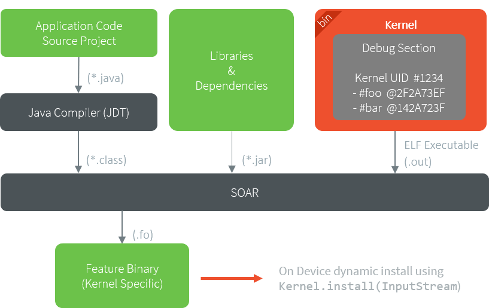

.. _sandboxed_application:

Sandboxed Application
=====================

.. toctree::
   :maxdepth: 2
   :hidden:

   sandboxedAppFundamentalConcepts
   sandboxedAppSharedInterface

A Sandboxed Application is an Application that can run over a Multi-Sandbox Executable.
Sandboxed Applications can be linked statically to the Multi-Sandbox Executable or installed dynamically on the device.

Typical use cases for a Sandboxed Application are:

- over the air provisioning: the Application is dynamically installed or updated on a fleet of heterogenous devices.
- modularization: a monolithic application is split into multiple Sandboxed Applications; each of them can be started or stopped separately.

The following figure shows the general process of building a Sandboxed Application.

   Sandboxed Application Link Flow

Please refer to the :ref:`kernel-developer-guide` to learn more on writing Kernel Applications and building Multi-Sandbox Executable and Virtual Devices.

..
   | Copyright 2008-2023, MicroEJ Corp. Content in this space is free 
   for read and redistribute. Except if otherwise stated, modification 
   is subject to MicroEJ Corp prior approval.
   | MicroEJ is a trademark of MicroEJ Corp. All other trademarks and 
   copyrights are the property of their respective owners.
