Category: Runtime
=================

Group: Types
------------

Option(checkbox): Embed all type names
^^^^^^^^^^^^^^^^^^^^^^^^^^^^^^^^^^^^^^

*Option Name*: ``soar.generate.classnames``

*Default value*: ``true``

*Description*:

Embed the name of all types. When this option is disabled, only names of
declared required types are embedded.

Group: Assertions
-----------------

Option(checkbox): Execute assertions on Simulator
^^^^^^^^^^^^^^^^^^^^^^^^^^^^^^^^^^^^^^^^^^^^^^^^^

*Option Name*: ``core.assertions.sim.enabled``

*Default value*: ``false``

*Description*:

When this option is enabled, ``assert`` statements are executed. Please note
that the executed code may produce side effects or throw
``java.lang.AssertionError``.

Option(checkbox): Execute assertions on Device
^^^^^^^^^^^^^^^^^^^^^^^^^^^^^^^^^^^^^^^^^^^^^^

*Option Name*: ``core.assertions.emb.enabled``

*Default value*: ``false``

*Description*:

When this option is enabled, ``assert`` statements are executed. Please note
that the executed code may produce side effects or throw
``java.lang.AssertionError``.

.. _architecture_options_group_trace:

Group: Trace
------------

Option(checkbox): Enable execution traces
^^^^^^^^^^^^^^^^^^^^^^^^^^^^^^^^^^^^^^^^^

*Option Name*: ``core.trace.enabled``

*Default value*: ``false``

Option(checkbox): Start execution traces automatically
^^^^^^^^^^^^^^^^^^^^^^^^^^^^^^^^^^^^^^^^^^^^^^^^^^^^^^

*Option Name*: ``core.trace.autostart``

*Default value*: ``false``

Category: Memory
----------------

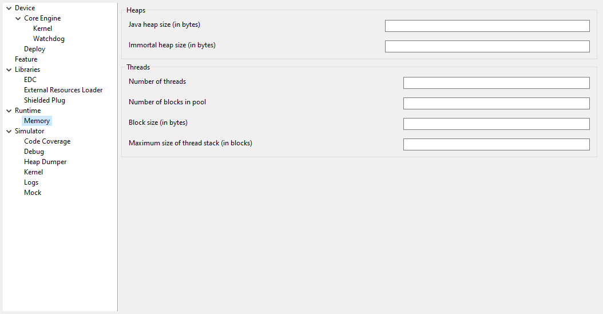

Group: Heaps
^^^^^^^^^^^^

.. _option_java_heap:

Option(text): Java heap size (in bytes)
"""""""""""""""""""""""""""""""""""""""

*Option Name*: ``core.memory.javaheap.size``

*Default value*: ``65536``

*Description*:

Specifies the Java heap size in bytes.

A Java heap contains live Java objects. An OutOfMemory error can occur if the
heap is too small.

.. _option_immortal_heap:

Option(text): Immortal heap size (in bytes)
"""""""""""""""""""""""""""""""""""""""""""

*Option Name*: ``core.memory.immortal.size``

*Default value*: ``4096``

*Description*:

Specifies the Immortal heap size in bytes.

The Immortal heap contains allocated Immortal objects. An OutOfMemory error can
occur if the heap is too small.

Group: Threads
^^^^^^^^^^^^^^

*Description*:

This group allows the configuration of application and library thread(s). A
thread needs a stack to run. This stack is allocated from a pool and this
pool contains several blocks. Each block has the same size. At thread startup
the thread uses only one block for its stack. When the first block is full it
uses another block. The maximum number of blocks per thread must be
specified. When the maximum number of blocks for a thread is reached or when
there is no free block in the pool, a StackOverflow error is thrown. When a
thread terminates all associated blocks are freed. These blocks can then be
used by other threads.

.. _option_number_of_threads:

Option(text): Number of threads
"""""""""""""""""""""""""""""""

*Option Name*: ``core.memory.threads.size``

*Default value*: ``5``

*Description*:

Specifies the number of threads the application will be able to use at the same
time.

.. _option_number_of_stack_blocks:

Option(text): Number of blocks in pool
""""""""""""""""""""""""""""""""""""""

*Option Name*: ``core.memory.threads.pool.size``

*Default value*: ``15``

*Description*:

Specifies the number of blocks in the stacks pool.

Option(text): Block size (in bytes)
"""""""""""""""""""""""""""""""""""

*Option Name*: ``core.memory.thread.block.size``

*Default value*: ``512``

*Description*:

Specifies the thread stack block size (in bytes).

.. _option_maximum_number_of_stack_blocks_per_thread:

Option(text): Maximum size of thread stack (in blocks)
""""""""""""""""""""""""""""""""""""""""""""""""""""""

*Option Name*: ``core.memory.thread.max.size``

*Default value*: ``4``

*Description*:

Specifies the maximum number of blocks a thread can use. If a thread requires
more blocks a StackOverflow error will occur.

Category: Simulator
===================

Group: Options
--------------

*Description*:

This group specifies options for MicroEJ Simulator.

Option(checkbox): Use target characteristics
^^^^^^^^^^^^^^^^^^^^^^^^^^^^^^^^^^^^^^^^^^^^

*Option Name*: ``s3.board.compliant``

*Default value*: ``false``

*Description*:

When selected, this option forces the MicroEJ Simulator to use the MicroEJ
Platform exact characteristics. It sets the MicroEJ Simulator scheduling policy
according to the MicroEJ Platform one. It forces resources to be explicitly
specified. It enables log trace and gives information about the RAM memory size
the MicroEJ Platform uses.

Option(text): Slowing factor (0 means disabled)
^^^^^^^^^^^^^^^^^^^^^^^^^^^^^^^^^^^^^^^^^^^^^^^

*Option Name*: ``s3.slow``

*Default value*: ``0``

*Description*:

*Format:* Positive ``integer``

This option allows the MicroEJ Simulator to be slowed down in order to match
the MicroEJ Platform execution speed. The greater the slowing factor, the
slower the MicroEJ Simulator runs.

Group: HIL Connection
---------------------

*Description*:

This group enables the control of HIL (Hardware In the Loop) connection
parameters (connection between MicroEJ Simulator and the Mocks).

Option(checkbox): Specify a port
^^^^^^^^^^^^^^^^^^^^^^^^^^^^^^^^

*Option Name*: ``s3.hil.use.port``

*Default value*: ``false``

*Description*:

When selected allows the use of a specific HIL connection port, otherwise a
random free port is used.

Option(text): Port
^^^^^^^^^^^^^^^^^^

*Option Name*: ``s3.hil.port``

*Default value*: ``8001``

*Description*:

*Format:* Positive ``integer``

*Values:* [1024-65535]

It specifies the port used by the MicroEJ Simulator to accept HIL connections.

Option(text): Timeout (s)
^^^^^^^^^^^^^^^^^^^^^^^^^

*Option Name*: ``s3.hil.timeout``

*Default value*: ``10``

*Description*:

*Format:* Positive ``integer``

It specifies the time the MicroEJ Simulator should wait before failing when
it invokes native methods.

Option(text): Maximum frame size (bytes)
^^^^^^^^^^^^^^^^^^^^^^^^^^^^^^^^^^^^^^^^^

*Option Name*: ``com.microej.simulator.hil.frame.size``

*Default value*: ``262144``

*Description*:

Maximum frame size in bytes. Must be increased to transfer large arrays to
native side.

Group: Shielded Plug server configuration
-----------------------------------------

*Description*:

This group allows configuration of the Shielded Plug database.

Option(text): Server socket port
^^^^^^^^^^^^^^^^^^^^^^^^^^^^^^^^

*Option Name*: ``sp.server.port``

*Default value*: ``10082``

*Description*:

Set the Shielded Plug server socket port.

Category: Code Coverage
-----------------------

.. figure:: images/architecture_options/img4.png
   :align: center
   :width: 998px
   :height: 551px

Group: Code Coverage
^^^^^^^^^^^^^^^^^^^^

*Description*:

This group is used to set parameters of the code coverage analysis tool.

Option(checkbox): Activate code coverage analysis
"""""""""""""""""""""""""""""""""""""""""""""""""

*Option Name*: ``s3.cc.activated``

*Default value*: ``false``

*Description*:

When selected it enables the code coverage analysis by the MicroEJ Simulator.
Resulting files are output in the cc directory inside the output directory.

Option(text): Saving coverage information period (in sec.)
""""""""""""""""""""""""""""""""""""""""""""""""""""""""""

*Option Name*: ``s3.cc.thread.period``

*Default value*: ``15``

*Description*:

It specifies the period between the generation of .cc files.

Category: Debug
---------------

.. _simulator-remote-debug-options:

Group: Remote Debug
^^^^^^^^^^^^^^^^^^^

Option(text): Debug port
""""""""""""""""""""""""

*Option Name*: ``debug.port``

*Default value*: ``12000``

*Description*:

Configures the JDWP debug port.

*Format:* Positive ``integer``

*Values:* [1024-65535]

Category: Heap Dumper
---------------------

.. figure:: images/architecture_options/img6.png
   :align: center
   :width: 998px
   :height: 551px

Group: Heap Inspection
^^^^^^^^^^^^^^^^^^^^^^

*Description*:

This group is used to specify heap inspection properties.

Option(checkbox): Activate heap dumper
""""""""""""""""""""""""""""""""""""""

*Option Name*: ``s3.inspect.heap``

*Default value*: ``false``

*Description*:

When selected, this option enables a dump of the heap each time the System.gc()
method is called by the MicroEJ Application.

Category: Logs
--------------

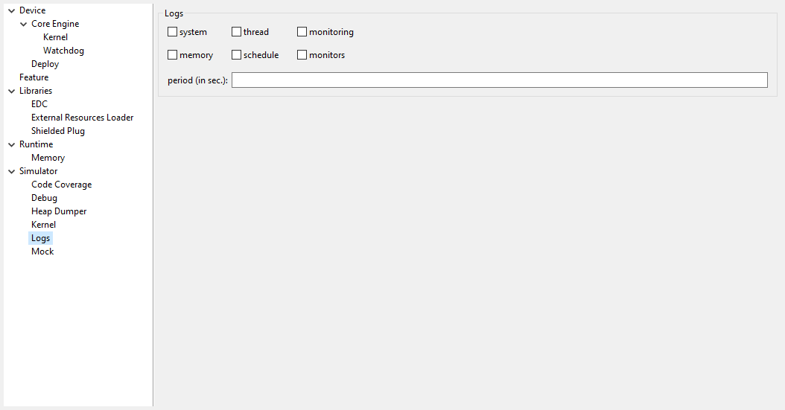

Group: Logs
^^^^^^^^^^^

*Description*:

This group defines parameters for MicroEJ Simulator log activity. Note that
logs can only be generated if the ``Simulator > Use target characteristics``
option is selected.

Some logs are sent when the platform executes some specific action (such as
start thread, start GC, etc), other logs are sent periodically (according to
defined log level and the log periodicity).

Option(checkbox): system
""""""""""""""""""""""""

*Option Name*: ``console.logs.level.low``

*Default value*: ``false``

*Description*:

When selected, System logs are sent when the platform executes the following
actions:

start and terminate a thread

start and terminate a GC

exit

Option(checkbox): thread
""""""""""""""""""""""""

*Option Name*: ``console.logs.level.thread``

*Default value*: ``false``

*Description*:

When selected, thread information is sent periodically. It gives information
about alive threads (status, memory allocation, stack size).

Option(checkbox): monitoring
""""""""""""""""""""""""""""

*Option Name*: ``console.logs.level.monitoring``

*Default value*: ``false``

*Description*:

When selected, thread monitoring logs are sent periodically. It gives
information about time execution of threads.

Option(checkbox): memory
""""""""""""""""""""""""

*Option Name*: ``console.logs.level.memory``

*Default value*: ``false``

*Description*:

When selected, memory allocation logs are sent periodically. This level
allows to supervise memory allocation.

Option(checkbox): schedule
""""""""""""""""""""""""""

*Option Name*: ``console.logs.level.schedule``

*Default value*: ``false``

*Description*:

When selected, a log is sent when the platform schedules a thread.

Option(checkbox): monitors
""""""""""""""""""""""""""

*Option Name*: ``console.logs.level.monitors``

*Default value*: ``false``

*Description*:

When selected, monitors information is sent periodically. This level permits
tracing of all thread state by tracing monitor operations.

Option(text): period (in sec.)
""""""""""""""""""""""""""""""

*Option Name*: ``console.logs.period``

*Default value*: ``2``

*Description*:

*Format:* Positive ``integer``

*Values:* [0-60]

Defines the periodicity of periodical logs.

Category: Device
----------------

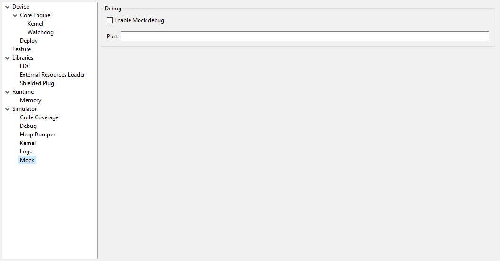

Group: Device Architecture
^^^^^^^^^^^^^^^^^^^^^^^^^^

Option(checkbox): Use a custom device architecture
""""""""""""""""""""""""""""""""""""""""""""""""""

*Option Name*: ``s3.mock.device.architecture.option.use``

*Default value*: ``false``

Option(text): Architecture Name
"""""""""""""""""""""""""""""""

*Option Name*: ``s3.mock.device.architecture.option``

*Default value*: ``(empty)``

Group: Device Unique ID
^^^^^^^^^^^^^^^^^^^^^^^

Option(checkbox): Use a custom device unique ID
"""""""""""""""""""""""""""""""""""""""""""""""

*Option Name*: ``s3.mock.device.id.option.use``

*Default value*: ``false``

Option(text): Unique ID (hexadecimal value)
"""""""""""""""""""""""""""""""""""""""""""

*Option Name*: ``s3.mock.device.id.option``

*Default value*: ``(empty)``

Category: Com Port
------------------

Category: Libraries
===================

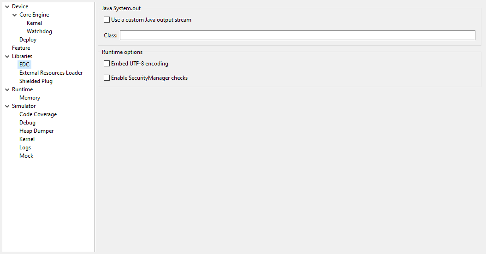

Category: EDC
-------------

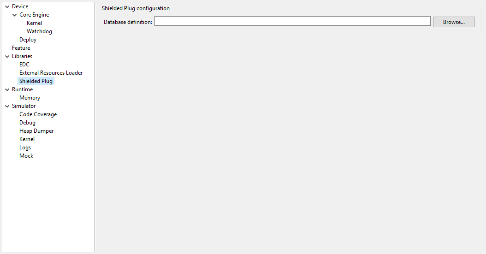

Group: Java System.out
^^^^^^^^^^^^^^^^^^^^^^

Option(checkbox): Use a custom Java output stream
"""""""""""""""""""""""""""""""""""""""""""""""""

*Option Name*: ``core.outputstream.disable.uart``

*Default value*: ``false``

*Description*:

Select this option to specify another Java ``System.out`` print stream.

If selected, the default Java output stream is not used by the Java
application. the JPF will not use the default Java output stream at startup.

Option(text): Class
"""""""""""""""""""

*Option Name*: ``core.outputstream.class``

*Default value*: ``(empty)``

*Description*:

*Format:* ``Java`` class like ``packageA.packageB.className``

Defines the Java class used to manage ``System.out``.

At startup the JPF will try to load this class using the ``Class.forName()``
method. If the given class is not available, the JPF will use the default
Java output stream as usual. The specified class must be available in the
application classpath.

Group: Runtime options
^^^^^^^^^^^^^^^^^^^^^^

*Description*:

Specifies the additional classes to embed at runtime.

Option(checkbox): Embed UTF-8 encoding
""""""""""""""""""""""""""""""""""""""

*Option Name*: ``cldc.encoding.utf8.included``

*Default value*: ``true``

*Description*:

Embed UTF-8 encoding.

Option(checkbox): Enable SecurityManager checks
"""""""""""""""""""""""""""""""""""""""""""""""

*Option Name*: ``com.microej.library.edc.securitymanager.enabled``

*Default value*: ``false``

*Description*:

Enable the security manager runtime checks.

Category: Shielded Plug
-----------------------

Group: Shielded Plug configuration
^^^^^^^^^^^^^^^^^^^^^^^^^^^^^^^^^^

*Description*:

Choose the database XML definition.

Option(browse): Database definition
"""""""""""""""""""""""""""""""""""

*Option Name*: ``sp.database.definition``

*Default value*: ``(empty)``

*Description*:

Choose the database XML definition.

Category: ECOM
--------------

Group: Device Management
^^^^^^^^^^^^^^^^^^^^^^^^

Option(checkbox): Enable registration event notifications
"""""""""""""""""""""""""""""""""""""""""""""""""""""""""

*Option Name*: ``com.is2t.ecom.eventpump.enabled``

*Default value*: ``false``

*Description*:

Enables notification of listeners when devices are registered or
unregistered. When a device is registered or unregistered, a new
``ej.ecom.io.RegistrationEvent`` is added to an event queue. Then events are
processed by a dedicated thread that notifies registered listeners.

Option(text): Registration events queue size
""""""""""""""""""""""""""""""""""""""""""""

*Option Name*: ``com.is2t.ecom.eventpump.size``

*Default value*: ``5``

*Description*:

Specifies the size (in number of events) of the registration events queue.

Category: Comm Connection
^^^^^^^^^^^^^^^^^^^^^^^^^

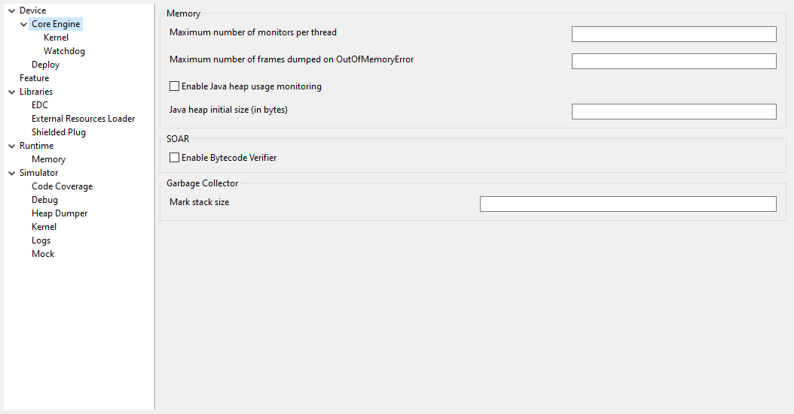

Group: Comm Connection Options
""""""""""""""""""""""""""""""

*Description*:

This group allows comm connections to be enabled and application-platform
mappings set.

Option(checkbox): Enable comm connections
~~~~~~~~~~~~~~~~~~~~~~~~~~~~~~~~~~~~~~~~~

*Option Name*: ``use.comm.connection``

*Default value*: ``false``

*Description*:

When checked application is able to open a ``CommConnection``.

Group: Device Management
""""""""""""""""""""""""

Option(checkbox): Enable dynamic comm ports registration
~~~~~~~~~~~~~~~~~~~~~~~~~~~~~~~~~~~~~~~~~~~~~~~~~~~~~~~~~

*Option Name*: ``com.is2t.ecom.comm.registryPump.enabled``

*Default value*: ``false``

*Description*:

Enables registration (or unregistration) of ports dynamically added (or
removed) by the platform. A dedicated thread listens for ports dynamically
added (or removed) by the platform and adds (or removes) their ``CommPort``
representation to the ECOM ``DeviceManager``.

Category: External Resources Loader
-----------------------------------

Group: External Resources Loader
^^^^^^^^^^^^^^^^^^^^^^^^^^^^^^^^

*Description*:

This group allows to specify the external resources input folder. The content
of this folder will be copied in an application output folder and used by
SOAR and the Simulator. If empty, the default location will be [output
folder]/externalResources, where [output folder] is the location defined in
Execution tab.

Option(browse):
""""""""""""""""

*Option Name*: ``ej.externalResources.input.dir``

*Default value*: ``(empty)``

*Description*:

Browse to specify the external resources folder..

Category: Device
================

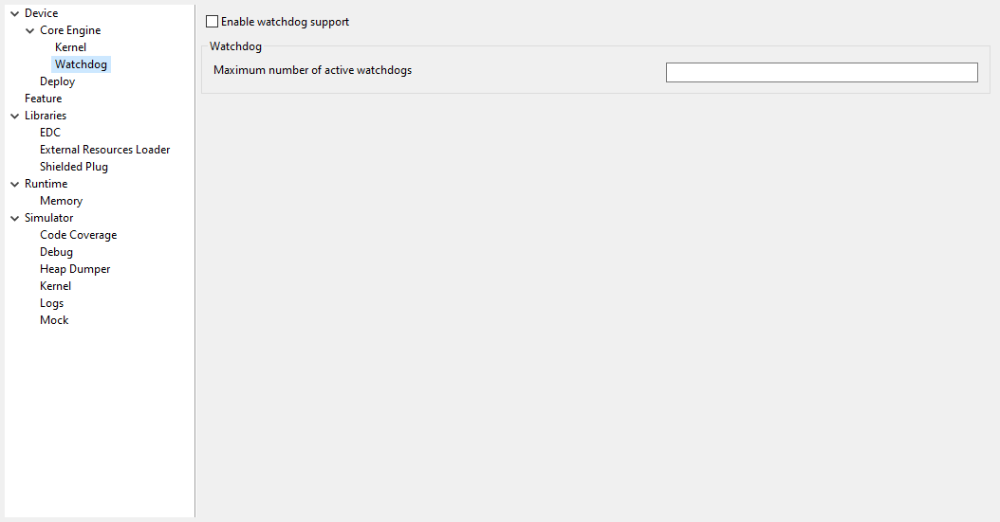

Category: Core Engine
---------------------

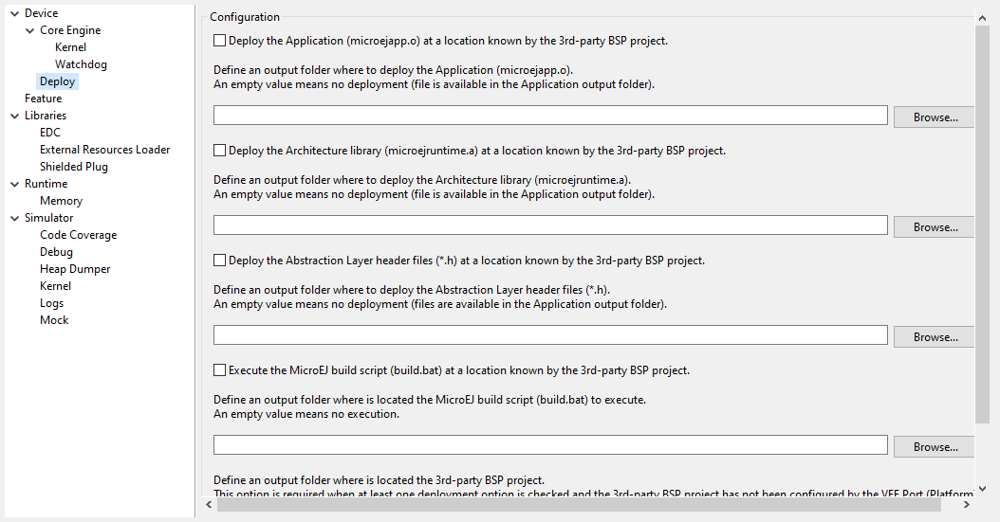

Group: Memory
^^^^^^^^^^^^^

.. _option_maximum_number_of_monitors_per_thread:

Option(text):
""""""""""""""

*Option Name*: ``core.memory.thread.max.nb.monitors``

*Default value*: ``8``

*Description*:

Specifies the maximum number of monitors a thread can own at the same time.

Option(text):
""""""""""""""

*Option Name*: ``core.memory.oome.nb.frames``

*Default value*: ``5``

*Description*:

Specifies the maximum number of stack frames that can be dumped to the standard
output when Core Engine throws an OutOfMemoryError.

Option(checkbox): Enable Java heap usage monitoring
"""""""""""""""""""""""""""""""""""""""""""""""""""

*Option Name*: ``com.microej.runtime.debug.heap.monitoring.enabled``

*Default value*: ``false``

Option(text):
""""""""""""""

*Option Name*: ``com.microej.runtime.debug.heap.monitoring.init.size``

*Default value*: ``0``

*Description*:

Specify the initial size (in bytes) of the Java Heap.

Group: SOAR
^^^^^^^^^^^

Option(checkbox): Enable Bytecode Verifier
""""""""""""""""""""""""""""""""""""""""""

*Option Name*: ``soar.bytecode.verifier``

*Default value*: ``false``

Category: Kernel
^^^^^^^^^^^^^^^^

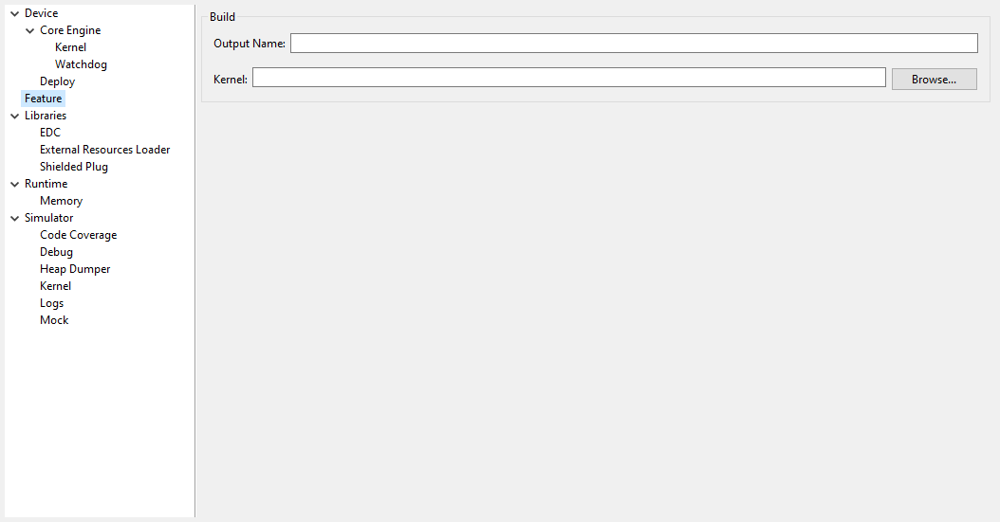

Option(checkbox): Check APIs allowed by Kernel
""""""""""""""""""""""""""""""""""""""""""""""

*Option Name*: ``apis.check.enable``

*Default value*: ``true``

Group: Threads
""""""""""""""

Option(text):
~~~~~~~~~~~~~~

*Option Name*: ``core.memory.feature.max.threads``

*Default value*: ``5``

*Description*:

Specifies the maximum number of threads a Feature is allowed to use at the same
time.

Group: Installed Features
"""""""""""""""""""""""""

Option(text):
~~~~~~~~~~~~~~

*Option Name*: ``core.memory.installed.features.max``

*Default value*: ``0``

*Description*:

Specifies the maximum number of installed Features that can be added to this
Kernel.

Option(text):
~~~~~~~~~~~~~~

*Option Name*: ``core.memory.installed.features.text.size``

*Default value*: ``0``

*Description*:

Specifies the size in bytes reserved for installed Features code.

Option(text):
~~~~~~~~~~~~~~

*Option Name*: ``core.memory.installed.features.bss.size``

*Default value*: ``0``

*Description*:

Specifies the size in bytes reserved for installed Features runtime memory.

Category: Watchdog
^^^^^^^^^^^^^^^^^^

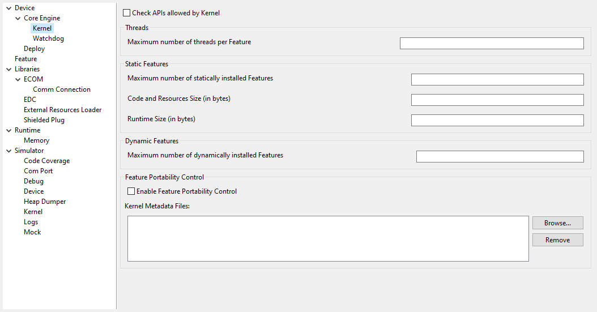

Option(checkbox): Enable watchdog support
"""""""""""""""""""""""""""""""""""""""""

*Option Name*: ``enable.watchdog.support``

*Default value*: ``true``

Group: Watchdog
"""""""""""""""

Option(text):
~~~~~~~~~~~~~~

*Option Name*: ``maximum.active.watchdogs``

*Default value*: ``4``

*Description*:

Specifies the maximum number of active watchdogs at the same time.

Category: Deploy
----------------

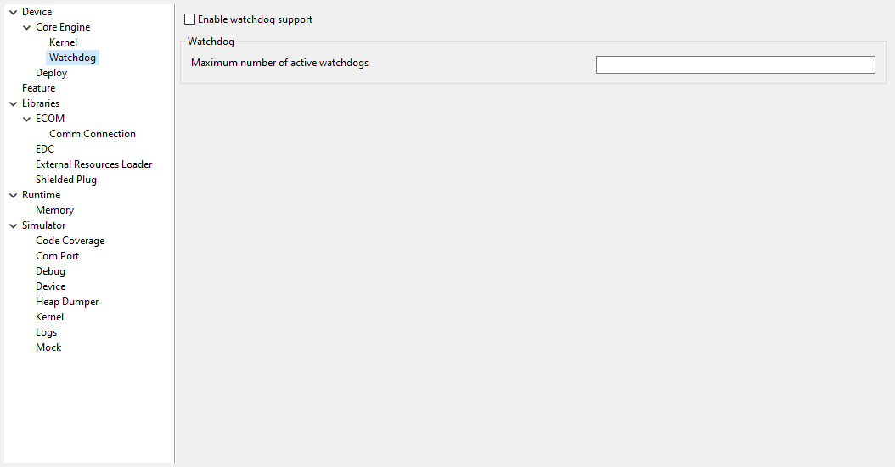

*Description*:

Configures the output location where store the MicroEJ Application, the MicroEJ
platform libraries and header files.

Group: Configuration
^^^^^^^^^^^^^^^^^^^^

Option(checkbox): Deploy the compiled MicroEJ Application in a folder in MicroEJ Application main class project
"""""""""""""""""""""""""""""""""""""""""""""""""""""""""""""""""""""""""""""""""""""""""""""""""""""""""""""""

*Default value*: ``true``

*Description*:

Deploy the compiled MicroEJ Application in a folder in MicroEJ Application's
main class project.

Option(browse): Output file
"""""""""""""""""""""""""""

*Option Name*: ``deploy.copy.filename``

*Default value*: ``(empty)``

*Description*:

Choose an output file location where copy the compiled MicroEJ Application.

Category: Feature
=================

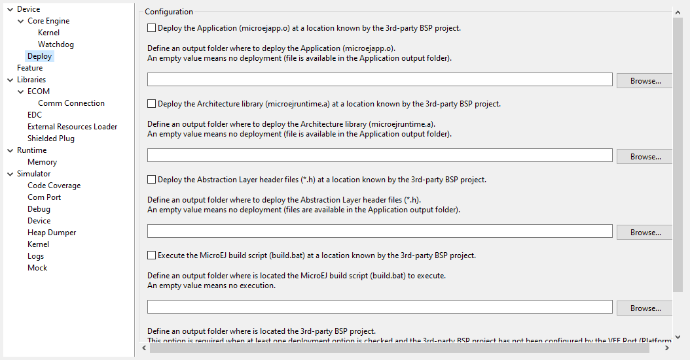

*Description*:

Specify Feature options

Category: Dynamic Download
--------------------------

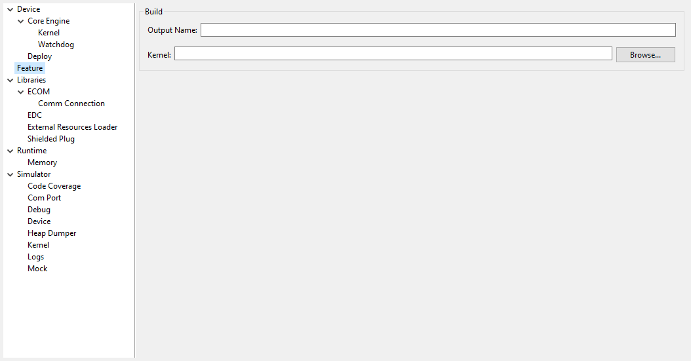

Group: Dynamic Download
^^^^^^^^^^^^^^^^^^^^^^^

Option(text): Output Name
"""""""""""""""""""""""""

*Option Name*: ``feature.output.basename``

*Default value*: ``application``

Option(browse): Kernel
""""""""""""""""""""""

*Option Name*: ``kernel.filename``

*Default value*: ``(empty)``

..
   | Copyright 2008-2021, MicroEJ Corp. Content in this space is free 
   for read and redistribute. Except if otherwise stated, modification 
   is subject to MicroEJ Corp prior approval.
   | MicroEJ is a trademark of MicroEJ Corp. All other trademarks and 
   copyrights are the property of their respective owners.
