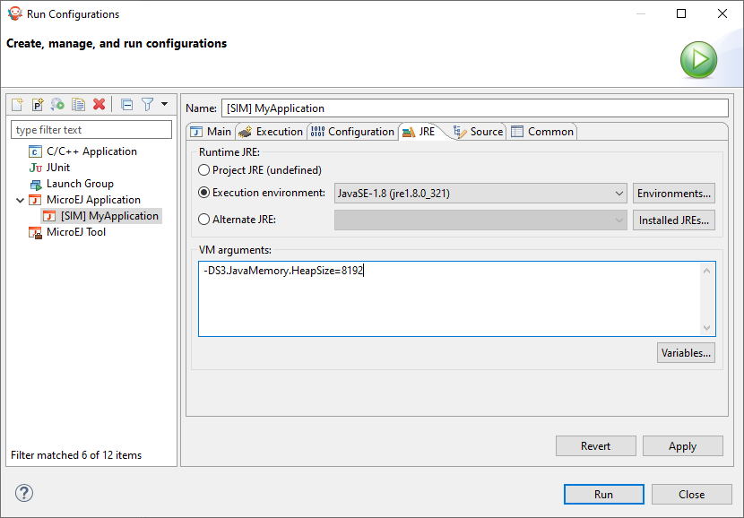

.. _simulator_options:

Category: Simulator Limits
==========================

``OutOfMemory`` errors can occur in several memory sections. To resolve these problems you may need
to set some system properties to increase these sections. 

These properties are system properties. They must be set in the :guilabel:`JRE` tab from the application launch configuration. 
Set a property in the :guilabel:`VM arguments` group following the pattern ``-D[OPTION_KEY]>=[OPTION_VALUE]``

Group: RAM Size
---------------

Option: Java Heap Size
^^^^^^^^^^^^^^^^^^^^^^

*Option Name*: ``S3.JavaMemory.HeapSize``

*Default value*: ``4096``

*Description*:

Heap Size allocated by the Simulator. It is used to allocate object on Java Heap,
but also immutable objects. It thus must be at least equal to the sum of option_java_heap_ 
and option_immortal_heap_. Value is in kilobytes.

Option: System Chars Size
^^^^^^^^^^^^^^^^^^^^^^^^^

*Option Name*: ``S3.JavaMemory.SystemCharsSize``

*Default value*: ``100``

*Launchscripts value*: ``1024``

*Recomended value*: ``3000``

*Description*:

Memory allocated to system strings. Value is in kilobytes.

Option: Application Chars Size
^^^^^^^^^^^^^^^^^^^^^^^^^^^^^^

*Option Name*: ``S3.JavaMemory.ApplicationCharsSize``

*Default value*: ``250``

*Launchscripts value*: ``4096``

*Description*:

Memory allocated to application strings. Value is in kilobytes.

Group: Statics and Methods
--------------------------

Option: Statics Size
^^^^^^^^^^^^^^^^^^^^

*Option Name*: ``S3.JavaMemory.StaticsSize``

*Default value*: ``200``

*Description*:

Memory space allocated for statics. Value is in kilobytes.

Option: Methods Size
^^^^^^^^^^^^^^^^^^^^

*Option Name*: ``S3.JavaMemory.MethodsSize``

*Default value*: ``1500``

*Launchscripts value*: ``10000``

*Recomended value*: ``20000``

*Description*:

Memory space allocated for methods. Value is in kilobytes.

Option: Thread Stack Size
^^^^^^^^^^^^^^^^^^^^^^^^^

*Option Name*: ``S3.JavaMemory.MethodsSize``

*Default value*: ``300``

*Description*:

Memory space allocated for each thread stack. Value is in kilobytes.

Group: Icetea Heap Size
-----------------------

Option: Icetea Heap Start
^^^^^^^^^^^^^^^^^^^^^^^^^

*Option Name*: ``IceteaRuntimeSupport.S3.HeapStart``

*Default value*: ``200``

*Description*:

Internal heap start address used by the Simulator to manage its own memory. It is an adress in bytes.

Option: Icetea Heap End
^^^^^^^^^^^^^^^^^^^^^^^

*Option Name*: ``IceteaRuntimeSupport.S3.HeapEnd``

*Default value*: ``40000000``

*Recomended value*: ``60000000``

*Description*:

Internal heap end address used by the Simulator to manage its own memory. It is an adress in bytes.

..
   | Copyright 2022, MicroEJ Corp. Content in this space is free 
   for read and redistribute. Except if otherwise stated, modification 
   is subject to MicroEJ Corp prior approval.
   | MicroEJ is a trademark of MicroEJ Corp. All other trademarks and 
   copyrights are the property of their respective owners.
