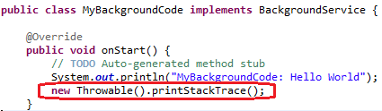
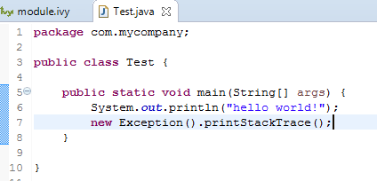
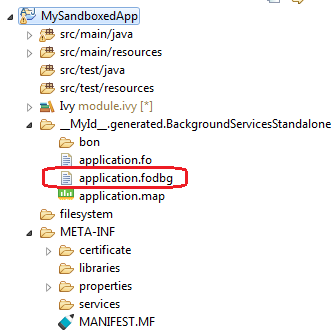
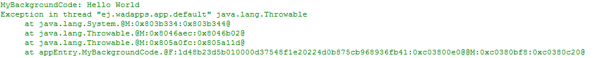
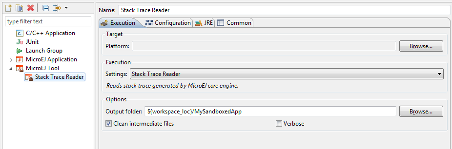
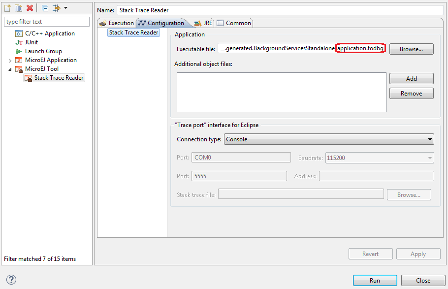
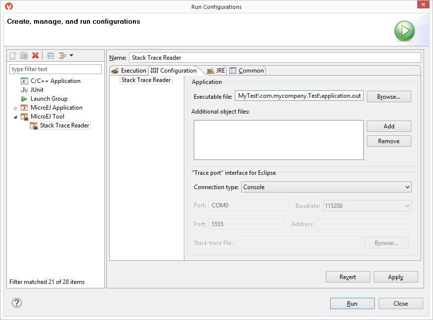
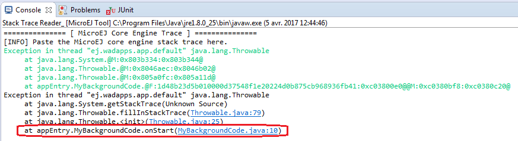

.. _section.stacktrace.reader.tool:

Stack Trace Reader
==================

When an application is deployed on a device, stack traces dumped on
standard output are not directly readable: non required types (see
:ref:`section.classpath.elements.types`) names, methods names and
methods line numbers may not have been embedded to save code space. A
stack trace dumped on the standard output can be decoded using the Stack
Trace Reader tool.

Write a new line to dump the currently executed stack trace on the
standard output.

   Code to Dump a Stack Trace

Write a new line to dump the currently executed stack trace on the
standard output.

   Code to Dump a Stack Trace

To be able to decode an application stack trace, the stack trace reader
tool requires the application binary file with debug information
(``application.fodbg`` in the output folder). Note that the file which
is uploaded on the device is ``application.fo`` (stripped version
without debug information).

   Application Binary File with Debug Information

On successful deployment, the application is started on the device and
the following trace is dumped on standard output.

.. TODO this figure was controled by a conditional, isSandbox
   is showing

   Stack Trace Output

.. TODO This figure was controlled by a conditional, isStandalone
    .. figure:: ../StandaloneAppDevGuide/png/trace2.png
       :alt: Stack Trace Output
       :width: 80.0%
       :align: center
       
       Stack Trace Output

To create a new MicroEJ Tool configuration, right-click on the application
project and click on :guilabel:`Run As...` > :guilabel:`Run Configurations...`.

In :guilabel:`Execution` tab, select the :guilabel:`Stack Trace Reader` tool.

   Select Stack Trace Reader Tool

In :guilabel:`Configuration` tab, browse the previously generated application
binary file with debug information (``application.fodbg``)

   Stack Trace Reader Tool Configuration

In :guilabel:`Configuration` tab, browse the previously generated application
binary file with debug information (``application.fodbg`` in case of a Sandboxed
Application or ``application.out`` in case of a Standalone Application)

   Stack Trace Reader Tool Configuration (Sandboxed Application)

   Stack Trace Reader Tool Configuration (Standalone Application)

Click on :guilabel:`Run` button and copy/paste the trace into the Eclipse
console. The decoded trace is dumped and the line corresponding to the
application hook is now readable.

.. TODO this figure was controlled with a conditional, isSandbox

   Read the Stack Trace

.. TODO this figure was controlled with a conditional, isStandalone
    .. figure:: ../StandaloneAppDevGuide/png/trace4.png
       :alt: Read the Stack Trace
       :width: 100.0%
       :align: center
       
       Read the Stack Trace

The stack trace reader can simultaneously decode heterogeneous stack
traces with lines owned by different applications and the firmware.
Other debug information files can be appended using the
:guilabel:`Additional object files` option. Lines owned by the firmware can be
decoded with the firwmare debug information file (optionally made
available by your firmware provider).

