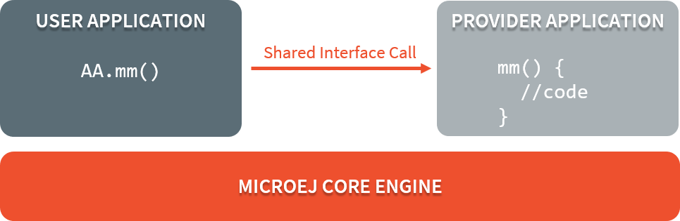
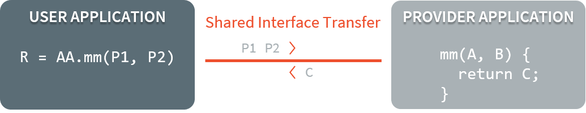
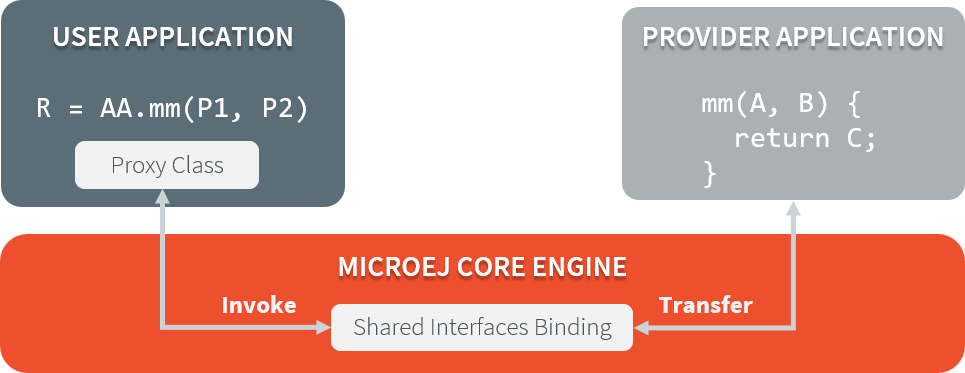

.. _chapter.shared.interfaces:

Shared Interfaces
=================

.. _section.shared.interfaces.contract:

Principle
---------

The Shared Interface mechanism provided by MicroEJ Core Engine is an
object communication bus based on plain Java interfaces where method
calls are allowed to cross MicroEJ Sandboxed Applications boundaries.
The Shared Interface mechanism is the cornerstone for designing reliable
Service Oriented Architectures on top of MicroEJ. Communication is based
on the sharing of interfaces defining APIs (Contract Oriented
Programming).

The basic schema:

-  A provider application publishes an implementation for a shared
   interface into a system registry.

-  A user application retrieves the implementation from the system
   registry and directly calls the methods defined by the shared
   interface.

   Shared Interface Call Mechanism

.. _section.shared.interfaces.element:

Shared Interface Creation
-------------------------

Creation of a shared interface follows three steps:

-  Interface definition,

-  Proxy implementation,

-  Interface registration.

Interface Definition
~~~~~~~~~~~~~~~~~~~~

The definition of a shared interface starts by defining a standard Java
interface.

.. code:: java

   package mypackage;
   public interface MyInterface{ 
       void foo();
   }

To declare an interface as a shared interface, it must be registered in
a shared interfaces identification file. A shared interface
identification file is an XML file with the ``.si`` suffix with the
following format:

::

   <sharedInterfaces>
       <sharedInterface name="mypackage.MyInterface"/>
   </sharedInterfaces>

Shared interface identification files must be placed at the root of a
path of the application classpath. For a MicroEJ Sandboxed Application
project, it is typically placed in ``src/main/resources`` folder.

Some restrictions apply to shared interface compared to standard java
interfaces:

-  Types for parameters and return values must be transferable types;

-  Thrown exceptions must be classes owned by the MicroEJ Firmware.

.. _section.transferable.types:

Transferable Types
~~~~~~~~~~~~~~~~~~

In the process of a cross-application method call, parameters and return
value of methods declared in a shared interface must be transferred back
and forth between application boundaries.

   Shared Interface Parameters Transfer

:ref:`table.si.transfer.rules` describes the rules applied depending on the
element to be transferred.

.. _table.si.transfer.rules:

.. list-table:: Shared Interface Types Transfer Rules
   :widths: 19 14 10 29
   :header-rows: 1

   - 

      - Type
      - Owner
      - Instance Owner
      - Rule

   - 

      - Base type
      - N/A
      - N/A
      - Passing by value. (``boolean``, ``byte``, ``short``, ``char``,
        ``int``, ``long``, ``double``, ``float``)

   - 

      - Any Class, Array or Interface
      - Kernel
      - Kernel
      - Passing by reference

   - 

      - Any Class, Array or Interface
      - Kernel
      - Application
      - Kernel specific or forbidden

   - 

      - Array of base types
      - Any
      - Application
      - Clone by copy

   - 

      - Arrays of references
      - Any
      - Application
      - Clone and transfer rules applied again on each element

   - 

      - Shared Interface
      - Application
      - Application
      - Passing by indirect reference (Proxy creation)

   - 

      - Any Class, Array or Interface
      - Application
      - Application
      - Forbidden

Objects created by an application which class is owned by the
Kernel can be transferred to another application if this has been
authorized by the Kernel. The list of eligible types that can be
transferred is Kernel specific, so you have to consult the firmware
specification. :ref:`table.si.transfer.firmware` lists
Kernel types allowed to be transferred through a shared interface
call. When an argument transfer is forbidden, the call is abruptly
stopped and a ``java.lang.IllegalAccessError`` is thrown by MicroEJ Core
Engine.

.. _table.si.transfer.firmware:

.. list-table:: MicroEJ Evaluation Firmware Example of Transfer Types
   :header-rows: 1

   - 

      - Type
      - Rule

   - 

      - ``java.lang.String``
      - Clone by copy

   - 

      - ``java.io.InputStream``
      - Proxy reference creation

   - 

      - ``java.util.Map<String,String>``
      - Clone by deep copy

.. _section.proxy.implementation:

Proxy Class Implementation
~~~~~~~~~~~~~~~~~~~~~~~~~~

The Shared Interface mechanism is based on automatic proxy objects
created by the underlying MicroEJ Core Engine, so that each application
can still be dynamically stopped and uninstalled. This offers a reliable
way for users and providers to handle the relationship in case of a
broken link.

Once a Java interface has been declared as Shared Interface, a dedicated
implementation is required (called the Proxy class implementation). Its
main goal is to perform the remote invocation and provide a reliable
implementation regarding the interface contract even if the remote
application fails to fulfill its contract (unexpected exceptions,
application killed...). The MicroEJ Core Engine will allocate instances
of this class when an implementation owned by another application is
being transferred to this application.

   Shared Interfaces Proxy Overview

A proxy class is implemented and executed on the client side, each
method of the implemented interface must be defined according to the
following pattern:

.. code:: java

   package mypackage;

   public class MyInterfaceProxy extends Proxy<MyInterface> implements MyInterface {

       @Override
       public void foo(){
           try {
               invoke(); // perform remote invocation
           } catch (Throwable e) {
               e.printStackTrace();
           }
       }
   }

Each implemented method of the proxy class is responsible for performing
the remote call and catching all errors from the server side and to
provide an appropriate answer to the client application call according
to the interface method specification (contract). Remote invocation
methods are defined in the super class ``ej.kf.Proxy`` and are named
``invokeXXX()`` where ``XXX`` is the kind of return type. As this class
is part of the application, the application developer has the full
control on the Proxy implementation and is free to insert additional
code such as logging calls and errors for example.

.. list-table:: Proxy Remote Invocation Built-in Methods
   :widths: 31 41
   :header-rows: 1

   - 

      - Invocation Method
      - Usage

   - 

      - void invoke()
      - Remote invocation for a proxy method that returns void

   - 

      - Object invokeRef()
      - Remote invocation for a proxy method that returns a reference

   - 

      - boolean invokeBoolean(), byte invokeByte(), char invokeChar(),
        short invokeShort(), int invokeInt(), long invokeLong(), double
        invokeDouble(), float invokeFloat()
      - Remote invocation for a proxy method that returns a base type

..
   | Copyright 2008-2020, MicroEJ Corp. Content in this space is free 
   for read and redistribute. Except if otherwise stated, modification 
   is subject to MicroEJ Corp prior approval.
   | MicroEJ is a trademark of MicroEJ Corp. All other trademarks and 
   copyrights are the property of their respective owners.
