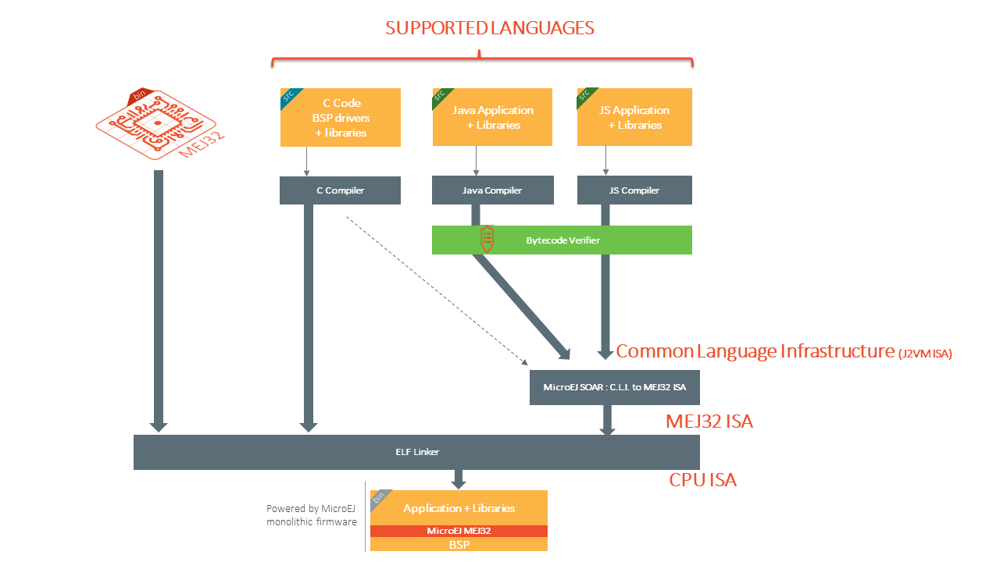

.. _soar:

SOAR
====

This chapter describes SOAR capabilities and optimizations from the Application developer's point of view.
To get more details on its internal structure, please refer to :ref:`soar_build_phases` section.

Java Symbols Encoding
---------------------

Java symbols are any of package, type, method, field, or local names. 
In ``.class`` files, they are encoded in ``UTF-8``.
However, SOAR only supports Java symbols composed of characters that can be stored on 8 bits (unsigned byte). 

This is typically the case of `ISO-8859-X <https://en.wikipedia.org/wiki/ISO/IEC_8859>`_ encoding family.

If you try to build an Application that includes an unsupported Java symbol you will get the following error:

.. code-block::
   
   Unsupported Java symbol XXX in file YYY. A character cannot be stored on an unsigned byte.

.. note:: 

   Classpath ``*.list`` files are `standard Java properties files <https://en.wikipedia.org/wiki/.properties>`_ that are encoded in ``ISO-8859-1`` (Latin-1).
   If you need to refer to a Java Symbol that contains a character out of this charset, you must declare the character using the ``\uHHHH`` notation where HHHH is the hexadecimal index of the character in the Unicode character set.

.. _soar_clinit:

Class Initialization Code
-------------------------

SOAR complies with the deterministic class initialization (``<clinit>``)
order specified in :ref:`[BON] specification <runtime_bon>`. The application is statically analyzed from
its entry points in order to generate a clinit dependency graph. The
computed clinit sequence is the result of the topological sort of the
dependency graph. An error is thrown if the clinit dependency graph
contains cycles.

A clinit map file (ending with extension ``.clinitmap``) is generated
beside the SOAR object file. It describes for each clinit dependency:

-  the types involved

-  the kind of dependency

-  the stack calls between the two types

.. _soar_clinit_explicit_dependencies:

In case of complex clinit code with too many runtime dependencies, the statically computed clinit order may be wrong.

It is then possible to help SOAR by manually declaring explicit clinit dependencies.
Such dependencies are declared in XML files with the ``.clinitdesc`` extension in the application classpath. 

The file has the following format:

::

   <?xml version='1.0' encoding='UTF-8'?>
   <clinit>
       <type name="T1" depends="T2"/>
   </clinit>

where ``T1`` and ``T2`` are fully qualified names on the form ``a.b.C``.
This explicitly forces SOAR to create a dependency from ``T1`` to
``T2``, and therefore cuts a potentially detected dependency from ``T2``
to ``T1``.

.. _soar_method_devirtualization:

Method Devirtualization
------------------------

Method devirtualization consists of transforming a virtual method call to a direct method call when possible.
A virtual method call is a call to a non-private instance method declared either in an interface or in a class. 
The Core Engine determines the proper method to call at runtime depending on the actual class of the object. 
A call to a constructor or a private method is already optimized as a direct method call by the Java compiler.

SOAR automatically optimizes a virtual method call to a direct method call if there is one and only one embedded implementation method.

.. note::
  
   SOAR generates the list of the embedded methods in the :ref:`SOAR Information File <soar_info_file>`.

.. _soar_method_inlining:

Method Inlining
---------------

Method inlining consists of replacing a direct method call with the content of the method. This avoids the creation of a new stack frame context, which can be slower than executing the code itself.
Method inlining is transitively applied from leaf to root methods.

The following method code patterns are inlined:

- empty code after processing :ref:`assertions <enable_assertions_emb>` and :ref:`if code removal <if_constant_removal>`.
- call to a constructor with no parameters.
- call to a private method with no parameters.
- call to a static method with no parameters, if and only if the caller is also a static method.

.. note::

   Method inlining is performed after :ref:`method devirtualization <soar_method_devirtualization>`, so a virtual method call will be inlined 
   if there is a unique embedded implementation method that matches one of the inlined method code patterns.

.. _soar_bytecode_verifier:

Bytecode Verifier
-----------------

Bytecode Verifier is the tool that scrutinizes the bytecode instructions for adherence to strict rules and constraints.
This process is crucial for preventing runtime errors, security vulnerabilities, and unexpected behavior.
It ensures that code loaded by the SOAR is in a consistent state before being linked.
Consequently, this guarantees the safe execution of the code by the Core Engine.

   Application Build Flow with Bytecode Verifier

The verifier performs tasks including:

- Type Checking: Verifying that variables and operands are used in a manner consistent with their declared data types, preventing type-related errors at runtime.

- Bytecode Structure: Ensuring the bytecode is well-formed and follows the structure required by the JVM, which helps prevent memory corruption and crashes.

- Stack Management: Checking that the operand stack used for calculations and evaluations is properly managed to prevent stack overflows or underflows.

- Access Control: Verifying that class access and method invocations adhere to Java's access control rules, ensuring data encapsulation and security.

- Exception Handling: Validating that exception handlers are correctly defined and that exceptions are caught and handled appropriately.

- Control Flow: Analyzing the flow of control within bytecode to detect anomalies in loops, branches, and jumps that could lead to program instability.

Starting from :ref:`Architecture 8.1.0 <changelog-8.1.0>`, a default Bytecode Verifier implementation, derived from the `Apache BCEL Project <https://commons.apache.org/proper/commons-bcel/>`_, is now included.
If you wish to integrate an alternative implementation, contact `our support team <https://www.microej.com/contact/#form_2>`_  for access to the SOAR interface API and integration instructions.

 
.. note:: 

   Bytecode Verifier is enabled by default when building a Sandboxed Application, and disabled by default when building a Standalone Application.
   See :ref:`option_enable_bytecode_verifier` for more details.

..
   | Copyright 2008-2023, MicroEJ Corp. Content in this space is free 
   for read and redistribute. Except if otherwise stated, modification 
   is subject to MicroEJ Corp prior approval.
   | MicroEJ is a trademark of MicroEJ Corp. All other trademarks and 
   copyrights are the property of their respective owners.
