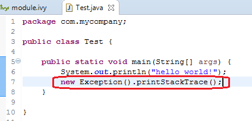
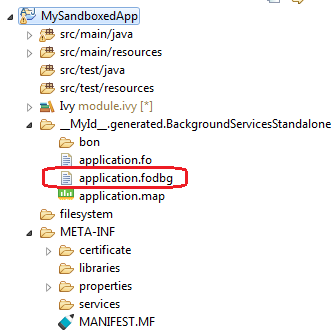
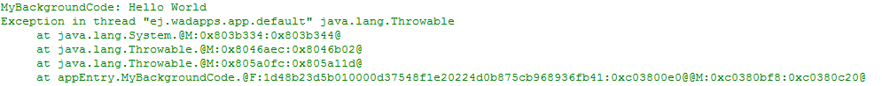
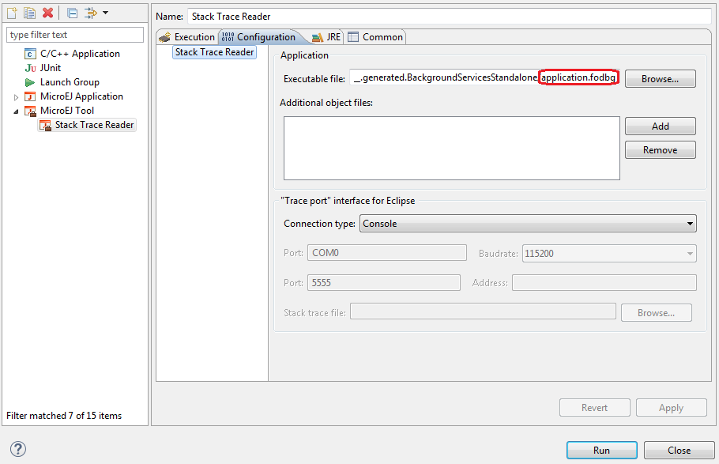
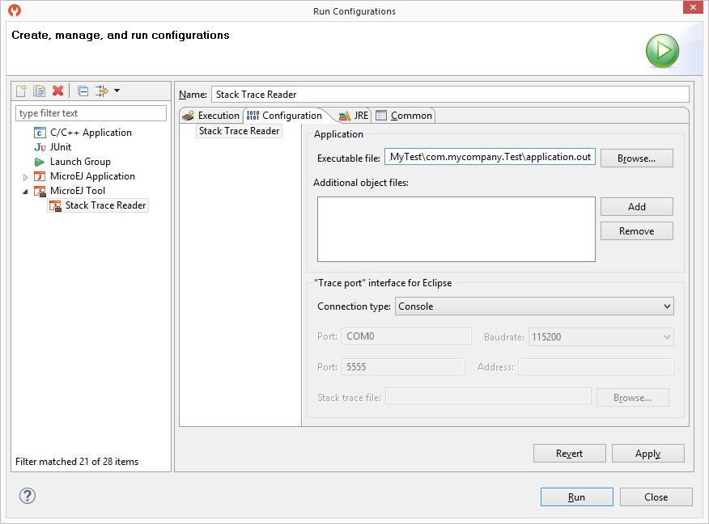
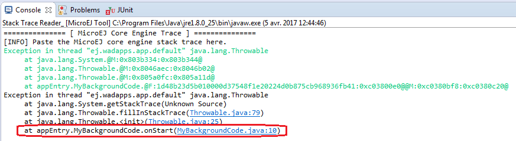

.. _section.stacktrace.reader.tool:

.. _stack_trace_reader:

==================
Stack Trace Reader
==================

Principle
=========

Stack Trace Reader is a MicroEJ tool which reads and decodes the MicroEJ
stack traces. When an exception occurs, the MicroEJ Core Engine prints
the stack trace on the standard output ``System.out``. The class names,
non required types (see :ref:`section.classpath.elements.types`) names
and method names obtained are encoded with a MicroEJ internal format.
This internal format prevents the embedding of all class names and
method names in the flash, in order to save some memory space. The Stack
Trace Reader tool allows you to decode the stack traces by replacing the
internal class names and method names with their real names. It also
retrieves the line number in the MicroEJ Application.

Functional Description
======================

The Stack Trace Reader reads the debug info from the fully linked ELF
file (the ELF file that contains the MicroEJ Core Engine, the other
libraries, the BSP, the OS, and the compiled MicroEJ Application). It
prints the decoded stack trace.

Dependencies
============

No dependency.

Installation
============

This tool is a built-in platform tool.

Use
===

Write a new line to dump the currently executed stack trace on the
standard output.

.. figure:: images/STR_stacktracedump.png
   :alt: Code to Dump a Stack Trace
   :align: center
   :width: 425px
   :height: 124px

   Code to Dump a Stack Trace

Write a new line to dump the currently executed stack trace on the
standard output.

   Code to Dump a Stack Trace

To be able to decode an application stack trace, the stack trace reader
tool requires the application binary file with debug information
(``application.fodbg`` in the output folder). Note that the file which
is uploaded on the device is ``application.fo`` (stripped version
without debug information).

   Application Binary File with Debug Information

On successful deployment, the application is started on the device and
the following trace is dumped on standard output.

.. TODO this figure was controled by a conditional, isSandbox
   is showing

   Stack Trace Output

.. TODO This figure was controlled by a conditional, isStandalone
    .. figure:: ../StandaloneAppDevGuide/png/trace2.png
       :alt: Stack Trace Output
       :width: 80.0%
       :align: center
       
       Stack Trace Output

To create a new MicroEJ Tool configuration, right-click on the application
project and click on :guilabel:`Run As...` > :guilabel:`Run Configurations...`.

In :guilabel:`Execution` tab, select the :guilabel:`Stack Trace Reader` tool.

.. figure:: images/STR_selecttool.png
   :alt: Select Stack Trace Reader Tool
   :align: center
   :width: 926px
   :height: 306px

   Select Stack Trace Reader Tool

In :guilabel:`Configuration` tab, browse the previously generated application
binary file with debug information (``application.fodbg`` in case of a Sandboxed
Application or ``application.out`` in case of a Standalone Application)

   Stack Trace Reader Tool Configuration (Sandboxed Application)

   Stack Trace Reader Tool Configuration (Standalone Application)

Click on :guilabel:`Run` button and copy/paste the trace into the Eclipse
console. The decoded trace is dumped and the line corresponding to the
application hook is now readable.

.. TODO this figure was controlled with a conditional, isSandbox

   Read the Stack Trace

.. TODO this figure was controlled with a conditional, isStandalone
    .. figure:: ../StandaloneAppDevGuide/png/trace4.png
       :alt: Read the Stack Trace
       :width: 100.0%
       :align: center
       
       Read the Stack Trace

The stack trace reader can simultaneously decode heterogeneous stack
traces with lines owned by different applications and the firmware.
Other debug information files can be appended using the
:guilabel:`Additional object files` option. Lines owned by the firmware can be
decoded with the firwmare debug information file (optionally made
available by your firmware provider).

The following section explains MicroEJ tool options.

.. include:: stackTraceReader_use.rst

..
   | Copyright 2008-2020, MicroEJ Corp. Content in this space is free 
   for read and redistribute. Except if otherwise stated, modification 
   is subject to MicroEJ Corp prior approval.
   | MicroEJ is a trademark of MicroEJ Corp. All other trademarks and 
   copyrights are the property of their respective owners.
