.. _section.stacktrace.reader.tool:

.. _stack_trace_reader:

==================
Stack Trace Reader
==================

Principle
=========

Stack Trace Reader is a MicroEJ tool that reads and decodes the MicroEJ
stack traces. When an exception occurs, the MicroEJ Core Engine prints
the stack trace on the standard output ``System.out``. The class names,
non-required types names(see :ref:`section.classpath.elements.types`),
and method names obtained are encoded with a MicroEJ internal format.
This internal format prevents embedding all class names and
method names in the executable image to save some memory space. The Stack
Trace Reader tool allows you to decode the stack traces by replacing the
internal class names and method names with their real names. It also
retrieves the line numbers in the MicroEJ Application.

Functional Description
======================

The Stack Trace Reader reads the debug info from the fully linked ELF
file (the ELF file that contains the MicroEJ Core Engine, the other
libraries, the BSP, the OS, and the compiled MicroEJ Application). It
prints the decoded stack trace.

Dependencies
============

No dependency.

Installation
============

This tool is a built-in platform tool.

Use (Standalone Application)
============================

For example, write the following new line to dump the currently executed stack trace on the
standard output.

.. figure:: images/trace1.png
   :alt: Code to Dump a Stack Trace
   :align: center
   :scale: 100%

   Code to Dump a Stack Trace

To decode an application stack trace, the stack trace reader tool requires the application executable ELF file.
In the case of a platform with full BSP connection (see :ref:`BSP Connection Cases <bsp_connection_cases>`), the file is ``application.out`` in the output folder. 
In the other cases, the ELF file is generated by the C toolchain when building the BSP project (usually a ``.out`` or ``.axf`` file).

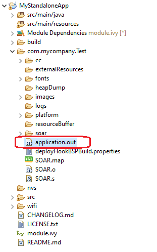

   Application Binary File

On successful deployment, the application is started on the device and
the following trace is dumped on standard output.

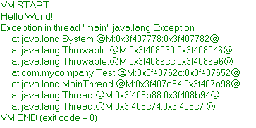
   
   Stack Trace Output

To create a new MicroEJ Tool configuration, right-click on the application
project and click on :guilabel:`Run As...` > :guilabel:`Run Configurations...`.

Create a new MicroEJ Tool configuration. In the :guilabel:`Execution` tab, select your target platform, then select the :guilabel:`Stack Trace Reader` tool. Set an output folder in the :guilabel:`Output folder` field.

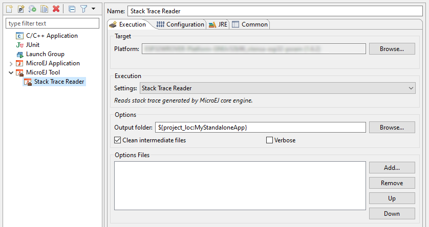

   Stack Trace Reader Tool Configuration (Platform Selection)

In :guilabel:`Configuration` tab, browse the previously generated application
binary file with debug information (``application.out`` in case of a Standalone Application with full BSP connection)

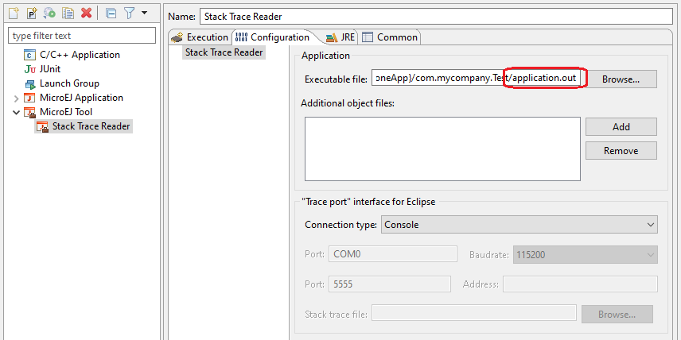

   Stack Trace Reader Tool Configuration (Standalone Application)

Click on :guilabel:`Run` button and copy/paste the trace into the Eclipse
console. The decoded trace is dumped and the line corresponding to the
application hook is now readable.

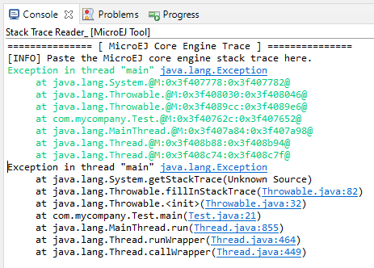
   
   Stack trace Reader Console

Use (Sandboxed Application)
===========================

For example, write the following new line to dump the currently executed stack trace on the
standard output.

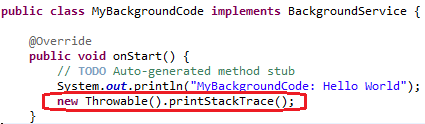

   Code to Dump a Stack Trace

To decode an application stack trace, the stack trace reader
tool requires the application binary file with debug information
(``application.fodbg`` in the output folder). Note that the file 
uploaded on the device is ``application.fo`` (stripped version
without debug information).

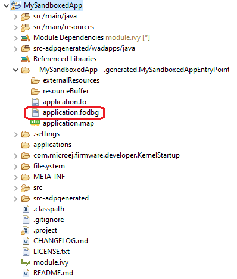

   Application Binary File with Debug Information

On successful deployment, the application is started on the device and
the following trace is dumped on standard output.

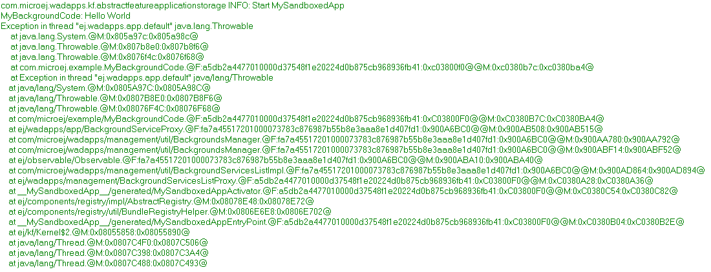

   Stack Trace Output

To create a new MicroEJ Tool configuration, right-click on the application
project and click on :guilabel:`Run As...` > :guilabel:`Run Configurations...`.

Create a new MicroEJ Tool configuration. In the :guilabel:`Execution` tab, select your target platform, then select the :guilabel:`Stack Trace Reader` tool. Set an output folder in the :guilabel:`Output folder` field.

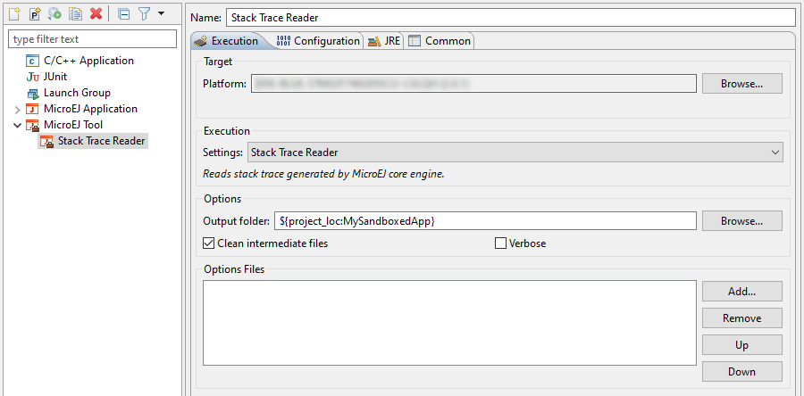

   Stack Trace Reader Tool Configuration (Virtual Device Selection)

In :guilabel:`Configuration` tab, browse the previously generated application
binary file with debug information (``application.fodbg`` in case of a Sandboxed
Application)

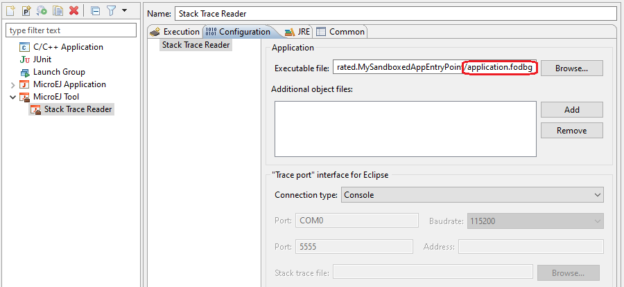

   Stack Trace Reader Tool Configuration (Sandboxed Application)

Click on :guilabel:`Run` button and copy/paste the trace into the Eclipse
console. The decoded trace is dumped and the line corresponding to the
application hook is now readable.

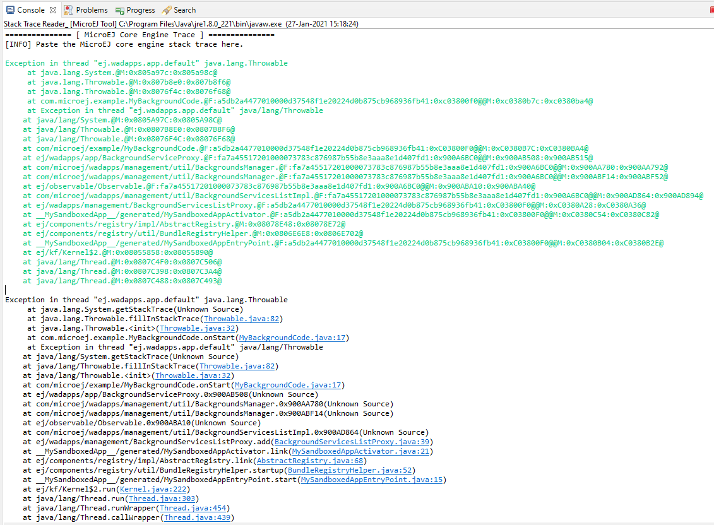

   Stack trace Reader Console

The stack trace reader can simultaneously decode heterogeneous stack
traces with lines owned by different applications and the firmware.
Other debug information files can be appended using the
:guilabel:`Additional object files` option. Lines owned by the firmware can be
decoded with the firmware debug information file (optionally made
available by your firmware provider).

The following section explains MicroEJ tool options.

Stack Trace Reader Options
==========================

.. include:: stackTraceReader_use.rst

..
   | Copyright 2008-2020, MicroEJ Corp. Content in this space is free 
   for read and redistribute. Except if otherwise stated, modification 
   is subject to MicroEJ Corp prior approval.
   | MicroEJ is a trademark of MicroEJ Corp. All other trademarks and 
   copyrights are the property of their respective owners.
