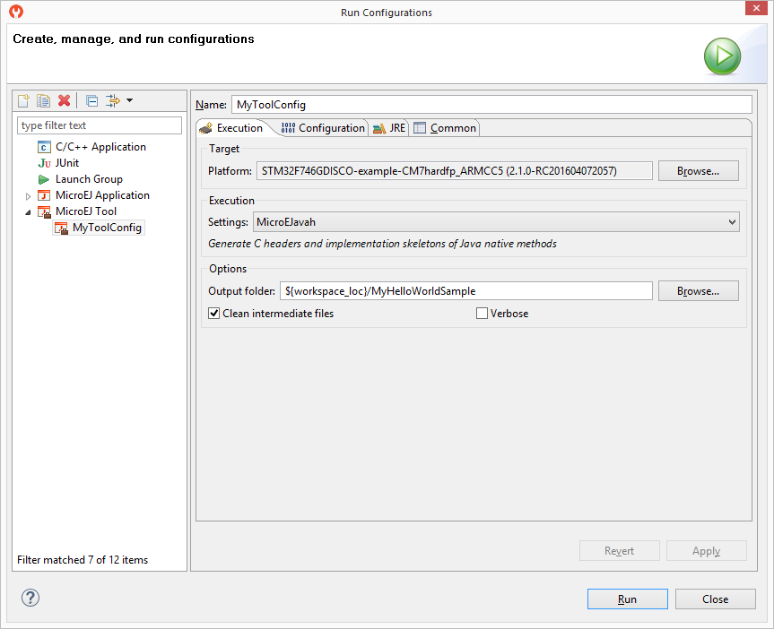

.. _MicroEJToolsSection:

Development Tools
#################

MicroEJ provides a number of tools to assist with various
aspects of development. Some of these tools are run using MicroEJ Tool
configurations, and created using the Run Configurations dialog of the
MicroEJ SDK. A configuration must be created for the tool before it can be
used.

.. _fig_tool-launch:

   MicroEJ Tool Configuration

:ref:`The above figure <fig_tool-launch>` shows a tool configuration
being created. In the figure, the MicroEJ Platform has been selected,
but the selection of which tool to run has not yet been made. That
selection is made in the Execution Settings... box. The Configuration
tab then contains the options relevant to the selected tool.

.. toctree::
   :maxdepth: 2

   testsuite
   stackTraceReader
   codeCoverageAnalyzer
   heapAnalyzer
   elfToMapGenerator
   serialToSocketTransmitter
   memoryMapAnalyzer
   trace
   nullAnalysis

..
   | Copyright 2008-2020, MicroEJ Corp. Content in this space is free 
   for read and redistribute. Except if otherwise stated, modification 
   is subject to MicroEJ Corp prior approval.
   | MicroEJ is a trademark of MicroEJ Corp. All other trademarks and 
   copyrights are the property of their respective owners.
