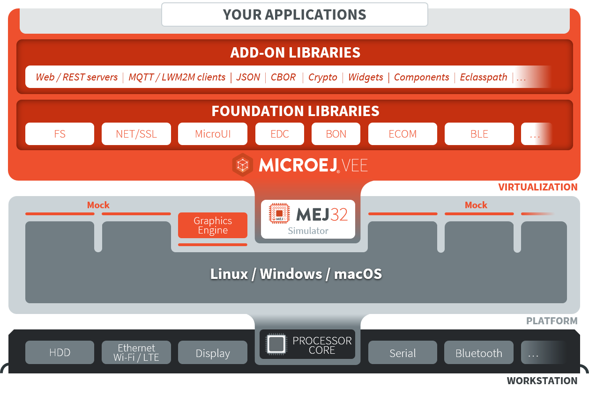

.. _section.virtual.device:

Virtual Device
==============

.. _section.virtual.device.simulation:

Using a Virtual Device for Simulation
-------------------------------------

The Virtual Device includes the same custom MicroEJ Core, libraries and
System Applications as the real device. The Virtual Device allows
developers to run their applications either on the Simulator, or
directly on the real device through local deployment.

The Simulator runs a mockup board support package (BSP Mock) that mimics
the hardware functionality. An application on the Simulator is run as a
Standalone Application.

Before an application is locally deployed on device, the SDK
ensures that it does not depend on any API that is unavailable on the
device.

   MicroEJ Virtual Device Architecture

.. _section.javadoc.specification:

Runtime Environment
-------------------

The set of MicroEJ APIs exposed by a Virtual Device (and therefore
provided by its associated firwmare) is documented in Javadoc format, please consult https://repository.microej.com/javadoc/microej_5.x/apis/.

   | Copyright 2008-2022, MicroEJ Corp. Content in this space is free 
   for read and redistribute. Except if otherwise stated, modification 
   is subject to MicroEJ Corp prior approval.
   | MicroEJ is a trademark of MicroEJ Corp. All other trademarks and 
   copyrights are the property of their respective owners.
