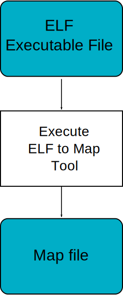

=========================
ELF to Map File Generator
=========================

Principle
=========

The ELF to Map generator takes an ELF executable file and generates a
MicroEJ compliant ``.map`` file. Thus, any ELF executable file produced
by third party linkers can be analyzed and interpreted using the
:ref:`memorymapanalyzer`.

Functional Description
======================

   ELF To Map Process

Installation
============

This tool is a built-in platform tool.

Use
===

This chapter explains MicroEJ tool options.
