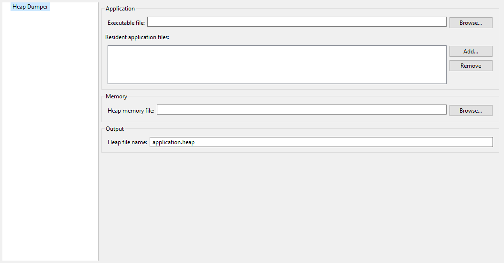

---------------------
Category: Heap Dumper
---------------------

Group: Application
------------------

Option(browse): Executable file
^^^^^^^^^^^^^^^^^^^^^^^^^^^^^^^

*Option Name*: ``application.filename``

*Default value*: ``(empty)``

*Description*:

Specify the full path of a full linked ELF file.

Option(list): Resident application files
^^^^^^^^^^^^^^^^^^^^^^^^^^^^^^^^^^^^^^^^

*Option Name*: ``additional.application.filenames``

*Default value*: ``(empty)``

*Description*:

Specify the full path of resident applications ``.out`` files linked by the
Firmware Linker.

Group: Memory
-------------

Option(browse): Heap memory file
^^^^^^^^^^^^^^^^^^^^^^^^^^^^^^^^

*Option Name*: ``heap.filename``

*Default value*: ``(empty)``

*Description*:

Specify the full path of heap memory dump, in Intel Hex format.

Group: Output
-------------

Option(text): Heap file name
^^^^^^^^^^^^^^^^^^^^^^^^^^^^

*Option Name*: ``output.name``

*Default value*: ``application.heap``

