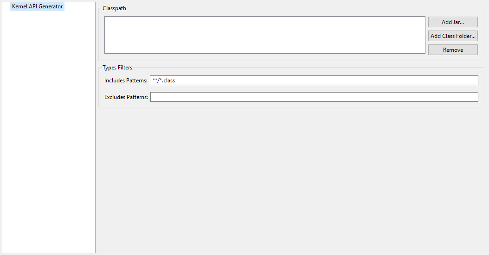

Category: Kernel API Generator
==============================

Group: Classpath
----------------

Option(list):
^^^^^^^^^^^^^^

*Option Name*: ``kernel.api.generator.classpath``

*Default value*: ``(empty)``

Group: Types Filters
--------------------

Option(text): Includes Patterns
^^^^^^^^^^^^^^^^^^^^^^^^^^^^^^^

*Option Name*: ``kernel.api.generator.includes.patterns``

*Default value*: ``**/*.class``

*Description*: Comma separated list of ANT Patterns for types to include.

Option(text): Excludes Patterns
^^^^^^^^^^^^^^^^^^^^^^^^^^^^^^^

*Option Name*: ``kernel.api.generator.excludes.patterns``

*Default value*: ``(empty)``

*Description*: Comma separated list of ANT Patterns for types to exclude.

