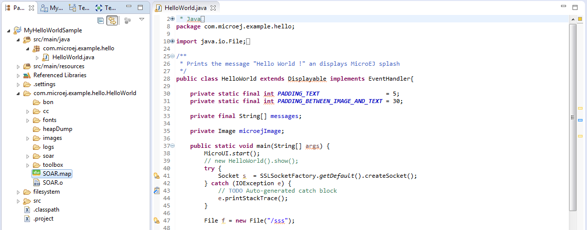
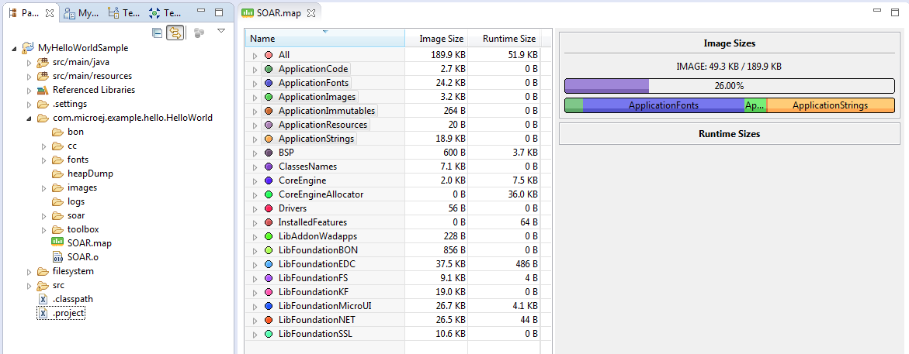

.. _memorymapanalyzer:

===================
Memory Map Analyzer
===================

Principle
=========

When a MicroEJ application is linked with the MicroEJ workbench, a
Memory MAP file is generated. The Memory Map Analyzer (MMA) is an
Eclipse plug-in made for exploring the map file. It displays the memory
consumption of different features in the RAM and ROM.

Functional Description
======================

.. figure:: images/process.*
   :alt: Memory Map Analyzer Process
   :width: 30.0%
   :align: center

   Memory Map Analyzer Process

In addition to the executable file, the MicroEJ platform generates a map
file. Double click on this file to open the Memory Map Analyzer.

Dependencies
============

No dependency.

Installation
============

This tool is a built-in platform tool.

Use
===

The map file is available in the MicroEJ application project output
directory.

   Retrieve Map File

Select an item (or several) to show the memory used by this item(s) on
the right. Select "All" to show the memory used by all items. This
special item performs the same action as selecting all items in the
list.

   Consult Full Memory

Select an item in the list, and expand it to see all symbols used by the
item. This view is useful in understanding why a symbol is embedded.

.. figure:: images/RIDetailedView.png
   :alt: Detailed view
   :align: center
   :width: 1216px
   :height: 753px

   Detailed View
