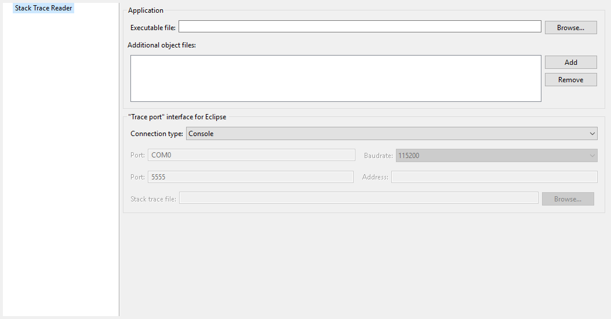

Category: Stack Trace Reader
============================

Group: Application
------------------

Option(browse): Executable file
^^^^^^^^^^^^^^^^^^^^^^^^^^^^^^^

*Option Name*: ``application.file``

*Default value*: ``(empty)``

*Description*:

Specify the full path of a full linked elf file.

Option(list): Additional object files
^^^^^^^^^^^^^^^^^^^^^^^^^^^^^^^^^^^^^

*Option Name*: ``additional.application.files``

*Default value*: ``(empty)``

Group: "Trace port" interface for Eclipse
------------------------------------------

*Description*:

This group describes the hardware link between the device and the PC.

Option(combo): Connection type
^^^^^^^^^^^^^^^^^^^^^^^^^^^^^^

*Option Name*: ``proxy.connection.connection.type``

*Default value*: ``Console``

*Available values: *

``Uart (COM)``

``Socket``

``File``

``Console``

*Description*:

Specify the connection type between the device and PC.

Option(text): Port
^^^^^^^^^^^^^^^^^^

*Option Name*: ``pcboardconnection.usart.pc.port``

*Default value*: ``COM0``

*Description*:

*Format:* ``port name``

Specifies the PC COM port:

Windows - ``COM1``, ``COM2``, ``...``, ``COM*n*``

Linux - ``/dev/ttyS0``, ``/dev/ttyS1``, ``...``, ``/dev/ttyS*n*``

Option(combo): Baudrate
^^^^^^^^^^^^^^^^^^^^^^^

*Option Name*: ``pcboardconnection.usart.pc.baudrate``

*Default value*: ``115200``

*Available values: *

``9600``

``38400``

``57600``

``115200``

*Description*:

Defines the COM baudrate for PC-Device communication.

Option(text): Port
^^^^^^^^^^^^^^^^^^

*Option Name*: ``pcboardconnection.socket.port``

*Default value*: ``5555``

*Description*:

IP port.

Option(text): Address
^^^^^^^^^^^^^^^^^^^^^

*Option Name*: ``pcboardconnection.socket.address``

*Default value*: ``(empty)``

*Description*:

IP address, on the form A.B.C.D.

Option(browse): Stack trace file
^^^^^^^^^^^^^^^^^^^^^^^^^^^^^^^^

*Option Name*: ``pcboardconnection.file.path``

*Default value*: ``(empty)``

