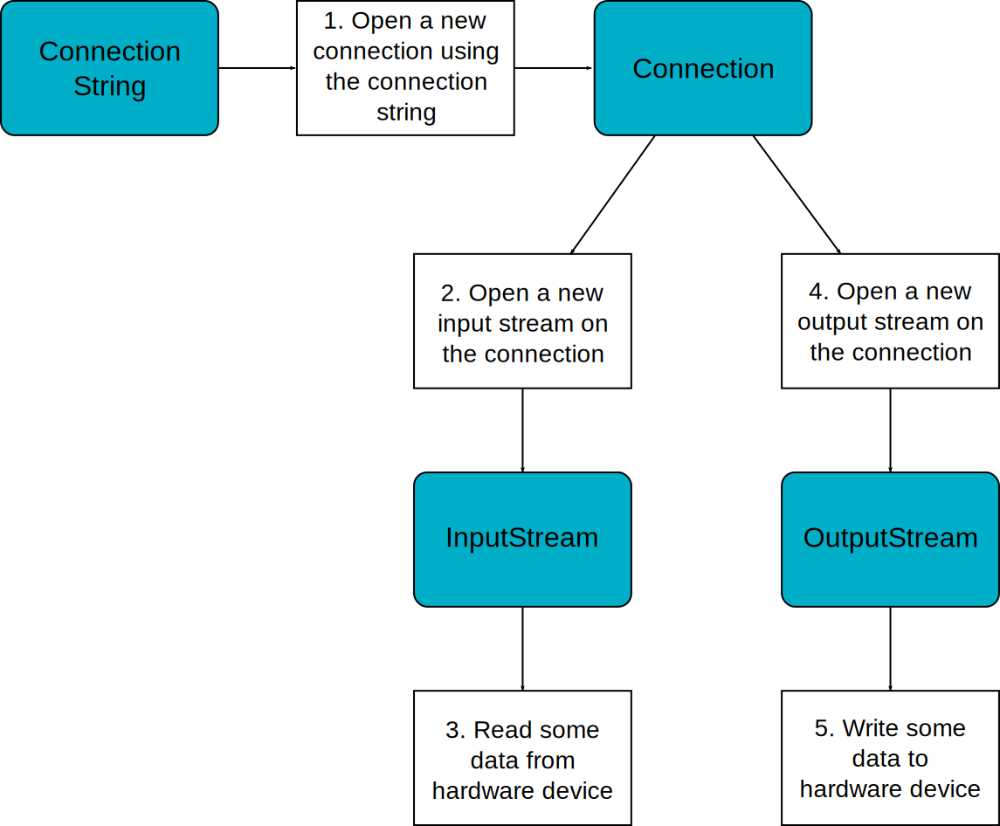

====
ECOM
====

Principle
=========

The Embedded COMmunication foundation library (ECOM) is a generic
communication library with abstract communication stream support (a
communication framework only). It allows you to open and use streams on
communication devices such as a COMM port.

This library also provides a device manager, including a generic device
registry and a notification mechanism, which allows plug&play-based
applications.

This library does not provide APIs to manipulate some specific options
for each communication method, but it does provide some generic APIs
which abstract the communication method. After the opening step, the
MicroEJ application can use every communications method (COMM, USB etc.)
as generic communication in order to easily change the communication
method if needed.

Functional Description
======================

`figure_title <#ecom_flow>`__ shows the overall process to open a
connection on a hardware device.

   ECOM Flow

1. Step 1 consists of opening a connection on a hardware device. The
   connection kind and its configuration are fixed by the parameter
   ``String connectionString`` of the method ``Connection.open``.

2. Step 2 consists of opening an ``InputStream`` on the connection. This
   stream allows the MicroEJ application to access the "RX" feature of
   the hardware device.

3. Step 3 consists of using the ``InputStream`` APIs to receive in the
   MicroEJ application all hardware device data.

4. Step 4 consists of opening an ``OutputStream`` on the connection.
   This stream allows the MicroEJ application to access the "TX" feature
   of the hardware device.

5. Step 5 consists of using the ``OutputStream`` APIs to transmit some
   data from the MicroEJ application to the hardware device.

Note that steps 2 and 4 may be performed in parallel, and do not depend
on each other.

.. _section_ecom_dm:

Device Management API
=====================

A device is defined by implementing ``ej.ecom.Device``. It is identified
by a name and a descriptor (``ej.ecom.HardwareDescriptor``), which is
composed of a set of MicroEJ properties. A device can be
registered/unregistered in the ``ej.ecom.DeviceManager``.

A device registration listener is defined by implementing
``ej.ecom.RegistrationListener``. When a device is registered to or
unregistered from the device manager, listeners registered for the
device type are notified. The notification mechanism is done in a
dedicated MicroEJ thread. The mechanism can be enabled or disabled (see
`??? <#workbenchLaunchOptions>`__).

Dependencies
============

No dependency.

Installation
============

ECOM foundation library is an additional library. In the platform
configuration file, check ``Serial Communication`` > ``ECOM`` to install
the library.

Use
===

A classpath variable named ``ECOM-1.1`` is available. This foundation
library is always required when developing a MicroEJ application which
communicates with some external devices. It is automatically embedded as
soon as a sub communication library is added in the classpath.
