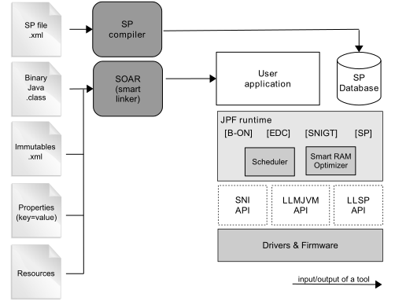

Introduction
============

Scope
-----

This document explains how the core features of XPF are accessed,
configured and used by the PLATFORM_BUILDER. It describes the process
for creating and augmenting a XPF. This document is concise, but
attempts to be exact and complete. Semantics of implemented JAVALIBS are
described in their respective specifications. This document includes an
outline of the required low level drivers (LLAPI) for porting the XPFs
to different real-time operating systems (RTOS).

XPF is state-of-the-art, with embedded MicroEJ runtimes for MCUs. They
also provide simulated runtimes that execute on workstations to allow
software development on "virtual hardware."

Intended Audience
-----------------

The audience for this document is software engineers who need to
understand how to create and configure a PLATFORM using the
PLATFORM_BUILDER. This document also explains how a MicroEJ application
can interoperate with C code on the target, and the details of the XPF
modules, including their APIs, error codes and options.

XPF Modules Overview
--------------------

XPF features the MJVM: a tiny and fast runtime associated with a smart
RAM optimizer. It provides four built-in foundation libraries :

-  [B-ON]

-  [EDC]

-  [SNI]

-  [SP]

`figure_title <#overviewFigure1>`__ shows the components involved.

   XPF Runtime Modules: Tools, Libraries and APIs

Three APIs allow the device architecture runtime to link with (and port
to) external code, such as any kind of RTOS or legacy C libraries. These
three APIs are

-  Simple Native Interface (SNI)

-  Low Level MJVM (LLMJVM)

-  Low Level Shielded Plug (LLSP)

XPF features additional JAVALIBS and modules to extend the kernel:

-  serial communication,

-  UI extension (User Interface)

-  networking

-  file system

-  etc.

Each additional module is optional and selected on demand during the
PLATFORM configuration.

Scheduler
---------

The XPF features a green thread platform that can interact with the C
world [SNI]. The (green) thread policy is as follows:

-  preemptive for different priorities,

-  round-robin for same priorities,

-  "priority inheritance protocol" when priority inversion occurs.  [1]_

MicroEJ stacks (associated with the threads) automatically adapt their
sizes according to the thread requirements: Once the thread has
finished, its associated stack is reclaimed, freeing the corresponding
RAM memory.

Smart RAM Optimizer
-------------------

The XPF includes a state-of-the-art memory management system, the
Garbage Collector (GC). It manages a bounded piece of RAM memory,
devoted to the Java world. The GC automatically frees dead Java objects,
and defragments the memory in order to optimize RAM usage. This is done
transparently while the MicroEJ applications keep running.

.. [1]
   This protocol raises the priority of a thread (that is holding a
   resource needed by a higher priority task) to the priority of that
   task.
