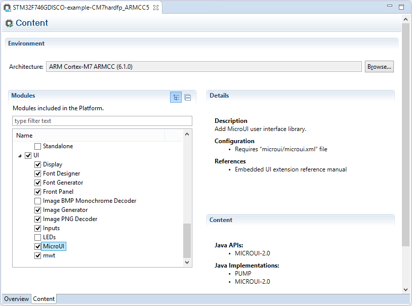

Concepts
========

.. _concepts-jpf:

MicroEJ Platform
----------------

A MicroEJ Platform includes development tools and a runtime environment.

The runtime environment consists of:

-  A MicroEJ core engine.

-  Some Foundation Libraries.

-  Some C libraries.

The development tools are composed of:

-  Java APIs to compile MicroEJ application code.

-  Documentation: this guide, library specifications, etc.

-  Tools for development and compilation.

-  Launch scripts to run the simulation or build the binary file.

-  Eclipse plugins.

MicroEJ Platform Configuration
------------------------------

A MicroEJ Platform is described by a ``.platform`` file. This file is
usually called ``[name].platform``, and is stored at the root of a
MicroEJ Platform configuration project called ``[name]-configuration``.

The configuration file is recognized by the MicroEJ platform builder.
The MicroEJ platform builder offers a visualization with two tabs:

   MicroEJ Platform Configuration Overview Tab

This tab groups the basic platform information used to identify it: its
name, its version, etc. These tags can be updated at any time.

   MicroEJ Platform Configuration Content Tab

This tab shows all additional modules (see `Modules <#jpf_modules>`__)
which can be installed into the platform in order to augment its
features. The modules are sorted by groups and by functionality. When a
module is checked, it will be installed into the platform during the
platform creation.

.. _jpf_modules:

Modules
-------

The primary mechanism for augmenting the capabilities of a `MicroEJ
Platform <#concepts-jpf>`__ is to add modules to it.

A MicroEJ module is a group of related files (Foundation Libraries,
scripts, link files, C libraries, simulator, tools, etc.) that together
provide all or part of a platform capability. Generally, these files
serve a common purpose. For example, providing an API, or providing a
library implementation with its associated tools.

The list of modules is in the second tab of the platform configuration
tab. A module may require a configuration step to be installed into the
platform. The :guilabel:`Modules Detail` view indicates if a configuration file
is required.

Low Level API Pattern
---------------------

Principle
~~~~~~~~~

Each time the user must supply C code that connects a platform component
to the target, a *Low Level API* is defined. There is a standard pattern
for the implementation of these APIs. Each interface has a name and is
specified by two header files:

-  ``[INTERFACE_NAME].h`` specifies the functions that make up the
   public API of the implementation. In some cases the user code will
   never act as a client of the API, and so will never use this file.

-  ``[INTERFACE_NAME]_impl.h`` specifies the functions that must be
   coded by the user in the implementation.

The user creates *implementations* of the interfaces, each captured in a
separate C source file. In the simplest form of this pattern, only one
implementation is permitted, as shown in the illustration below.

.. figure:: images/low-level-1c.*
   :alt: Low Level API Pattern (single implementation)
   :width: 70.0%
   :align: center

   Low Level API Pattern (single implementation)

The following figure shows a concrete example of an LLAPI. The C world
(the board support package) has to implement a ``send`` function and
must notify the library using a ``receive`` function.

.. figure:: images/low-level-3c.*
   :alt: Low Level API Example
   :width: 70.0%
   :align: center

   Low Level API Example

Multiple Implementations and Instances
~~~~~~~~~~~~~~~~~~~~~~~~~~~~~~~~~~~~~~

When a Low Level API allows multiple implementations, each
implementation must have a unique name. At run-time there may be one or
more instances of each implementation, and each instance is represented
by a data structure that holds information about the instance. The
address of this structure is the handle to the instance, and that
address is passed as the first parameter of every call to the
implementation.

The illustration below shows this form of the pattern, but with only a
single instance of a single implementation.

.. figure:: images/low-level-2c.*
   :alt: Low Level API Pattern (multiple implementations/instances)
   :width: 70.0%
   :align: center

   Low Level API Pattern (multiple implementations/instances)

The ``#define`` statement in ``MYIMPL.c`` specifies the name given to
this implementation.
