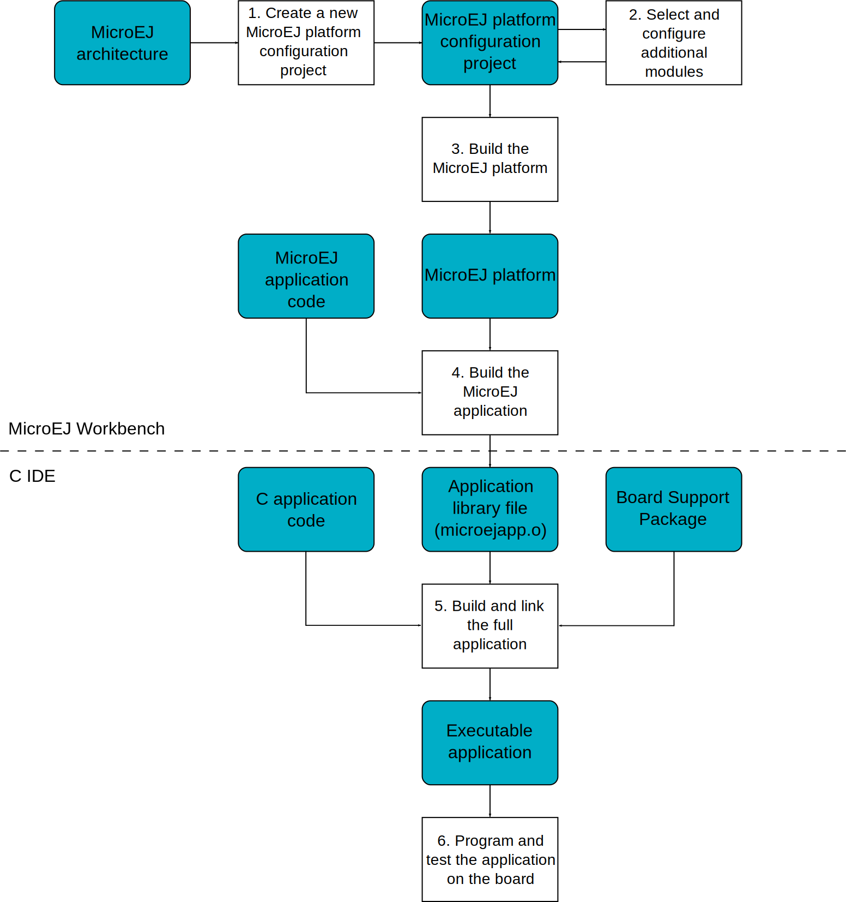

.. _processOverviewId:

Process Overview
================

This section summarizes the steps required to build a MicroEJ Platform
and obtain a binary file to deploy on a board.

:ref:`The following figure <fig_overall-process>` shows the overall process. The first
three steps are performed within the MicroEJ platform builder. The
remaining steps are performed within the C IDE.

.. _fig_overall-process:

   Overall Process

1. Step 1 consists in creating a new MicroEJ Platform configuration
   project. This project describes the MicroEJ Platform (MicroEJ
   architecture, metadata, etc.).

2. Step 2 allows you to select which modules available in MicroEJ
   architecture will be installed in the MicroEJ Platform.

3. Step 3 builds the MicroEJ Platform according to the choices made in
   steps 1 and 2.

4. Step 4 compiles a MicroEJ application against the MicroEJ Platform in
   order to obtain an application file to link in the BSP.

5. Step 5 consists in compiling the BSP and linking it with the MicroEJ
   application that was built previously, in step 4.

6. Step 6 is the final step: Deploy the binary application onto a board.
