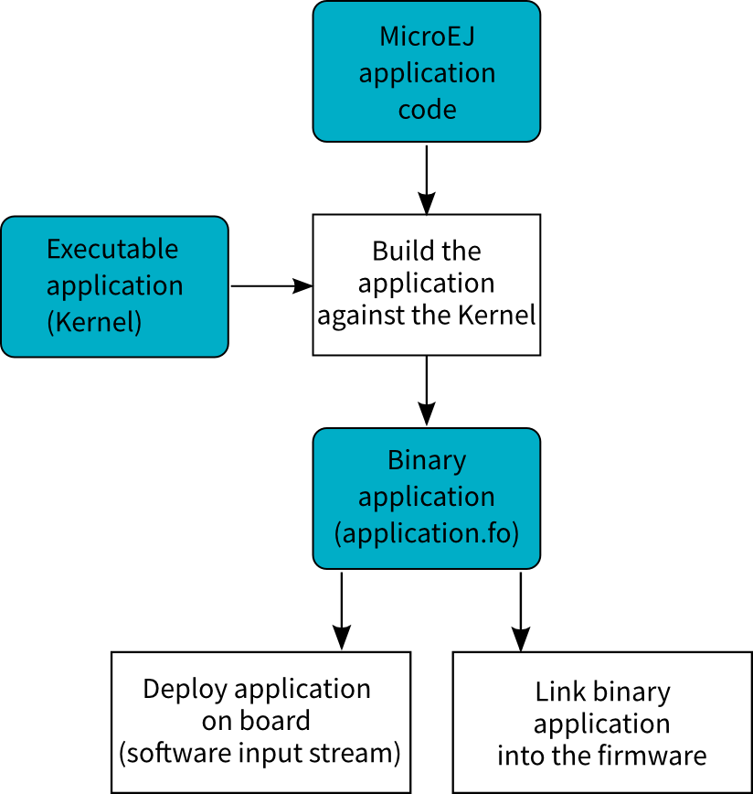

.. _core-multiapp:

==================
Multi applications
==================

Principle
=========

The Multi applications capability of the MicroEJ core engine allows a
main application (called standalone application) to install and execute
at runtime additional applications (called sandboxed applications).

The MicroEJ core engine implements the [KF] specification. A Kernel is a
standalone application generated on a Multi applications-enabled
platform. A Feature is a sandboxed application generated against a
Kernel.

A sandboxed application may be dynamically downloaded at runtime or
integrated at build-time within the executable application.

Note that the Multi applications is a capability of the MicroEJ core
engine. The MicroEJ simulator always runs an application as a standalone
application.

Functional Description
======================

The Multi applications process extends the overall process described in
:ref:`the overview of the platform process <processOverviewId>`.

   Multi applications Process

Once a Kernel has been generated, additional MicroEJ application code
(Feature) can be built against the Kernel by :

-  Creating one launch configuration per feature.

-  Setting the :guilabel:`Settings` field in the :guilabel:`Execution` tab of each
   feature launch configuration to :guilabel:`Build Dynamic Feature`.

-  Setting the :guilabel:`Kernel` field in the :guilabel:`Configuration` tab of each
   feature launch configuration to the :guilabel:`...`.

using the MicroEJ application launch named Build Dynamic Feature. The
binary application file produced (``application.fo``) is compatible only
for the Kernel on which it was generated. Generating a new Kernel
requires that you generate the Features again on this Kernel.

The Features built can be deployed in the following ways:

-  Downloaded and installed at runtime by software. Refer to the [KF]
   specification for ``ej.kf.Kernel`` install APIs.

-  Linked at build-time into the executable application. Features linked
   this way are then called Installed Features. The Kernel should have
   been generated with options for dimensioning the maximum size (code,
   data) for such Installed Features. Features are linked within the
   Kernel using the Firmware linker tool.

Firmware Linker
===============

A MicroEJ tool is available to link Features as Installed Features
within the executable application. The tool name is Firmware Linker. It
takes as input the executable application file and the Feature binary
code into which to be linked. It outputs a new executable application
file, including the Installed Feature. This tool can be used to append
multiple Features, by setting as the input file the output file of the
previous pass.

Memory Considerations
=====================

Multi applications memory overhead of MicroEJ core engine runtime
elements are described in :ref:`the table below <table_kf-overhead>`.

.. _table_kf-overhead:
.. table:: Multi applications Memory Overhead

   +-----------+-----------+-----------------------------------------------+
   | Runtime   | Memory    | Description                                   |
   | element   |           |                                               |
   +===========+===========+===============================================+
   | Object    | RW        | 4 bytes                                       |
   +-----------+-----------+-----------------------------------------------+
   | Thread    | RW        | 24 bytes                                      |
   +-----------+-----------+-----------------------------------------------+
   | Stack     | RW        | 8 bytes                                       |
   | Frame     |           |                                               |
   +-----------+-----------+-----------------------------------------------+
   | Class     | RO        | 4 bytes                                       |
   | Type      |           |                                               |
   +-----------+-----------+-----------------------------------------------+
   | Interface | RO        | 8 bytes                                       |
   | Type      |           |                                               |
   +-----------+-----------+-----------------------------------------------+

Dependencies
============

-  ``LLKERNEL_impl.h`` implementation (see :ref:`LLKF-API-SECTION`).

Installation
============

Multi applications is an additional module, disabled by default.

To enable Multi applications of the MicroEJ core engine, in the platform
configuration file, check :guilabel:`Multi Applications`.

Use
===

A classpath variable named ``KF-1.4`` is available.

This library provides a set of options. Refer to the chapter
:ref:`workbenchLaunchOptions` which lists all available options.
