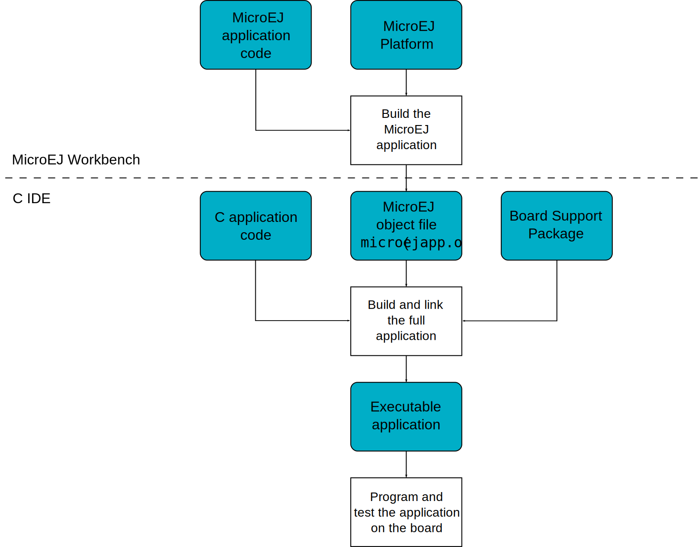

Functional Description
======================

`figure_title <#mjvm_flow>`__ shows the overall process. The first two
steps are performed within the MicroEJ Workbench. The remaining steps
are performed within the C IDE.

   MicroEJ core engine Flow

1. Step 1 consists in writing a MicroEJ application against a set of
   foundation libraries available in the platform.

2. Step 2 consists in compiling the MicroEJ application code and the
   required libraries in an ELF library, using the Smart Linker.

3. Step 3 consists in linking the previous ELF file with the MicroEJ
   core engine library and a third-party BSP (OS, drivers, etc.). This
   step may require a third-party linker provided by a C toolchain.
