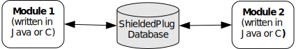

==================
Shielded Plug (SP)
==================

Principle
=========

The Shielded Plug [SP] provides data segregation with a clear
publish-subscribe API. The data-sharing between modules uses the concept
of shared memory blocks, with introspection. The database is made of
blocks: chunks of RAM.

   A Shielded Plug Between Two Application (Java/C) Modules.

Functional Description
======================

The usage of the Shielded Plug (SP) starts with the definition of a
database. The implementation of the SP for the MicroEJ Platform uses an
XML file description to describe the database; the syntax follows the
one proposed by the SP specification [SP].

Once this database is defined, it can be accessed within the MicroEJ
application or the C application. The SP foundation library is
accessible from the classpath variable ``SP-2.0``. This library contains
the classes and methods to read and write data in the database. See also
the Java documentation from the MicroEJ workbench resources center
("Javadoc" menu). The C header file sp.h available in the MicroEJ
platform ``source/MICROJVM/include`` folder contains the C functions for
accessing the database.

To embed the SP database in your binary file, the XML file description
must be processed by the SP compiler. This compiler generates a binary
file (.o) that will be linked to the overall application by the linker.
It also generates two descriptions of the block ID constants, one in
Java and one in C. These constants can be used by either the Java or the
C application modules.

Shielded Plug Compiler
======================

A MicroEJ tool is available to launch the SP compiler tool. The tool
name is Shielded Plug Compiler. It outputs:

-  A description of the requested resources of the database as a binary
   file (``.o``) that will be linked to the overall application by the
   linker. It is an ELF format description that reserves both the
   necessary RAM and the necessary Flash memory for the database of the
   Shielded Plug.

-  Two descriptions, one in Java and one in C, of the block ID constants
   to be used by either Java or C application modules.

Example
=======

Below is an example of using a database SP. The code that publishes the
data is written in C, and the code that receives the data is written in
Java. The data is transferred using two memory blocks. One is a scalar
value, the other is a more complex object representing a two-dimensional
vector.

Database Description
--------------------

The database is described as follows:

.. code:: xml

   <shieldedPlug>
       <database name="Forecast" id="0" immutable="true" version="1.0.0">
           <block id="1" name="TEMP" length="4" maxTasks="1"/>
           <block id="2" name="THERMOSTAT" length="4" maxTasks="1"/>
       </database>
   </shieldedPlug>

Java Code
---------

From the database description we can create an interface.

.. code:: java

   public interface Forecast {
               public static final int ID = 0;
               public static final int TEMP = 1;
               public static final int THERMOSTAT = 2;
   }

Below is the task that reads the published temperature and controls the
thermostat.

.. code:: java

   public void run(){
               ShieldedPlug database = ShieldedPlug.getDatabase(Forecast.ID);
               while (isRunning){
                   //reading the temperature every 30 seconds
                   //and update thermostat status
                   try {
                       int temp = database.readInt(Forecast.TEMP);
                       print(temp);
                       //update the thermostat status
                       database.writeInt(Forecast.THERMOSTAT,temp>tempLimit ? 0 : 1);
                   }
                   catch(EmptyBlockException e){
                       print("Temperature not available");
                   }
                   sleep(30000);
               }
   }

C Code
------

Here is a C header that declares the constants defined in the XML
description of the database.

.. code:: c

   #define Forecast_ID 0
   #define Forecast_TEMP 1
   #define Forecast_THERMOSTAT 2

Below, the code shows the publication of the temperature and thermostat
controller task.

.. code:: c

   void temperaturePublication(){
               ShieldedPlug database = SP_getDatabase(Forecast_ID);
               int32_t temp = temperature();
               SP_write(database, Forecast_TEMP, &temp);
           }

           void thermostatTask(){
               int32_t thermostatOrder;
               ShieldedPlug database = SP_getDatabase(Forecast_ID);
               while(1){
                   SP_waitFor(database, Forecast_THERMOSTAT);
                   SP_read(database, Forecast_THERMOSTAT, &thermostatOrder);
                   if(thermostatOrder == 0) {
                       thermostatOFF();
                   }
                   else {
                       thermostatON();
                   }
               }
   }

Dependencies
============

-  ``LLSP_impl.h`` implmentation (see `??? <#LLSP-API-SECTION>`__).

Installation
============

The SP library and its relative tools are an optional feature of the
platform. In the platform configuration file, check
``Java to C Interface`` > ``Shielded Plug`` to install the library and
its relative tools.

Use
===

A classpath variable named ``SP-2.0`` is available, which must be added
to the build path of the MicroEJ application project in order to access
the SP library.

This library provides a set of options. Refer to the chapter
`??? <#workbenchLaunchOptions>`__ which lists all available options.
