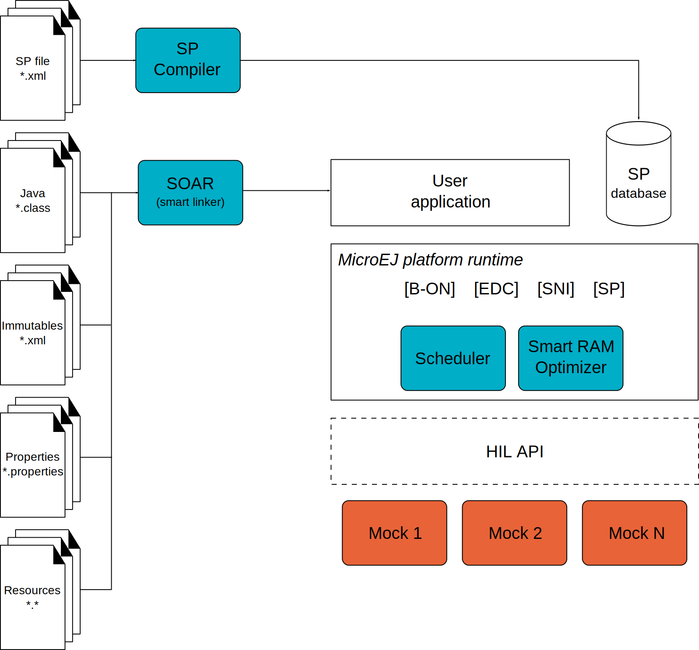
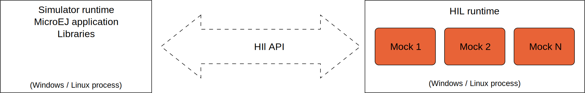

Functional Description
======================

In order to simulate external stimuli that come from the native world
(that is, "the C world"), the MicroEJ simulator has a Hardware In the
Loop interface, HIL, which performs the simulation of Java-to-C calls.
All Java-to-C calls are rerouted to an HIL engine. Indeed HIL is a
replacement for the [SNI] interface.

   The HIL Connects the MicroEJ simulator to the Workstation.

The "simulated C world" is made of mocks that simulate native code (such
as drivers and any other kind of C libraries), so that the MicroEJ
application can behave the same as the device using the MicroEJ
platform.

The MicroEJ simulator and the HIL are two processes that run in
parallel:  the communication between them is through a socket
connection. Mocks run inside the process that runs the HIL engine.

   A MicroEJ simulator connected to its HIL Engine via a socket.
