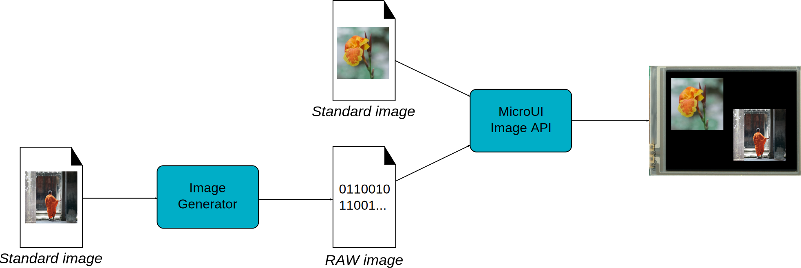

.. _section_image_core:

=================
Image Engine Core
=================

Principle
=========

The Image Engine Core module is a built-in module of the MicroUI module
(see `??? <#section_microui>`__) for the application side, and a
built-in module of the Display module (see `??? <#section_display>`__)
for the C side.

.. _section_image_core_process:

Functional Description
======================

   Image Engine Core Principle

Process overview:

1. The user specifies the pre-generated images to embed (see
   `??? <#section_image_generator>`__) and / or the images to embed as
   regular resources (see `??? <#section_image_runtime>`__)

2. The files are embedded as resources with the MicroEJ application. The
   files' data are linked into the FLASH memory.

3. When the MicroEJ application creates a MicroUI Image object, the
   Image Engine Core loads the image, calling the right sub Image Engine
   module (see `??? <#section_image_generator>`__ and
   `??? <#section_image_runtime>`__) to decode the specified image.

4. When the MicroEJ application draws this MicroUI Image on the display
   (or on another image), the decoded image data is used, and no more
   decoding is required, so the decoding is done only once.

5. When the MicroUI Image is no longer needed, it is garbage-collected
   by the platform; and the Image Engine Core asks the right sub Image
   Engine module (see `??? <#section_image_generator>`__ and
   `??? <#section_image_runtime>`__) to free the image working area.

Image Identifier
================

Before loading an image calling the right sub module, the Image Engine
Core module tries first to attribute a unique identifier to the future
decoded image. This identifier will be used to retrieve the image after
the decoding step, in order to draw it and free it.

This identifier also targets some metadata for the image (same size for
all images, specific to the Display module). An identifier is reserved
for an image as long as the image is used by the MicroEJ application.
When the MicroUI Image is no longer needed, it is garbage collected by
the platform. The identifier (and its meta data memory space) is freed.
Thus, a new image can use this identifier.

To prevent some C allocation at runtime, the number of identifiers and
the memory space useful to store the image metadata are allocated at
compile time. By consequence the available number of identifiers is
limited. The MicroEJ launcher of the MicroEJ application has to specify
the number of identifiers.

When the limit of identifiers is reached, the MicroUI library throws an
``OutOfMemoryError``, error code ``-5``. In this case try to augment the
number of concurrent images in the MicroEJ launcher or try to remove the
links on useless MicroUI Image objects.

External Resources
==================

The Image Engine Core is able to load some images located outside the
CPU addresses' space range. It uses the External Resource Loader.

When an image is located in such memory, the Image Engine Core copies it
into RAM (into the CPU address space range). Then it calls the right sub
Image Engine module (see `??? <#section_image_generator>`__ and
`??? <#section_image_runtime>`__) to decode the specified image.

The RAM section used to load the external image is automatically freed
when the Image Engine Core and its modules do not need it again.

Dependencies
============

-  MicroUI module (see `??? <#section_microui>`__)

-  Display module (see `??? <#section_display>`__)

Installation
============

Image Engine Core modules are part of the MicroUI module and Display
module. Install them in order to be able to use some images.

Use
===

The MicroUI image APIs are available in the class
``ej.microui.display.Image``.
