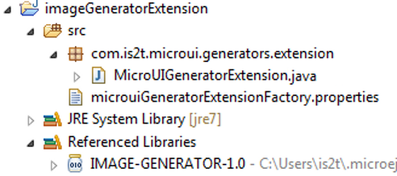

.. _section_image_generator:

===============
Image Generator
===============

Principle
=========

The Image Generator module is an off-board tool that generates image
data that is ready to be displayed without needing additional runtime
memory. The two main advantages of this module are:

-  A pre-generated image is already encoded in the format known by the
   display stack. The image loading is very fast and does not require
   any RAM.

-  No extra support is needed (no runtime decoder).

Functional Description
======================

.. figure:: images/static-image-gen2.*
   :alt: Image Generator Principle
   :width: 70.0%
   :align: center

   Image Generator Principle

Process overview (see too :ref:`section_image_core_process`)

1. The user defines, in a text file, the images to load.

2. The Image Generator outputs a raw file for each image to convert (the
   raw format is display device-dependent).

3. The raw files are embedded as (hidden) resources within the MicroEJ
   application. The raw files' data are linked into the FLASH memory.

4. When the MicroEJ application creates a MicroUI Image object which
   targets a pre-generated image, the Image Engine Core has only to
   create a link from the MicroUI image object to the data in the FLASH
   memory. Therefore, the loading is very fast; only the image data from
   the FLASH memory is used: no copy of the image data is sent to the
   RAM first.

5. When the MicroUI Image is no longer needed, it is garbage-collected
   by the platform, which just deletes the useless link to the FLASH
   memory.

Extensions Purpose
==================

The output representation of the images in the same format as the LCD
(same pixel representation, see :ref:`imagen_lcd_format`) is
dependent on the drivers that run the underlying screen. Indeed, the
output raw format is specific to each display device. The Image
Generator tool provided is expandable by extensions, each extension
implementing a dedicated display device layout.

Standard Extension
------------------

When the LCD pixels representation is standard (``ARGB8888`` or
``RGB565`` etc., see :ref:`display_pixel_structure`) the image
generator does not need an extension. The formulas of conversions
``ARGB8888`` to RAW formats are the same as described in the chapter
:ref:`display_pixel_structure`.

Generic Extension
-----------------

When the LCD pixel representation is generic
(``1 | 2 | 4 | 8 | 16 | 24 | 32``, see
:ref:`display_pixel_structure`) the image generator requires an
extension in order to understand how to convert ARGB pixels into LCD
pixel representations.

The Display module provides generic display implementation according the
number of bits-per-pixels (1, 2, 4, 8, 16, 24 and 32). The Image
Generator tool provides a simple extension to implement in order to
target these kinds of displays: ``GenericDisplayExtension``.  [1]_

A method must be implemented in relation to the way the driver has built
the layout of the display buffers in memory: The
``convertARGBColorToDisplayColor`` method is used to convert a 32-bits
ARGB color into the display pixel memory representation.

.. note::

   The Image Generator automatically uses the right number of bits to
   represent a pixel (BPP) and respect the memory buffer layout using
   the result of the installation of the Display module.

.. _section_image_extension:

Create an Extension
-------------------

Follow the steps below to create an Image Generator extension:

1. First, create a new J2SE project, called (for example)
   ``imageGeneratorExtension``.

2. In the project's Java build path (project's property window, select
   ``Java Build Path > Libraries tab``), add the variable
   ``IMAGE-GENERATOR-x.y``.

3. Create the package ``com.is2t.microui.generators.extension``.

4. Create a class in the package whose name must be:
   ``MicroUIGeneratorExtension``.

5. The Java class must implement the extension interface available in
   the library ``IMAGE-GENERATOR-x.y`` (see previous chapters). Fill the
   required methods.

The Java project should now look like this:

   Image Generator Extension Project

With a Java class like this:

.. code-block:: java
   :caption: Image Generator Extension Implementation Example

   package com.is2t.microui.generators.extension;

   import com.is2t.microej.microui.image.GenericDisplayExtension;

   public class MicroUIGeneratorExtensionMyLCD implements GenericDisplayExtension{

       public int convertARGBColorToDisplayColor(int color) {
           return (char) 
               ((color & 0xf80000) >>> 8) | 
               ((color & 0x00fc00) >>> 5) | 
               ((color & 0x0000f8) >>> 3);       
       }

   }

.. [1]
   Package com.is2t.microej.microui.image

Configuration File
==================

The Image Generator uses a configuration file (also called the "list
file") for describing images that need to be processed. The list file is
a text file in which each line describes an image to convert. The image
is described as a resource path, and should be available from the
application classpath.

.. note::

   The list file must be specified in the MicroEJ application launcher
   (see :ref:`workbenchLaunchOptions`). However, all files in
   application classpath with suffix ``.images.list`` are automatically
   parsed by the Image Generator tool.

Each line can add optional parameters (separated by a ':') which define
and/or describe the output file format (raw format). When no option is
specified, the image is converted into the default format.

.. note::

   See :ref:`image_gen_tool` to understand the list file grammar.

Below is an example of a list file for the Image Generator:

.. code-block:: txt
   :caption: Image Generator Configuration File Example

   image1
   image2:RGB565

The next chapters describe the available output formats.

Generic Output Formats
======================

Several generic output formats are available. Some formats may be
directly managed by the display driver. Refers to the platform
specification to retrieve the list of better formats.

Advantages:

-  The pixels layout and bits format are standard, so it is easy to
   manipulate these images on the C-side.

-  Drawing an image is very fast when the display driver recognizes the
   format (with or without transparency).

-  Supports or not the alpha encoding: select the better format
   according to the image to encode.

Disadvantages:

-  No compression: the image size in bytes is proportional to the number
   of pixels, the transparency, and the bits-per-pixel.

Select one the following format to use a generic format:

-  ARGB8888: 32 bits format, 8 bits for transparency, 8 per color.

   ::

      u32 convertARGB8888toRAWFormat(u32 c){
          return c;
      }

-  RGB888: 24 bits format, 8 per color. Image is always fully opaque.

   ::

      u32 convertARGB8888toRAWFormat(u32 c){
          return c & 0xffffff;
      }

-  ARGB4444: 16 bits format, 4 bits for transparency, 4 per color.

   ::

      u32 convertARGB8888toRAWFormat(u32 c){
          return 0
                  | ((c & 0xf0000000) >> 16)
                  | ((c & 0x00f00000) >> 12)
                  | ((c & 0x0000f000) >> 8)
                  | ((c & 0x000000f0) >> 4)
                  ;
      }

-  ARGB1555: 16 bits format, 1 bit for transparency, 5 per color.

   ::

      u32 convertARGB8888toRAWFormat(u32 c){
          return 0
                  | (((c & 0xff000000) == 0xff000000) ? 0x8000 : 0)
                  | ((c & 0xf80000) >> 9)
                  | ((c & 0x00f800) >> 6)
                  | ((c & 0x0000f8) >> 3)
                  ;
      }

-  RGB565: 16 bits format, 5 or 6 per color. Image is always fully
   opaque.

   ::

      u32 convertARGB8888toRAWFormat(u32 c){
          return 0
                  | ((c & 0xf80000) >> 8)
                  | ((c & 0x00fc00) >> 5)
                  | ((c & 0x0000f8) >> 3)
                  ;
      }

-  A8: 8 bits format, only transparency is encoded. The color to apply
   when drawing the image, is the current GraphicsContext color.

   ::

      u32 convertARGB8888toRAWFormat(u32 c){
          return 0xff - (toGrayscale(c) & 0xff);
      }

-  A4: 4 bits format, only transparency is encoded. The color to apply
   when drawing the image, is the current GraphicsContext color.

   ::

      u32 convertARGB8888toRAWFormat(u32 c){
          return (0xff - (toGrayscale(c) & 0xff)) / 0x11;
      }

-  A2: 2 bits format, only transparency is encoded. The color to apply
   when drawing the image, is the current GraphicsContext color.

   ::

      u32 convertARGB8888toRAWFormat(u32 c){
          return (0xff - (toGrayscale(c) & 0xff)) / 0x55;
      }

-  A1: 1 bit format, only transparency is encoded. The color to apply
   when drawing the image, is the current GraphicsContext color.

   ::

      u32 convertARGB8888toRAWFormat(u32 c){
          return (0xff - (toGrayscale(c) & 0xff)) / 0xff;
      }

-  C4: 4 bits format with grayscale conversion. Image is always fully
   opaque.

   ::

      u32 convertARGB8888toRAWFormat(u32 c){
          return (toGrayscale(c) & 0xff) / 0x11;
      }

-  C2: 2 bits format with grayscale conversion. Image is always fully
   opaque.

   ::

      u32 convertARGB8888toRAWFormat(u32 c){
          return (toGrayscale(c) & 0xff) / 0x55;
      }

-  C1: 1 bit format with grayscale conversion. Image is always fully
   opaque.

   ::

      u32 convertARGB8888toRAWFormat(u32 c){
          return (toGrayscale(c) & 0xff) / 0xff;
      }

-  AC44: 4 bits for transparency, 4 bits with grayscale conversion.

   ::

      u32 convertARGB8888toRAWFormat(u32 c){
          return 0
              | ((color >> 24) & 0xf0)
              | ((toGrayscale(color) & 0xff) / 0x11)
              ;
      }

-  AC22: 2 bits for transparency, 2 bits with grayscale conversion.

   ::

      u32 convertARGB8888toRAWFormat(u32 c){
          return 0
              | ((color >> 28) & 0xc0)
              | ((toGrayscale(color) & 0xff) / 0x55)
              ;
      }

-  AC11: 1 bit for transparency, 1 bit with grayscale conversion.

   ::

      u32 convertARGB8888toRAWFormat(u32 c){
          return 0
              | ((c & 0xff000000) == 0xff000000 ? 0x2 : 0x0)
              | ((toGrayscale(color) & 0xff) / 0xff)
              ;
      }

.. code-block:: txt
   :caption: Generic Output Format Examples

   image1:ARGB8888
   image2:RGB565
   image3:A4

.. _imagen_lcd_format:

Display Output Format
=====================

The default embedded image data format provided by the Image Generator
tool when using a generic extension is to encode the image into the
exact display memory representation. If the image to encode contains
some transparent pixels, the output file will embed the transparency
according to the display's implementation capacity. When all pixels are
fully opaque, no extra information will be stored in the output file in
order to free up some memory space.

Advantages:

-  Drawing an image is very fast.

-  Supports alpha encoding.

Disadvantages:

-  No compression: the image size in bytes is proportional to the number
   of pixels.

.. code-block:: txt
   :caption: Display Output Format Example

   image1:display

RLE1 Output Format
==================

The image engine can display embedded images that are encoded into a
compressed format which encodes several consecutive pixels into one or
more 16-bits words. This encoding manages a maximum alpha level of 2
(alpha level is always assumed to be 2, even if the image is not
transparent).

-  Several consecutive pixels have the same color (2 words).

   -  First 16-bit word specifies how many consecutive pixels have the
      same color.

   -  Second 16-bit word is the pixels' color.

-  Several consecutive pixels have their own color  (1 + n words).

   -  First 16-bit word specifies how many consecutive pixels have their
      own color.

   -  Next 16-bit word is the next pixel color.

-  Several consecutive pixels are transparent (1 word).

   -  16-bit word specifies how many consecutive pixels are transparent.

Advantages:

-  Supports 0 & 2 alpha encoding.

-  Good compression when several consecutive pixels respect one of the
   three previous rules.

Disadvantages:

-  Drawing an image is slightly slower than when using Display format.

.. code-block:: txt
   :caption: RLE1 Output Format Example

   image1:RLE1

No compression
==============

When no output format is set in the images list file, the image is
embedded without any conversion / compression. This allows you to embed
the resource as well, in order to keep the source image characteristics
(compression, bpp etc.). This option produces the same result as
specifying an image as a resource in the MicroEJ launcher.

Advantages:

-  Conserves the image characteristics.

Disadvantages:

-  Requires an image runtime decoder.

-  Requires some RAM in which to store the decoded image

.. code-block:: txt
   :caption: Unchanged Image Example

   image1

External Resources
==================

The Image Generator manages two configuration files when the External
Resources Loader is enabled. The first configuration file lists the
images which will be stored as internal resources with the MicroEJ
application. The second file lists the images the Image Generator must
convert and store in the External Resource Loader output directory. It
is the BSP's responsibility to load the converted images into an
external memory.

Dependencies
============

-  Image Engine Core module (see :ref:`section_image_core`).

-  Display module (see :ref:`section_display`): This module gives
   the characteristics of the graphical display that are useful in
   configuring the Image Generator.

.. _section_imagen_installation:

Installation
============

The Image Generator is an additional module for the MicroUI library.
When the MicroUI module is installed, also install this module in order
to be able to target pre-generated images.

In the platform configuration file, check :guilabel:`UI` > :guilabel:`Image Generator`
to install the Image Generator module. When checked, the properties file
``imageGenerator`` > ``imageGenerator.properties`` is required during
platform creation to configure the module, only when the LCD pixel
representation is not standard (see :ref:`display_pixel_structure`).
This configuration step is used to identify the extension class name
(see :ref:`section_image_extension`).

Use
===

The MicroUI Image APIs are available in the class
``ej.microui.display.Image``. There are no specific APIs that use a
pre-generated image. When an image has been pre-processed, the MicroUI
Image APIs ``createImage*`` will load the image.

Refer to the chapter :ref:`workbenchLaunchOptions` (``Libraries`` >
``MicroUI`` > ``Image``) for more information about specifying the image
configuration file.

