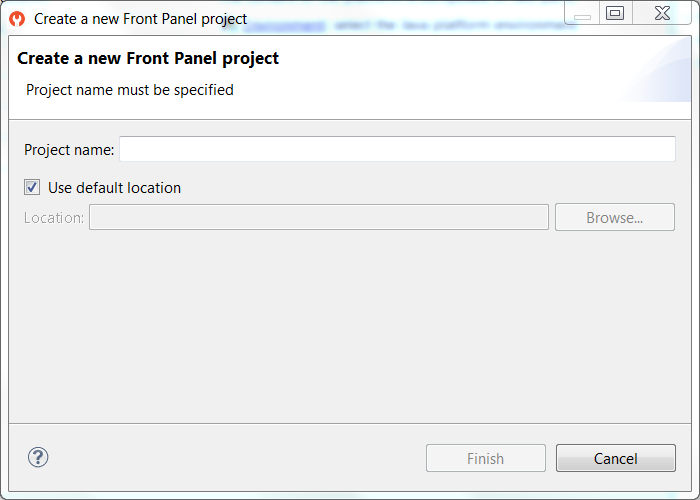
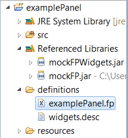
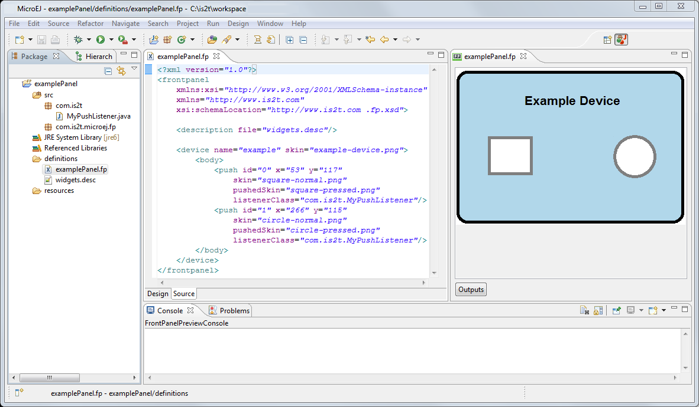

.. _section_simulation:

==========
Simulation
==========

Principle
=========

A major strength of the MicroEJ environment is that it allows
applications to be developed and tested in a simulator rather than on
the target device, which might not yet be built. To make this possible
for devices that have a display or controls operated by the user (such
as a touch screen or buttons), the simulator must connect to a "mock" of
the control panel (the "Front Panel") of the device. This mock is called
the *mockFP*. The mockFP generates a graphical representation of the
required front panel, and is displayed in a window on the user's
development machine when the application is executed in the simulator.
The mockFP is the equivalent of the three embedded modules (Display,
Inputs and LED) of the MicroEJ platform (see
:ref:`section_microui`).

The Front Panel mock enhances the development environment by allowing
User Interface  applications to be designed and tested on the computer
rather than on the target device (which may not yet be built). The mock
interacts with the user's computer in two ways:

-  output: LEDs, graphical displays

-  input: buttons, joystick, touch, haptic sensors

Functional Description
======================

1. Creates a new Front Panel project.

2. Creates an image of the required front panel. This could be a
   photograph or a drawing.

3. Defines the contents and layout of the front panel by editing an XML
   file (called an fp file). Full details about the structure and
   contents of fp files can be found in chapter
   :ref:`front_panel_file`.

4. Creates images to animate the operation of the controls (for example
   button down image).

5. Creates *Listeners* that generate the same MicroUI input events as
   the hardware.

6. Creates a *Display Extension* that configures the simulated display
   to match the real display.

7. Previews the front panel to check the layout of controls and the
   events they create, etc.

8. Exports the Front Panel project into a MicroEJ Platform project.

The Front Panel Project
=======================

Creating a Front Panel Project
------------------------------

A Front Panel project is created using the New Front Panel Project
wizard. Select:

``New > Project... > MicroEJ > Front Panel Project``

The wizard will appear:

   New Front Panel Project Wizard

Enter the name for the new project.

Project Contents
----------------

   Project Contents

A Front Panel project has the following structure and contents:

-  The ``src`` folder is provided for the definition of ``Listeners``
   and ``DisplayExtensions``. It is initially empty. The creation of
   ``Listeners`` and ``DisplayExtensions`` will be explained later.

-  The ``JRE System Library`` is referenced, because a Front Panel
   project needs to support the writing of Java for the ``Listeners``
   and ``DisplayExtensions``.

-  The ``mockFPWidgets.jar`` contains the code for the front panel
   simulation, the widgets it supports and the types needed to implement
   ``Listeners`` and ``DisplayExtensions``.

-  The ``definitions`` folder holds the file or files that define the
   contents and layout of the front panel, with a ``.fp`` extension (the
   fp file or files), plus some supporting files. A newly created
   project will have a single fp file with the same name as the project,
   as shown above. The contents of fp files are detailed later in this
   document.

-  The ``widgets.desc`` file contains descriptions of the widgets
   supplied with the Front Panel Designer. It is used by the Front Panel
   Designer tool and must not be edited.

-  The ``resources`` folder holds images used to create the mockFP. It
   is initially empty.

FP File
=======

File Contents
-------------

The mock engine takes an XML file (the fp file) as input. It describes
the panel using mock-widgets: They simulate the drivers, sensors and
actuators of the real device. The mock engine generates the graphical
representation of the real device, and is displayed in a window on the
user's development machine when the application is executed in the
simulator.

The following example file describes a typical board with one LCD, a
touch panel, three buttons, a joystick and four LEDs:

::

   <?xml version="1.0"?>
   <frontpanel 
       xmlns:xsi="http://www.w3.org/2001/XMLSchema-instance"
       xmlns="http://xml.is2t.com/ns/1.0/frontpanel" 
       xsi:schemaLocation="http://xml.is2t.com/ns/1.0/frontpanel .fp1.0.xsd">
       
       <description file="widgets.desc"/>
       
       <device name="MyBoard" skin="myboard.png">
           <body>
               <pixelatedDisplay id="0" x="162" y="114" width="320" height="240" initialColor="0x000000"/>
               <pointer id="0" x="162" y="114" width="320" height="240" touch="true" listenerClass="com.is2t.microej.fp.PointerListenerImpl"/>
       
               <led2states id="0" x="277" y="374" ledOff="led0_0.png" ledOn="led0_1.png" overlay="false"/>
               <led2states id="1" x="265" y="374" ledOff="led1_0.png" ledOn="led1_1.png" overlay="false"/>
               <led2states id="2" x="254" y="374" ledOff="led2_0.png" ledOn="led2_1.png" overlay="false"/>
               <led2states id="3" x="242" y="372" ledOff="led3_0.png" ledOn="led3_1.png" overlay="false"/>
               
               <repeatPush id="0" x="250" y="395" skin="Button1_0.png" pushedSkin="Button1_1.png" repeatPeriod="250" listenerClass="com.is2t.microej.fp.ButtonListener"/>
               <repeatPush id="1" x="322" y="395" skin="Button1_0.png" pushedSkin="Button1_1.png" repeatPeriod="250" listenerClass="com.is2t.microej.fp.ButtonListener"/>
               <repeatPush id="2" x="456" y="395" skin="Button1_0.png" pushedSkin="Button1_1.png" repeatPeriod="250" listenerClass="com.is2t.microej.fp.ButtonListener"/>
               <joystick id="0" x="368" y="375" skin="Joy0.png" mask="JoyMask.png" enterSkin="Joy1.png" upSkin="Joy_UP.png" downSkin="Joy_DOWN.png" leftSkin="Joy_LEFT.png" rightSkin="Joy_RIGHT.png" listenerClass="com.is2t.microej.fp.JoystickListenerImpl"/>
           </body>
       </device>
   </frontpanel>

The ``description`` element must appear exactly as shown. It refers to
the ``widgets.desc`` file mentioned above.

The ``device`` ``skin`` must refer to a ``png`` file in the
``resources`` folder. This image is used to render the background of the
front panel. The widgets are drawn on top of this background.

The ``body`` element contains the elements that define the widgets that
make up the front panel. The name of the widget element defines the type
of widget. The set of valid types is determined by the Front Panel
Designer. Every widget element defines an ``id``, which must be unique
for widgets of this type, and the ``x`` and ``y`` coordinates of the
position of the widget within the front panel (0,0 is top left). There
may be other attributes depending on the type of the widget.

The file and tags specifications are available in chapter
:ref:`front_panel_file`.

Working with fp Files
---------------------

To edit an fp file, open it using the Eclipse XML editor (right-click on
the fp file, select ``Open With > XML Editor``). This editor features
syntax highlighting and checking, and content-assist based on the schema
(XSD file) referenced in the fp file. This schema is a hidden file
within the project's definitions folder. An incremental builder checks
the contents of the fp file each time it is saved and highlights
problems in the Eclipse Problems view, and with markers on the fp file
itself.

A preview of the front panel can be obtained by opening the Front Panel
Preview
(``Window > Show View > Other... > MicroEJ > Front Panel Preview``).

The preview updates each time the fp file is saved.

A typical working layout is shown below.

   Working Layout Example

Within the XML editor, content-assist is obtained by pressing
ctrl+space.  The editor will list all the elements valid at the cursor
position, and insert a template for the selected element.

Skins and Filters
-----------------

The widgets which simulate the input devices use images (or "skins") to
show their current states (pressed and released). The user can change
the state of the widget by clicking anywhere on the skin: it is the
active area. This active area is, by default, rectangular.

These skins can be associated with an additional image called a
``filter`` or ``mask``. This image defines the widget's active area. It
is useful when the widget is not rectangular.

.. figure:: images/fp-widget-active-area.*
   :alt: Active Area
   :width: 50.0%
   :align: center

   Active Area

The filter image must have the same size as the skin image. The active
area is delimited by the color 0xFF00FF (pink). Every pixel in the
filter image which is not this color is considered not part of the
active area.

Display Mask
------------

By default, a display area is rectangular. Some displays can have
another appearance (for instance: circular). The front panel is able to
simulate that using a mask. This mask defines the pixels inside and
outside the real display area. The mask image must have the same size
than display rectangular area. A display pixel at a given position will
be not rendered if the pixel at the same position in mask is fully
transparent.

Inputs Extensions
=================

The mock engine also requires several extensions to know how to react to
input events. The extension names (package and classname) are specified
in the fp file.

Widgets and Listeners
---------------------

For widgets that generate events, a ``Listener`` class must be specified
within the ``.fp`` file.

As an example, consider this snippet of an ``.fp`` file for defining a
push button:

.. code-block:: xml
   :caption: .fp File - Push Example

   <push id="0" x="54" y="117"
       skin="square-normal.png"                
       pushedSkin="square-pressed.png"                
       listenerClass="com.is2t.MyPushListener" />

The value of the ``listenerClass`` attribute is the fully qualified name
of a class which has to implement the
``com.is2t.microej.frontpanel.input.listener.PushButtonListener``
interface. This class,  ``com.is2t.MyPushListener``, is written by the
developer, and implements the ``PushButtonListener`` interface.

The package ``com.is2t.microej.frontpanel.input.listener`` provides
``Listeners`` required by other widgets too:

-  ``push`` requires ``PushButtonListener``

-  ``repeatPush`` requires ``RepeatButtonListener``

-  ``joystick`` requires ``JoystickListener``

-  ``pointer`` requires ``PointerListener``

A listener implementation can target several widgets. Each action method
receives the ID of the widget that has changed as a parameter.

Event Generator
---------------

The ``Listener`` needs to be written to generate the same events that
the hardware will. In order to send an event, the implementation of a
``Listener`` needs to use the ``EventGenerator`` class provided. For
example, a ``PushButtonListener`` can generate button events by calling
static methods ``sendButtons[...]Event``.

.. note::

   A ``Listener`` can generate events using any methods of the provided
   ``EventGenerator``. In some cases, this may provide useful
   functionality.

Each ``EventGenerator`` method requires a unique ID of the MicroUI event
generator it targets. This unique ID is available in the interface
``com.is2t.microej.microui.Constants`` which has been generated by the
Static MicroUI Initializer tool.

The ``EventGenerator`` class targets six MicroUI event generators:

-  ``EventGenerator``: ``sendEvent``, ``sendEvents``

-  ``CommandEventGenerator``: ``sendCommandEvent``

-  ``ButtonsEventGenerator``: ``sendButtons[...]Event``

-  ``PointerEventGenerator``: ``sendPointer[...]Event``

-  ``TouchEventGenerator``: ``sendTouch[...]Event``

-  ``StatesEventGenerator``: ``sendState[...]Event``

Image Decoders
==============

Front Panel uses its own internal image decoders when the internal image
decoders related modules have been selected (see
:ref:`image_internal_decoder`).

Front Panel can add some additional decoders like the C-side for the
embedded platform (see :ref:`image_external_decoder`). However, the
exhaustive list of additional decoders is limited (Front Panel is using
the Java AWT ``ImageIO`` API). To add an additional decoder, specify the
property ``hardwareImageDecoders.list`` in front panel configuration
properties file (see :ref:`fp_installation`) with one or several
property values:

.. table:: Front Panel Additional Image Decoders

   +-----------------------------------------------------+-----------------+
   | Type                                                | Property value  |
   +=====================================================+=================+
   | Graphics Interchange Format (GIF)                   | gif             |
   +-----------------------------------------------------+-----------------+
   | Joint Photographic Experts Group (JPEG)             | jpeg \| jpg     |
   +-----------------------------------------------------+-----------------+
   | Portable Network Graphics (PNG)                     | png             |
   +-----------------------------------------------------+-----------------+
   | Windows bitmap (BMP)                                | bmp             |
   +-----------------------------------------------------+-----------------+

The decoders list is comma (*,*) separated. Example:

::

   hardwareImageDecoders.list=jpg,bmp

Dependencies
============

-  MicroUI module (see :ref:`section_microui`).

-  Display module (see :ref:`section_display`): This module gives
   the characteristics of the graphical display that are useful for
   configuring the Front Panel.

.. _fp_installation:

Installation
============

Front Panel is an additional module for MicroUI library. When the
MicroUI module is installed, install this module in order to be able to
simulate UI drawings on the simulator.

In the platform configuration file, check :guilabel:`UI` > :guilabel:`Front Panel` to
install the Front Panel module. When checked, the properties file
``frontpanel`` > ``frontpanel.properties`` is required during platform creation to
configure the module. This configuration step is used to identify and
configure the front panel.

The properties file must / can contain the following properties:

-  ``project.name`` [mandatory]: Defines the name of the front panel
   project (same workspace as the platform configuration project). If
   the project name does not exist, a new project will be created.

-  ``fpFile.name`` [optional, default value is "" (*empty*)]: Defines
   the front panel file (\*.fp) to export (in case "project.name"
   contains several fp files). If empty or unspecified, the first ".fp"
   file found will be exported.

-  ``hardwareImageDecoders.list`` [optional, default value is ""
   (*empty*)]: Defines the available list of additional image decoders
   provided by the hardware. Use comma (',') to specify several decoders
   among this list: bmp, jpg, jpeg, gif, png. If empty or unspecified,
   no image decoder is added.

Use
===

Launch a MicroUI application on the simulator to run the Front Panel.
