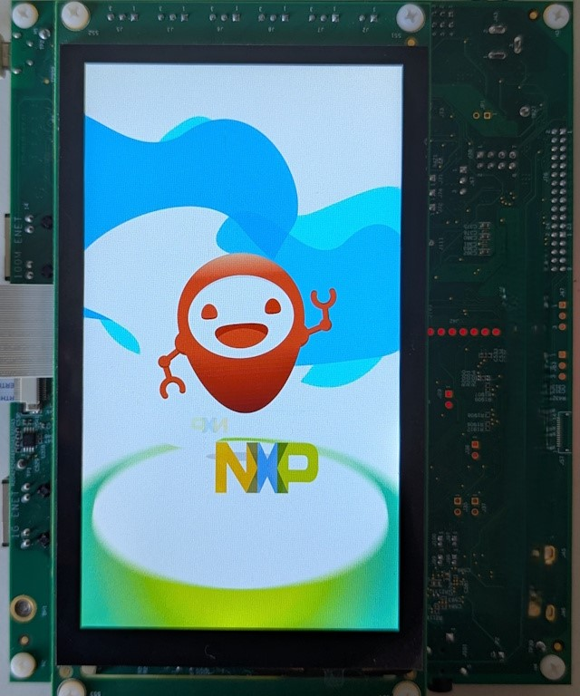
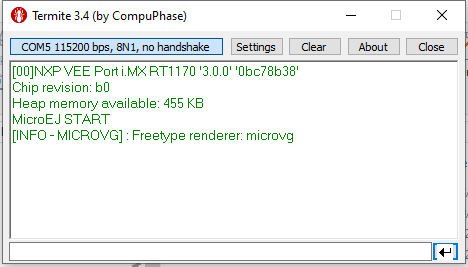

.. _sdk_6_getting_started_imxrt1170:

i.MX RT1170 Evaluation Kit
==========================

During this Getting Started, you will learn to:

* run an Application on the i.MX RT1170 Evaluation Kit Virtual Device,
* run the same Application on your i.MX RT1170 Evaluation Kit.

In case you are not familiar with MicroEJ, please visit `Discover MicroEJ <https://developer.microej.com/discover-microej/>`__ to understand the principles of our technology.

Prerequisites
-------------

.. note::
  
   This Getting Started has been tested on Windows 10 & 11. Also note that examples used in this Getting Started could depend on older tools and libraries. Most notably our dependency manager plugin (using `Gradle <https://gradle.org/>`_) could be an older version.

This Getting Started is separated in two main parts.

The first part consists of running a demo application on the Virtual Device. All you need is:

* An Internet connection to access Github repositories & :ref:`Module Repositories <module_repositories>`.
* MICROEJ SDK 6 (installed during :ref:`Environment Setup <sdk_6_getting_started_imxrt1170_environment_setup>`).

The second part consists of running the same demo application on your device. For that you will need:

* i.MX RT1170 EVKB Evaluation Kit, available `here <https://www.nxp.com/design/design-center/development-boards-and-designs/i-mx-evaluation-and-development-boards/i-mx-rt1170-evaluation-kit:MIMXRT1170-EVKB>`__.
* RK055HDMIPI4MA0 display panel, available `here <https://www.nxp.com/part/RK055HDMIPI4MA0>`__.
* A GNU ARM Embedded Toolchain, Cmake and Make are needed to build the BSP. You will be guided on how to install the toolchain later.
* LinkServer tool to flash the board. You will be guided on how to install this tool later.
* The ::guilabel:`west` command line tool from the Zephyr project. You will be guided on how to install this tool later.

.. _sdk_6_getting_started_imxrt1170_environment_setup:

Environment Setup
-----------------

To follow this Getting Started, you need to: 

* Install MICROEJ SDK 6.
* Get the VEE port from Github.

Install MICROEJ SDK 6
^^^^^^^^^^^^^^^^^^^^^

Install MICROEJ SDK 6 by following :ref:`sdk_6_install` instructions. 
IntelliJ IDEA is used on this Getting Started but feel free to use your favorite IDE.

Install West
^^^^^^^^^^^^

* `West <https://docs.zephyrproject.org/latest/develop/west/index.html>`__ is a Zephyr tool for multiple repository management systems. It will be used to fetch the code and
its dependencies.
* Install West by following `Installing west <https://docs.zephyrproject.org/latest/develop/west/install.html>`__ instructions (tested with west 1.2.0).
* Check that the tool has been properly installed by running the command: ``west --version``, it should print the west version you installed.

Get the VEE Port Project
^^^^^^^^^^^^^^^^^^^^^^^^

For this Getting Started, the :guilabel:`app` Application will be use. You can download it using the following command::
   
   mkdir nxpvee-mimxrt1170-prj
   cd nxpvee-mimxrt1170-prj
   west init -m https://github.com/nxp-mcuxpresso/nxp-vee-imxrt1170-evk .
   west update

.. note::
  
   If you don’t have Git installed, you can download the source code directly from our `GitHub repository <https://github.com/MicroEJ/nxp-vee-imxrt1170-evk/releases/tag/NXPVEE-MIMXRT1170-EVK-2.2.0>`__. 
   Then you can click on ::guilabel:`Code > Download ZIP`.

Set up the Application on your IDE
----------------------------------

Import the Project
^^^^^^^^^^^^^^^^^^

The first step is to import the :guilabel:`VEE Port` into your IDE: 

.. note::
  
   If you are using another IDE than IntelliJ IDEA, please have a look at :ref:`sdk_6_import_project` section.

* If you are in the Welcome Screen, click on the :guilabel:`Open` button. Otherwise click either on :guilabel:`File` > :guilabel:`Open...` or on :guilabel:`File` > :guilabel:`New` > :guilabel:`Project From Existing Sources...`.
* Select the ``nxp-vee-imxrt1170-evk`` directory located where you downloaded it and click on the :guilabel:`OK` button.

      .. figure:: images/iMXRT1170/getting-started-import-demo-application.png
         :alt: Import demo application
         :align: center
         :scale: 70%

* If you are asked to choose a project model, select :guilabel:`Gradle`. 

      .. raw:: html

         

            <table>
               <tr>
                  <td style="width:50%;text-align:center;vertical-align:middle;" alt="Project Model Selection when Opening in IntelliJ IDEA">
                     
                  </td>
                  <td style="width:50%;text-align:center;vertical-align:middle;" alt="Project Model Selection when Importing in IntelliJ IDEA">
                     
                  </td>
               </tr>
               <tr>
                  <td style="width:50%;text-align:center;font-size:18px;font-style:italic;">
                     Fig 1. Project Model Selection when Opening in IntelliJ IDEA
                  </td>
                  <td style="width:50%;text-align:center;font-size:18px;font-style:italic;">
                     Fig 2. Project Model Selection when Importing in IntelliJ IDEA
                  </td>
               </tr>
            </table>
         

      .. |image1| image:: images/intellij-import-gradle-project-01.png
      .. |image2| image:: images/intellij-import-gradle-project-02.png

* Click on the :guilabel:`Create` button.

The Gradle project should now be imported in IntelliJ IDEA, your workspace contains the following projects: 

      .. figure:: images/iMXRT1170/getting-started-workspace-view.png
         :alt: Workspace view
         :align: center
         :scale: 70%

.. _sdk_6_getting_started_rt1170_eula:

Accept the MICROEJ SDK EULA
---------------------------

You may have to accept the SDK EULA if you haven't already done it, please have a look at :ref:`sdk_6_eula_acceptation`.

.. _sdk_6_getting_started_rt1170_run_virtual_device:

Run an Application on the Virtual Device
----------------------------------------

In this example, we will run the :guilabel:`animatedMascot` Application available in the i.MX RT1170 VEE Port.
In order to execute the :guilabel:`animatedMascot` Application on the Virtual Device, the SDK provides the Gradle :guilabel:`runOnSimulator` task. 

.. note::
  
   If you are using another IDE than IntelliJ IDEA, please have a look at :ref:`sdk_6_run_on_simulator` section.

* In the Gradle view, navigate to :guilabel:`nxpvee-mimxrt1170-evk > apps > animatedMascot > Tasks > microej`. Double-click on the :guilabel:`runOnSimulator` task in the Gradle tasks view. It may takes few seconds.

      .. figure:: images/iMXRT1170/getting-started-runOnSimulator.png
         :alt: runOnSimulator task
         :align: center
         :scale: 70%

The Virtual Device starts and executes the :guilabel:`animatedMascot` application.

      .. figure:: images/iMXRT1170/getting-started-virtual-device.png
         :alt: Virtual Device
         :align: center
         :scale: 70%

.. note::
  
   The Front Panel may be too big for your screen, that is because of the RK055HDMIPI4MA0 display resolution. You can scroll down to see the bottom of the display.

   If you want to know more about the use of the :guilabel:`Demo-SmartThermostat`, please have a look at its `README.md <https://github.com/MicroEJ/Demo-SmartThermostat/blob/1.0.0/smart-thermostat/README.md>`__ file.

Well Done!
-----------

Now you know how to run an application on a Virtual Device.

If you want to learn how to run an application on your i.MX RT1170 Evaluation Kit, you can continue this Getting Started: :ref:`Run an Application on i.MX RT1170 Evaluation Kit <sdk_6_getting_started_rt1170_run_on_device>`.

Otherwise, learn how to :ref:`Modify the Java Application <sdk_6_getting_started_rt1170_modify_java_application>`.

.. _sdk_6_getting_started_rt1170_run_on_device:

Run an Application on i.MX RT1170 Evaluation Kit
------------------------------------------------

To deploy the :guilabel:`animatedMascot` application on your board, you will have to:

* Setup your Environment (Toolchain, flashing-tool, hardware setup).
* Request a 30 days :ref:`Evaluation License <sdk_eula>` and install an activation key.
* Build the Executable.
* Flash the board.

.. _sdk_6_getting_started_rt1170_run_on_device_environment_setup:

Environment Setup
^^^^^^^^^^^^^^^^^

This chapter takes approximately one hour and will take you through the steps to set up your board and build the BSP.

MCUXPresso SDK Setup
""""""""""""""""""""

Install MCUXPresso SDK
++++++++++++++++++++++

* Download and install `MCUXpresso Installer <https://github.com/nxp-mcuxpresso/vscode-for-mcux/wiki/Dependency-Installation>`__,
* Once installed, open it,
* Select :guilabel:`MCUXpresso SDK Developer` and :guilabel:`LinkSever` and click Install:

  .. figure:: images/iMXRT1170/getting-started-mcuxpresso-setup-1.png
     :alt: MCUXPresso setup
     :align: center
     :scale: 70%
* Once done, a green tick appears next to the installed packages:

  .. figure:: images/iMXRT1170/getting-started-mcuxpresso-setup-2.png
     :alt: MCUXPresso setup
     :align: center
     :scale: 70%

Add GNU ARM Embedded Toolchain Environment variable
+++++++++++++++++++++++++++++++++++++++++++++++++++

MCUXpresso Installer installs a GNU ARM Embedded Toolchain in the ``$user/.mcuxpressotools`` folder.

``ARMGCC_DIR`` must be set as an environment variable and point to the toolchain directory. To do so: 

* Open the :guilabel:`Edit the system environment variables` application on Windows.
* Click on the :guilabel:`Environment Variables...` button.
* Click on the :guilabel:`New...` button under the :guilabel:`User variables` section.
* Set :guilabel:`Variable Name` to ``ARMGCC_DIR``.
* Set :guilabel:`Variable Value` to the toolchain directory (e.g. ``C:\Users\MicroEJ\.mcuxpressotools\arm-gnu-toolchain-13.2.Rel1-mingw-w64-i686-arm-none-eabi``).
* Click on the :guilabel:`Ok` button until it closes :guilabel:`Edit the system environment variables` application.

Install Make
++++++++++++

`Make <https://gnuwin32.sourceforge.net/packages/make.htm>`__ is the tool that will generate the executable based on the files generated by CMake. It will also be used to flash the board. 
Under :guilabel:`Download` section, you can select the Setup program for the complete package, except sources. 

By default, it will automatically add Make to your path.
If not, you can manually add ``GnuWin32\bin`` folder to your path.

Check that the tool has been properly installed: 

Add the Flashing Tool Environment variable
++++++++++++++++++++++++++++++++++++++++++

* Open the :guilabel:`Edit the system environment variables` application on Windows.
* Click on the :guilabel:`Environment Variables...` button.
* Select :guilabel:`Path` variable under the :guilabel:`User variables` section and edit it.
* Click on :guilabel:`New` and point to the ``LinkServer_{version}`` folder located where you installed LinkServer (e.g. ``C:\nxp\LinkServer_1.2.45``).

.. _sdk_6_getting_started_rt1170_hardware_setup:

Hardware Setup
""""""""""""""

Set up the NXP i.MX RT1170 EVKB:

* Check that the dip switches (``SW1``) are set to ``OFF``, ``OFF``, ``ON`` and ``OFF``,
* Ensure jumper ``J5`` is removed,
* Connect the display panel ``RK055HDMIPI4MA0``,
* Connect the micro-USB cable to ``J86`` to power the board,
* Connect a 5 V power supply to ``J43``.

  .. figure:: images/iMXRT1170/getting-started-hardware-setup.png
     :alt: NXP i.MX RT1170 EVKB Hardware Setup
     :align: center

     NXP i.MX RT1170 EVKB Hardware Setup
     
The USB connection is used as a serial console for the SoC, as a CMSIS-DAP debugger and as a power input for the board.

The VEE Port uses the virtual UART from the i.MX RT1170 Evaluation Kit USB port. A COM port is automatically mounted when the board is plugged into a computer using a USB cable. All board logs are available through this COM port.

The COM port uses the following parameters:

.. list-table::
   :header-rows: 1
   :widths: 10 10 10 10 10

   * - Baudrate
     - Data bits
     - Parity bits
     - Stop bits
     - Flow control
   * - 115200
     - 8
     - None
     - 1
     - None

You can have a look at your application logs with an RS232 Terminal (e.g. `Termite <https://www.compuphase.com/software_termite.htm>`__).

Congratulations! You have finished the setup of your environment. You are now ready to discover how to build and flash a MicroEJ application.

Build the Executable for i.MX RT1170 Evaluation Kit
^^^^^^^^^^^^^^^^^^^^^^^^^^^^^^^^^^^^^^^^^^^^^^^^^^^

In order to build the Executable of the :guilabel:`animatedMascot` Application, the SDK provides the :guilabel:`buildExecutable` Gradle task.

.. note::
  
   If you are using another IDE than IntelliJ IDEA, please have a look at :ref:`sdk_6_build_executable` section.
   Come back on this page if you need to activate an Evaluation License.

* Double-click on the :guilabel:`buildExecutable` task in the Gradle tasks view.
* The build stops with a failure.
* Go to the top project in the console view and scroll up to get the following error message:

      .. figure:: images/iMXRT1170/getting-started-console-output-license-uid.png
         :alt: Console Output License UID
         :align: center
         :scale: 70%

* Copy the UID. It will be required to activate your Evaluation license.

Request your Evaluation License:

* Request your Evaluation license by following the :ref:`evaluation_license_request_activation_key` instructions. You will be asked to fill the machine UID field with the UID you copied before.

* When you have received your activation key by email, drop it in the license directory by following the :ref:`evaluation_license_install_license_key` instructions (drop the license key zip file to the ``~/.microej/licenses/`` directory).

Now your Evaluation license is installed, you can relaunch your application build by double-clicking on the :guilabel:`buildExecutable` task in the Gradle tasks view. It may take some time.

The Gradle task deploys the Application in the BSP and then builds the BSP using Make.

The :guilabel:`animatedMascot` application is built and ready to be flashed on i.MX RT1170 Evaluation Kit once the hardware setup is completed.

Flash the Application on the i.MX RT1170 Evaluation Kit
^^^^^^^^^^^^^^^^^^^^^^^^^^^^^^^^^^^^^^^^^^^^^^^^^^^^^^^

In order to flash the :guilabel:`animatedMascot` Application on i.MX RT1170 Evaluation Kit, the application provides the Gradle :guilabel:`runOnDevice` task.

.. note::
  
   If you are using another IDE than IntelliJ IDEA, please have a look at :ref:`sdk_6_run_on_device` section.

* Double-click on the :guilabel:`runOnDevice` task in the Gradle tasks view. It may take some time.

      .. figure:: images/iMXRT1170/getting-started-runOnDevice.png
         :alt: runOnDevice task
         :align: center
         :scale: 70%

Once the firmware is flashed, you should see the :guilabel:`animatedMascot` running on your board.      

.. raw:: html

   

      <table>
         <tr>
            <td style="width:50%;text-align:center;vertical-align:middle;" alt="Application running on i.MXRT1170 Evaluation Kit">
               
            </td>
            <td style="width:50%;text-align:center;vertical-align:middle;" alt="Termite Application Output">
               
            </td>
         </tr>
         <tr>
            <td style="width:50%;text-align:center;font-size:18px;font-style:italic;">
               Fig 1. Application running on i.MXRT1170 Evaluation Kit
            </td>
            <td style="width:50%;text-align:center;font-size:18px;font-style:italic;">
               Fig 2. Application logs on Termite
            </td>
         </tr>
      </table>
   

.. _sdk_6_getting_started_rt1170_modify_java_application:

Modify the Java Application
---------------------------

With MicroEJ, it is easy to modify and test your Java application on the Virtual Device.

For example, we could modify the color of the background that is shown on the inside part of the Home Screen.

* Open :guilabel:`ThermoColors.java` file located in the :guilabel:`src/main/java/com/microej/demo/smart_thermostat/style` folder.
* Background color is set line 31, replace the following line:

.. code:: 

   public static final int BG_INSIDE = 0xB6B1AB;

by

.. code:: 

   public static final int BG_INSIDE = Colors.RED;

* Follow :ref:`sdk_6_getting_started_rt1170_run_virtual_device` instructions to launch the modified application on the Virtual Device.

Here is the modified application running in simulation: 

      .. figure:: images/iMXRT1170/getting-started-virtual-device-modified.png
         :alt: Virtual Device
         :align: center
         :scale: 70%

Going Further
-------------

You have now successfully executed a MicroEJ application on an embedded device so what's next?

If you are an application developer you can continue to explore MicroEJ's APIs and functionalities by running and studying our samples at GitHub:

.. list-table::
   :widths: 33 33 33

   * - Foundation Libraries
     - Eclasspath
     - IoT
   * - This project gathers all the basic examples of the foundation libraries. 
     - This project gather all the examples of eclasspath. 
     - This project gathers simple applications using net libraries. 
   * - https://github.com/MicroEJ/Example-Foundation-Libraries
     - https://github.com/MicroEJ/Example-Eclasspath
     - https://github.com/MicroEJ/Example-IOT

You can also learn how to build bigger and better applications by reading our :ref:`Application Developer Guide <application-developer-guide>`.

If you are an embedded engineer you could look at our VEE port examples at `GitHub <https://github.com/microej?q=vee&type=all&language=&sort=>`_. And to learn how create custom VEE ports you can read our :ref:`VEE Porting Guide <vee-porting-guide>`.

You can also follow the :ref:`Kernel Developer Guide <kernel-developer-guide>` for more information on our multi-application framework or read about our powerful wearable solution called :ref:`VEE Wear <vee-wear>`.

Last but not least you can choose to learn about specific topics by following one of our many :ref:`trainings` ranging from how to easily debug application to setting up a Continuous Integration process and a lot of things in between.

..
   | Copyright 2008-2024, MicroEJ Corp. Content in this space is free 
   for read and redistribute. Except if otherwise stated, modification 
   is subject to MicroEJ Corp prior approval.
   | MicroEJ is a trademark of MicroEJ Corp. All other trademarks and 
   copyrights are the property of their respective owners.